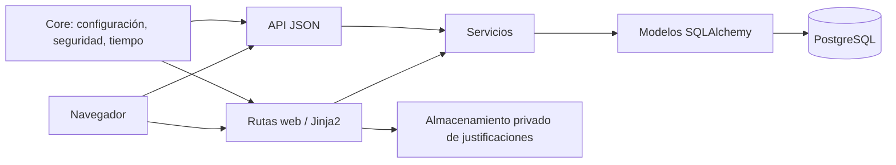
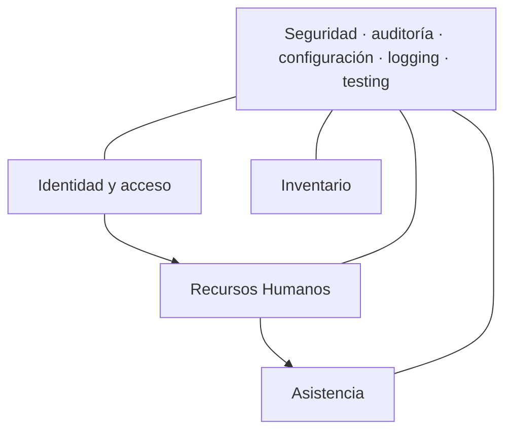

# Arquitectura de Boliklor

## Propósito y estado

Boliklor centraliza operaciones internas. Hoy es un monolito FastAPI con UI Jinja2, endpoints JSON, SQLAlchemy y PostgreSQL. Implementa identidad, trabajadores básicos, inventario y estructura inicial de asistencia; no tiene marcajes GPS reales ni evidencia de infraestructura productiva.

## Arquitectura actual

`app/main.py` compone routers. `app/web` atiende HTML, `app/api` expone JSON, `app/services` concentra una parte importante de las reglas y `app/models` representa persistencia. La separación es técnica, no todavía modular por dominio. La UI activa está en `app/templates`/`app/static`; `frontend/` es histórico.

## Módulos y relaciones

- Identidad es dueña de cuenta, rol y sesión.
- Recursos Humanos debe ser dueño de `Trabajador`; hoy el modelo está alojado en `identity.py`.
- Asistencia referencia trabajadores y es dueña de lugares, asignaciones y justificaciones.
- Inventario es dueño de empresa operativa, unidad, producto, movimiento y detalle; el stock se deriva del ledger.
- Órdenes de trabajo es legado en operación y queda fuera de expansión de Fase 0.

## Flujo y seguridad

La sesión opaca y el token CSRF se almacenan hasheados; las cookies son HttpOnly/SameSite Lax. Argon2id protege contraseñas. `AUTH_ENFORCED=false` permite una identidad administrativa de desarrollo y por ello es un bloqueo de configuración para producción. Los permisos son un mapa RBAC en código.

## Arquitectura objetivo

Evolucionar sin reescritura a un monolito modular:

Cada módulo tendrá contratos de aplicación, servicios y persistencia propios; referencias por ID y ninguna copia laboral paralela. Mantener un único despliegue y una única PostgreSQL inicialmente.

## Infraestructura, observabilidad y pruebas

No hay artefactos de Docker, CI/CD, proxy, TLS, backups o monitoreo versionados. `/health` solo confirma que el proceso responde. La suite usa `unittest` y pruebas web/servicio, pero no pudo ejecutarse en esta auditoría por ausencia de Python local.

## Documentación relacionada

- [Auditoría Fase 0](docs/audit/phase-0-audit.md)
- [Límites de módulos](docs/architecture/module-boundaries.md)
- [Base de datos](docs/architecture/database.md)
- [API](docs/architecture/api.md)
- [Autenticación y autorización](docs/architecture/authentication-authorization.md)
- [Plan de producción temprana](docs/plans/active/early-production.md)
