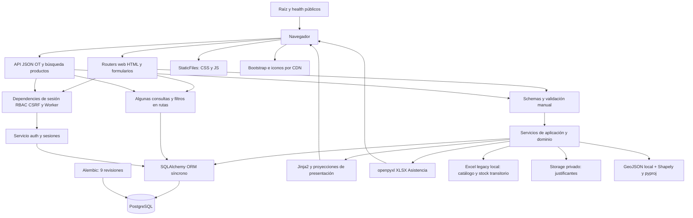
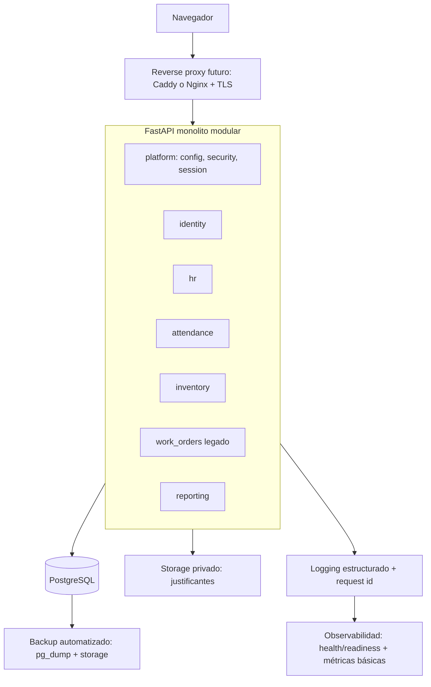

# BOLIKLOR — AUDITORÍA TÉCNICA INDEPENDIENTE

**Fecha de auditoría:** 21 de septiembre de 2026
**Fuente de evidencia:** `docs/audits/PROJECT_TECHNICAL_BASELINE.md` (levantamiento del 07-09-2026, HEAD `e4251dc0f7a1085f4f24d64e92dfc6771755df3a`)
**Modo de ejecución:** **SOLO BASELINE.** Esta auditoría no tuvo acceso al repositorio, a PostgreSQL ni a un entorno desplegado. Todo hallazgo, severidad y confianza se apoya exclusivamente en lo que el baseline documenta como evidencia de código. No se realizaron verificaciones adicionales, no se ejecutó código y no se inspeccionaron archivos fuera de lo que el baseline ya reporta. Cuando el baseline marca algo `[DESCONOCIDO / NO VERIFICABLE]`, esta auditoría lo conserva así.
**Fase:** READ + ANALYZE + DESIGN. No se modificó código, configuración, documentación, migraciones, Skills ni datos. No hubo commit, push ni despliegue.

> Nota de continuidad para la siguiente sesión (integración VS Code / Claude Code): esta auditoría deberá **re-contrastarse contra el repositorio real** en cuanto exista acceso de código, siguiendo el orden de prioridad P0/P1/P2 que el propio baseline define en su sección 34. Las secciones marcadas con confianza MEDIA o BAJA son las primeras candidatas a reverificación.

---

## 1. Executive Audit Summary

Boliklor es un monolito FastAPI de tamaño moderado (24 tablas ORM, ~217 archivos de texto relevantes, 209 tests) que centraliza Identidad, RRHH básico, Asistencia y una parte de Inventario, además de conservar un módulo heredado de Órdenes de Trabajo. El proyecto **no está sobre-diseñado ni sub-diseñado para su tamaño**: es una aplicación interna con usuarios internos (ADMIN, JEFATURA, TRABAJADOR), sin evidencia de necesidad de microservicios, SPA o infraestructura distribuida. La decisión implícita de mantenerlo como monolito por capas, evolucionando hacia un monolito modular por dominios, es coherente con la evidencia y **se ratifica** en esta auditoría.

**Nivel de madurez general:** el proyecto está en una etapa **"Funcional / Consolidándose"**, no en etapa de producción. El módulo de Asistencia (fase 4B-3, cerrada) es, con diferencia, el más maduro: tiene un motor de reglas puro y testeado, separación clara de responsabilidades, geocercas versionadas y una suite de 113 tests locales más 3 opcionales contra PostgreSQL. Identidad y RBAC tienen una base técnica sólida (Argon2id, sesiones opacas con HMAC, CSRF, fail-closed por defecto). Inventario, en cambio, está genuinamente en transición: coexisten una fuente legacy (Excel reconstruido) y un ledger operacional, y el propio proyecto ya reconoce esto como riesgo abierto antes de este informe.

**Principales fortalezas:**
1. Reglas de negocio de Asistencia excepcionalmente bien documentadas y con separación motor/adaptador/persistencia — probablemente la parte más exportable como referencia de calidad al resto del sistema.
2. Modelo de autenticación fail-closed por defecto, con Argon2id, CSRF de doble envío y sesiones revocables — una base de seguridad razonable para el tamaño del proyecto.
3. Migraciones Alembic lineales, con seeds deterministas y guards de downgrade que impiden pérdida silenciosa de datos.
4. Documentación abundante (57 Markdown, 5 ADR, `CURRENT.md`, 11 Skills) — el problema no es falta de documentación, sino **falta de una jerarquía clara de verdad** entre documentos de distintas fases.
5. Suite de tests amplia y proporcional al dominio (209 métodos), con aislamiento correcto vía SQLite/cliente ASGI manual.

**Principales debilidades:**
1. **Inventario tiene dos fuentes de verdad simultáneas** (`/productos` sigue leyendo legacy incondicionalmente; el resto ya usa ledger tras cualquier `AJUSTE_INICIAL`, que además conmuta el modo **globalmente**, no por empresa). Es el riesgo operativo más concreto del sistema hoy.
2. **Excepción de autorización en el dashboard**: JEFATURA ve KPIs y últimos movimientos de Inventario sin tener `INVENTARIO_ACCESS`. Es una discrepancia entre el mapa de permisos declarado y el comportamiento real, y el propio baseline la señala como el hallazgo de RBAC más importante.
3. **Nada de lo necesario para producción está automatizado todavía**: sin Docker/Compose, sin CI/CD, sin proxy/TLS versionado, sin backup automático, sin rate limiting, sin headers de seguridad centralizados. Existen runbooks manuales, no artefactos ejecutables.
4. **Documentación con contradicciones de fase**: README, `roadmap.md` y varios documentos de arquitectura describen un estado anterior a 4B-3 (Asistencia), y hay conteos de tablas/migraciones desactualizados. No hay una regla explícita de qué documento prevalece cuando difieren.
5. **Las 11 Skills actuales son checklists de gobernanza razonables pero genéricos**: ninguna prioriza `CURRENT.md` explícitamente como fuente de continuidad, lo que crea riesgo real de que un agente de IA reabra decisiones ya cerradas (p. ej. lotes/FEFO, ya excluidos del MVP) o remita a documentación de producto obsoleta.
6. **SQLAlchemy síncrono se invoca desde handlers `async def`** en varias rutas — no es necesariamente un problema hoy (no hay medición de concurrencia real), pero es una inconsistencia de patrón que conviene resolver antes de escalar tráfico.

**Mayores riesgos (ver Risk Register, sección 33, para detalle):** la dualidad de fuentes de Inventario (R-01, R-02) y la ausencia de continuidad operativa real — backup automatizado y despliegue reproducible (R-06) — son, en esta auditoría, los dos riesgos con mayor severidad condicionada. Ninguno constituye hoy una vulnerabilidad explotada o pérdida de datos confirmada; son condiciones que **deben resolverse antes de exponer el sistema a producción real** o antes de tratar el promedio de costos actual como definitivo.

**Preparación actual para producción: NO.** El propio proyecto no lo pretende — CURRENT.md declara la fase activa como *discovery de Inventario*, no como cierre de producción. Esta auditoría coincide: aun si Inventario se congelara hoy tal como está, faltarían automatización de backups, CI, hardening de sesión/secretos y headers de seguridad antes de un primer despliegue productivo razonable.

**Mayor oportunidad de mejora:** el sistema ya tiene el patrón correcto en Asistencia (motor de reglas puro + adaptadores + servicios transaccionales + tests). Replicar ese mismo patrón en Inventario al momento del cutover — en vez de diseñar algo nuevo — es probablemente el mayor apalancamiento disponible con el menor riesgo de reescritura.

Esta auditoría **no recomienda** microservicios, Kubernetes, SPA, CQRS, arquitectura hexagonal completa, ni convertir SQLAlchemy a async de forma generalizada en esta etapa (ver sección 34, "Not Recommended"). Las prioridades reales son: cerrar la ambigüedad de fuente en Inventario, cerrar la excepción de RBAC del dashboard, y construir la primera capa de operación reproducible (Docker + backup automatizado + CI mínimo) — en ese orden de impacto.

---

## 2. Audit Scope

**Dentro de alcance:** arquitectura general y modularidad; FastAPI/SQLAlchemy/PostgreSQL/Alembic; modelado de datos y transacciones; autenticación, sesiones, CSRF, RBAC; seguridad web y de APIs; manejo de archivos y exportaciones Excel; los cinco módulos funcionales (Identidad, RRHH, Asistencia, Inventario, OT); frontend Jinja/JS; testing; CI/CD, Docker, VPS, proxy, backups, observabilidad; documentación (README/CURRENT/AGENTS/ADR); y gobierno de las Skills usadas por agentes de IA.

**Fuera de alcance:** cualquier corrección de código, migración, cambio de configuración, modificación de documentación existente, creación de Skills, cambios de dependencias, Docker, CI, deploy, commit o push. Esta es una fase de auditoría, no de implementación.

**No evaluado por falta de evidencia:** contenido real de `.env`, dumps de datos, el XLSX privado actualizado del negocio, estado real de un servidor desplegado (si existe), permisos reales de PostgreSQL/almacenamiento, y cualquier vulnerabilidad que sólo sería observable con pruebas dinámicas (fuzzing, pentest, escaneo CVE). Estos requieren acceso a repositorio y/o entorno, no disponible en esta sesión.

---

## 3. Evidence & Limitations

Esta auditoría es una **auditoría de segundo orden**: no inspecciona el repositorio directamente, sino que confía en el levantamiento técnico ya realizado (`PROJECT_TECHNICAL_BASELINE.md`), que sí fue producido por inspección directa de 217 archivos de texto con `rg --files --hidden`, lectura de fuentes, contraste de imports/rutas/clases/constraints, y ejecución real de la suite de tests (209 descubiertos, 206 aprobados, 3 omitidos, sin fallos, 27.4s).

Limitaciones heredadas del baseline y **no resueltas por esta auditoría**:
- No se conectó a PostgreSQL; la revisión aplicada en la base de datos real es `[DESCONOCIDO / NO VERIFICABLE]`.
- No se abrió el dump de backup ni se repitió un restore.
- No se inspeccionaron secretos, `.env` real, ni el XLSX de inventario privado.
- No se hizo fetch al remoto Git ni se verificó sincronía con `origin/main`.
- No hubo escaneo de CVE de dependencias ni prueba de carga.
- El estado inicial tenía `CURRENT.md` modificado localmente antes del levantamiento — sus decisiones de continuidad de Inventario son contexto local, no necesariamente parte del commit HEAD.

Esta auditoría añade una limitación propia: **no verifica el baseline contra el código**, por lo que cualquier error u omisión del propio baseline se propaga aquí. Toda conclusión indica su nivel de **Confianza** (ALTA/MEDIA/BAJA) según qué tan directa es la evidencia citada por el baseline.

---

## 4. Architecture Scorecard

Herramienta de priorización cualitativa, no una métrica científica. Los puntajes son relativos al tamaño y objetivo real del proyecto (aplicación interna, uso interno, sin escala masiva), no contra una arquitectura de referencia de gran empresa.

| Área | Puntaje /10 | Madurez | Riesgo |
| --- | ---: | --- | --- |
| Arquitectura | 6 | Funcional | Medio |
| Backend (FastAPI/servicios) | 6 | Funcional | Medio |
| PostgreSQL | 6 | Consolidándose | Medio |
| Seguridad | 5 | En desarrollo | Medio-Alto (condicionado a exposición productiva) |
| Autorización / RBAC | 5 | En desarrollo | Medio |
| Inventario | 4 | En transición | Alto |
| Asistencia | 8 | Consolidada | Bajo-Medio |
| RRHH | 5 | Básico | Bajo |
| OT (legado) | 6 | Funcional, congelado | Bajo |
| Frontend | 6 | Funcional | Bajo-Medio |
| Tests | 6 | Consolidándose | Medio |
| DevOps | 3 | Inicial | Alto |
| Observabilidad | 3 | Inicial | Medio |
| Documentación | 5 | En desarrollo | Medio |
| Skills (gobierno de agentes IA) | 5 | En desarrollo | Medio |

**Justificación breve por fila** — Arquitectura/Backend: patrón correcto pero no uniforme (reglas en rutas en Inventario/OT, sí centralizadas en Asistencia). PostgreSQL: buen modelado (constraints, checks, tipos `Numeric`/`DateTime(timezone=True)`), pero sin re-verificación de paridad real en esta tarea. Seguridad: base técnica correcta, faltan controles de "última milla" (rate limit, headers, fortaleza de secretos). RBAC: guards sólidos, pero la excepción del dashboard es real y documentada. Inventario: la dualidad de fuentes y el modo global son el punto más bajo del sistema. Asistencia: el módulo de referencia del proyecto. DevOps/Observabilidad: prácticamente todo lo necesario para producción está en estado "planificado", no "implementado".

---

## 5. Current Architecture



*(Diagrama reproducido del baseline; es la reconstrucción de mayor confianza disponible dado que proviene de inspección directa de `app/main.py` y del árbol de servicios.)*

**Componentes y límites reales:**
- Una sola instancia FastAPI compone 9 routers web + 2 API. No hay workers, colas ni bus de eventos.
- La capa de "servicios" no es uniforme: Asistencia separa motor puro (`attendance_rules_service.py`, sin ORM) de adaptadores ORM y de presentación; Inventario y OT mezclan reglas con acceso a datos y, en parte, con las propias rutas.
- Persistencia: engine único con `pool_pre_ping=True`, sesión por request vía `get_db`, sin unidad de trabajo (unit of work) formal — cada servicio decide su propio commit/rollback.
- Autenticación: sesiones opacas persistidas (no JWT), HMAC-SHA256 sobre token/CSRF, sin capa de gateway/middleware de seguridad global (raíz, `/health` y documentación automática no pasan por los guards de RBAC).
- Frontend: 100% SSR (Jinja2 + Bootstrap + JS nativo sin bundler); no hay SPA activa. `frontend/` es un prototipo histórico, no montado por FastAPI (ver Frontend Review, sección 18, y la nota operativa al final de este documento sobre las dos carpetas).

**Problemas de arquitectura observados** (ver detalle en sección 6): ownership de RRHH físicamente dentro de Identidad; reglas de negocio de Inventario/OT dispersas en rutas; import circular entre `core/security.py` y `attendance_service.py`; ausencia de una capa de autorización aplicada uniformemente (excepción del dashboard).

---

## 6. Architecture Findings

| ID | Área | Hallazgo | Evidencia | Estado | Severidad | Confianza | Recomendación | Prioridad |
| --- | --- | --- | --- | --- | --- | --- | --- | --- |
| ARCH-001 | Arquitectura | RRHH (Trabajador) está físicamente en `models/identity.py`, no en un módulo propio, contradiciendo el ownership conceptual de ADR-002 | Baseline §3.4, §22, DT-01 | DEUDA_TECNICA | MEDIA | ALTA | Al modularizar, mover `Trabajador` a un paquete `hr` propio, conservando la FK opcional a `Usuario` | P2 |
| ARCH-002 | Arquitectura | Reglas de negocio (fechas, comunas, filtros de stock) viven en `web/products.py`, `web/inventory.py`, `web/work_orders.py`, `web/attendance_rates.py` en vez de en servicios | Baseline §14, §23, DT-02 | DEUDA_TECNICA | MEDIA | ALTA | Extraer esas reglas a servicios existentes o nuevos, siguiendo el patrón ya usado en Asistencia | P2 |
| ARCH-003 | Arquitectura | `core/security.py` depende de `attendance_service.worker_for_user`: el core transversal importa un servicio de dominio | Baseline §14, §23 (acoplamiento 1) | DEUDA_TECNICA | BAJA-MEDIA | ALTA | Definir una interfaz/puerto en `core` que Asistencia implemente, en vez de import directo | P2 |
| ARCH-004 | Arquitectura | Relaciones ORM entre `Producto↔MovimientoInventario`, `Identity↔Attendance`, etc. dependen de imports finales y strings, sin prueba que garantice todo orden de import | Baseline §23 (acoplamiento 2) | DEUDA_TECNICA | BAJA | ALTA | No romper el orden actual; si se modulariza, añadir test de import aislado por módulo | P3 |
| ARCH-005 | Arquitectura | No existe unidad de trabajo (unit of work) formal; cada servicio decide su propio commit/rollback | Baseline §4.3 | DEUDA_TECNICA | BAJA | ALTA | Evaluar sólo si aparecen bugs de transacciones parciales; no es bloqueante hoy | P3 |
| ARCH-006 | Arquitectura | Tamaño de archivos concentrados (`product_import_service.py` 495 líneas, `attendance_supervision_service.py` 444, etc.) sin evidencia de que esto ya cause bugs | Baseline §23 | INFORMATIVA | BAJA | ALTA | Vigilar al tocar esos archivos; no refactorizar por tamaño solamente | P3 |

**Conclusión de esta sección:** ninguno de estos hallazgos es un bloqueador de producción por sí solo. Son exactamente el tipo de deuda que una modularización incremental (sección 7) debería resolver de forma natural, sin requerir una reescritura.

---

## 7. Target Architecture

Se conserva la dirección ya propuesta por el propio proyecto (ADR-001, `PROPOSED`): **monolito organizado → monolito modular por dominios → separación adicional sólo si se demuestra necesidad**. Esta auditoría no encuentra evidencia que justifique saltarse ese orden.

```text
FastAPI Monolith (un solo deploy, una sola base de datos)
│
├── identity/        # Usuario, Rol, Sesión — ya bastante aislado hoy
├── hr/               # Trabajador — mover aquí desde identity (ver ARCH-001)
├── attendance/       # Ya es, de facto, el dominio mejor delimitado del proyecto
├── inventory/        # Empresa, UnidadMedida, Producto, Movimiento — requiere resolver dualidad legacy/ledger ANTES de mover código
├── work_orders/       # Legado, alcance congelado — mover tal cual, sin ampliar
├── reporting/         # Exportaciones XLSX existentes; punto de extensión futuro (Inventario/OT aún sin exportador)
└── platform/          # core/config, core/security, database/session, main.py
```

Para cada dominio, al modularizar, debe definirse explícitamente: `models`, `schemas`, `services`, `routes`, `templates`, `permissions`, `tests` e interfaces con otros dominios (p. ej. `hr` expone `worker_for_user` como interfaz pública en vez de que `core/security` importe `attendance_service` directamente).



**Justificación de cada propuesta (problema / beneficio / costo / riesgo / prioridad):**

| Propuesta | Problema que resuelve | Beneficio | Costo | Riesgo | Compatibilidad | Prioridad |
| --- | --- | --- | --- | --- | --- | --- |
| Mover `hr` fuera de `identity` | Ownership conceptual vs físico (ARCH-001) | Claridad de dominio, menos acoplamiento a futuro | Bajo (mover un modelo + ajustar imports) | Bajo si se hace con migración de sólo renombrado lógico, no de esquema | Alta — no cambia tablas | P2 |
| Extraer reglas de rutas a servicios (Inventario/OT) | Contratos inconsistentes web vs API (ARCH-002) | Reutilización, testing más fácil | Medio | Bajo si se hace módulo por módulo | Alta | P2 |
| Reverse proxy + TLS versionado | Sin HTTPS/hardening de borde | Requisito mínimo de producción | Medio (config, no código) | Bajo | Alta | P0 |
| Docker/Compose (opcional, sólo si facilita reproducibilidad) | Entorno no reproducible (Python 3.14.7 sin mínimo formal) | Builds reproducibles | Medio | Bajo | Alta | P1 |
| NO microservicios / NO Kubernetes | — | — | Alto costo, cero beneficio demostrado hoy | Alto | — | No recomendado (ver sección 34) |


---

## 8. Security Review

Threat modeling básico apoyado en la tabla de controles del baseline (§11) y en los riesgos preliminares (§25). No es una prueba de penetración; es un inventario de controles existentes/ausentes.

### SECURITY FINDINGS (ordenadas por severidad)

| ID | Hallazgo | Evidencia | Estado | Severidad | Confianza | Recomendación | Prioridad |
| --- | --- | --- | --- | --- | --- | --- | --- |
| SEC-001 | JEFATURA ve KPIs y últimos movimientos de Inventario en `/dashboard` sin tener `INVENTARIO_ACCESS` concedido | `main.py`, `web/dashboard.py`, `dashboard/index.html`; baseline §10, DT-08, R-03 | DEUDA_TECNICA / posible bug de autorización | ALTA | ALTA | Decidir si es alcance de negocio aprobado; si no, filtrar el dashboard por el mismo permiso que protege `/productos` e `/inventario/*` | P0 |
| SEC-002 | Sin rate limiting ni bloqueo tras intentos fallidos de login, ni a nivel app ni de proxy versionado | `auth_service.py`; baseline §11 AUSENTE, DT-09, R-04 | AUSENTE | ALTA (condicionada a exposición productiva) | ALTA | Añadir rate limiting básico (por IP/usuario) antes de exponer login fuera de red interna | P0 |
| SEC-003 | `COOKIE_SECURE` es configurable pero no obligatorio en producción; `validate_security_config` sólo exige que el secreto no esté vacío, no su fortaleza/entropía | `core/config.py`, `auth_service.py`; baseline §10, DT-09, R-04 | PARCIAL | ALTA (condicionada) | ALTA | Forzar `COOKIE_SECURE=true` y longitud mínima de `SESSION_SECRET` cuando `APP_ENV=production` | P0 |
| SEC-004 | Sin headers de seguridad centralizados (CSP, HSTS, X-Frame-Options) ni `TrustedHost`/política de proxy | `main.py`; baseline §11 AUSENTE explícito | AUSENTE | MEDIA (ALTA si se expone públicamente) | ALTA | Middleware de headers de seguridad antes de producción | P1 |
| SEC-005 | Logs de excepción (`logger.exception`) pueden incluir parámetros SQL sin redacción central | Servicios de import/recepción/OT; baseline R-11, DT-17 | PARCIAL | MEDIA (potencial) | MEDIA | Configurar `hide_parameters` en el engine o un formatter que redacte antes de producción | P1 |
| SEC-006 | Sin política de retención/acceso definida para datos GPS y documentos de justificantes | Modelos Asistencia, storage; baseline R-05, DT-10 | NO DETERMINADO | MEDIA | ALTA (de que la política no existe); MEDIA (de impacto real) | Requiere decisión de negocio antes de política técnica (ver Business Decisions Required) | P1 |
| SEC-007 | Sin rotación periódica de sesión/token; `resolve_session` escribe `last_seen_at` con commit en cada GET autenticado | `auth_service.resolve_session`; baseline DT-24 | PARCIAL | BAJA-MEDIA | ALTA | Evaluar throttling de la escritura de `last_seen_at` (p. ej. sólo si pasó >1 min) y política de rotación | P2 |
| SEC-008 | Validación de uploads limitada a magic bytes/tamaño/UUID + storage privado; no equivale a antimalware completo | `attendance_service.py` (justificantes); baseline §11 PARCIAL | PARCIAL | BAJA-MEDIA | ALTA | Suficiente para el volumen/tipo actual (justificantes internos); revisar si se amplía a otros tipos de archivo | P2 |
| SEC-009 | CDN de Bootstrap/Icons sin atributo `integrity` (SRI) | `base.html`; baseline R-12 | AUSENTE | BAJA | ALTA | Añadir SRI al cargar Bootstrap/Icons por CDN | P2 |
| SEC-010 | No hay MFA / API keys / JWT alternativo | Ausencia general; baseline §11 | AUSENTE | INFORMATIVA (dado alcance interno) | ALTA | No es una carencia por sí sola; evaluar MFA sólo si negocio decide exponer el sistema fuera de red interna | P3 |

**Categorías cubiertas con control razonable y sin hallazgo nuevo:** hashing de contraseñas (Argon2id + hash dummy contra enumeración de usuarios), CSRF (double-submit en login, comparación de hash+cookie en mutaciones autenticadas), autoescape Jinja2/XSS en los flujos observados, uso consistente de ORM/binds (sin interpolación de input en SQL), neutralización de fórmulas Excel (`safe_excel_text`), y descarga privada de justificantes con verificación de ownership y contención de path.

**Lo que esta auditoría NO puede confirmar ni descartar** (falta de evidencia, no ausencia de riesgo): vulnerabilidades de inyección en rutas no citadas explícitamente por el baseline, IDOR fuera de los flujos de justificantes, exposición real de OpenAPI/`/docs` en producción (hoy sin guard, pero se desconoce si el despliegue real los deshabilita), y CVEs de las dependencias listadas (ninguna versión fue contrastada contra una base de vulnerabilidades).

---

## 9. Authentication & Session Review

| ID | Hallazgo | Evidencia | Severidad | Confianza | Recomendación |
| --- | --- | --- | --- | --- | --- |
| AUTH-001 | Sesión de 12h fija, sin extensión automática por actividad ni rotación periódica de token tras uso prolongado | Baseline §10 | BAJA-MEDIA | ALTA | Es una decisión de negocio válida tal cual; documentarla explícitamente como decisión, no como pendiente (ver Business Decisions Required, pregunta 3) |
| AUTH-002 | `resolve_session` hace commit (`last_seen_at`) en cada GET autenticado — no es de solo lectura | `auth_service.resolve_session`; DT-24 | BAJA (hoy) / MEDIA (a escala) | ALTA | Throttle de escritura o mover a un job asíncrono si el volumen de tráfico crece |
| AUTH-003 | Sin `check_needs_rehash` para Argon2 — si cambian los parámetros de hashing, los hashes antiguos no se re-derivan automáticamente | `auth_service.py` | INFORMATIVA | ALTA | Añadir `check_needs_rehash` en el flujo de login como mejora de higiene, sin urgencia |
| AUTH-004 | Password temporal (`token_urlsafe(18)`) se muestra una vez en la respuesta de alta/reset y se guarda sólo como hash — correcto | — | — | — | Sin acción; buen patrón, se documenta como fortaleza |
| AUTH-005 | Reset revoca todas las sesiones; cambio propio revoca las demás pero conserva la actual — comportamiento coherente y esperado | — | — | — | Sin acción |

**Fortalezas confirmadas:** fail-closed por defecto (`AUTH_ENFORCED` activo salvo bypass explícito en development/test), Argon2id con parámetros razonables (`time_cost=3, memory_cost=65536, parallelism=4`), longitud mínima de 12 caracteres, mensaje de rechazo genérico + hash dummy contra enumeración de usuarios válidos.

---

## 10. RBAC Review

La matriz de permisos (baseline §10) es la evidencia central de esta sección. Se reproduce el hallazgo principal y se añaden matices que el propio baseline ya distingue.

| ID | Hallazgo | Evidencia | Severidad | Confianza | Recomendación |
| --- | --- | --- | --- | --- | --- |
| RBAC-001 | (= SEC-001) JEFATURA accede a datos de Inventario vía dashboard sin `INVENTARIO_ACCESS` | `main.py`, `dashboard.py`; DT-08 | ALTA | ALTA | Ver SEC-001. Requiere primero una decisión de negocio: ¿es alcance aprobado o bug? |
| RBAC-002 | El comportamiento de cuentas con **roles combinados** (p. ej. ADMIN+TRABAJADOR) no está cubierto por una matriz de test explícita | Baseline §10 (nota: "no debe extrapolarse esta matriz a todos esos casos") | MEDIA | MEDIA | Antes de producción, documentar y testear explícitamente los casos multirol reales que existan en el negocio |
| RBAC-003 | JEFATURA no tiene alcance por empresa/equipo/bodega — supervisa a cualquier trabajador sin segmentación | Baseline §10 | MEDIA | ALTA | Pregunta de negocio (ver Business Decisions Required, pregunta 1): ¿se requiere segmentación por empresa/equipo? |
| RBAC-004 | `require_role`/`require_permission`/`require_module` no se aplican a `/`, `/health`, `/docs`, `/redoc`, `/openapi.json` | Baseline §4.5, §13 | BAJA (uso interno) / MEDIA (si se expone públicamente) | ALTA | Antes de producción pública, evaluar ocultar `/docs`/`/redoc`/`/openapi.json` o protegerlos |
| RBAC-005 | No se filtra `Rol.activo` al comprobar permisos de una sesión **ya existente** (sólo se filtra al crear cuentas) | Baseline §10 | BAJA-MEDIA | ALTA | Si se desactiva un rol, las sesiones abiertas con ese rol podrían seguir teniendo el permiso hasta expirar — confirmar si es el comportamiento deseado |

**Matriz de referencia** (reproducida del baseline, válida para cuentas activas con un solo rol, auth activa y contraseña ya cambiada): ADMIN tiene wildcard sobre administración/catálogo/OT/usuarios; JEFATURA sólo supervisión de Asistencia (+ la excepción del dashboard); TRABAJADOR sólo su propio marcaje/calendario/justificaciones, y únicamente si tiene un `Worker` activo asociado.


---

## 11. PostgreSQL Review

| ID | Hallazgo | Evidencia | Severidad | Confianza | Recomendación |
| --- | --- | --- | --- | --- | --- |
| DB-001 | Buen uso de constraints, índices, FKs, `Numeric` para dinero/cantidades, `DateTime(timezone=True)` — patrón consistente | Baseline §7, §9 | — (fortaleza) | ALTA | Mantener el patrón al añadir nuevas tablas |
| DB-002 | No hay schemas PostgreSQL separados; todo vive en el esquema por defecto | Baseline §7 | INFORMATIVA | ALTA | Aceptable al tamaño actual; considerar sólo si se modulariza fuertemente por dominio a nivel de DB |
| DB-003 | La revisión aplicada realmente en la base de datos productiva/de desarrollo es `[DESCONOCIDO / NO VERIFICABLE]` en esta tarea ni en el baseline | Baseline §1 | — | — (no es hallazgo, es limitación) | Verificar con `alembic current` en cuanto haya acceso al entorno real |
| DB-004 | `CURRENT.md` reporta PostgreSQL 18.6 y 150 productos/1 recepción como evidencia histórica, no re-verificada | Baseline §7 | INFORMATIVA | BAJA (de esos números específicos) | No usar esos conteos como estado vigente sin reverificar |
| DB-005 | Sin PostGIS: geometrías en GeoJSON procesadas en Python (Shapely/pyproj) | Baseline §7 | INFORMATIVA | ALTA | Decisión correcta para el volumen actual de geocercas (13 geometrías); no se recomienda PostGIS (ver sección 34) |

**Conclusión:** el modelado de datos es, en general, uno de los puntos más sólidos del proyecto. El riesgo no está en el diseño de tablas sino en la falta de re-verificación de paridad real contra una instancia PostgreSQL viva (ver Alembic Review).

---

## 12. SQLAlchemy Review

| ID | Hallazgo | Evidencia | Severidad | Confianza | Recomendación |
| --- | --- | --- | --- | --- | --- |
| DB-006 | SQLAlchemy síncrono invocado desde handlers `async def` en varios routers | Baseline §4.2, DT-03 | MEDIA (no medida en producción) | ALTA (de que el patrón existe); MEDIA (de su impacto real) | No convertir todo a async de golpe (ver sección 34). Medir primero si hay bloqueo real bajo concurrencia típica del negocio; si no lo hay, dejarlo como deuda documentada, no urgente |
| DB-007 | Consultas cargan colecciones completas en memoria y filtran en Python (ledger, catálogo, dashboard de últimos 8 movimientos) | Baseline §23 (acoplamiento 7), DT-06 | MEDIA (riesgo de escala no medido) | ALTA | Mover filtros a la consulta SQL antes de que el volumen de productos/movimientos crezca; supervisión de Asistencia ya lo hace bien (paginación + lotes) y sirve de referencia |
| DB-008 | Sin capa repository ni unit of work formal; commits/rollbacks decididos por cada servicio | Baseline §14, §23 | BAJA | ALTA | No introducir repository genérico sin necesidad demostrada (ver sección 34) |
| DB-009 | `SessionLocal` usa `autoflush=False`, `expire_on_commit=False` — decisión explícita y razonable para el patrón actual | Baseline §4.3 | — (fortaleza) | ALTA | Mantener; documentar la razón en ARCHITECTURE.md si no está ya |

---

## 13. Alembic Review

| ID | Hallazgo | Evidencia | Severidad | Confianza | Recomendación |
| --- | --- | --- | --- | --- | --- |
| MIG-001 | El test estático de migraciones valida cadena/nombres de tabla/hash de las primeras 6 revisiones, no columnas/índices/defaults contra una PostgreSQL real | `test_migration_baseline.py`; DT-15 | MEDIA | ALTA | Añadir un gate real de `alembic upgrade` contra PostgreSQL desechable en CI (ver CI Recommendations) — ya existe el patrón en los 3 tests opcionales de PostgreSQL, sólo falta automatizarlo |
| MIG-002 | Gates de migración (`alembic check`, drift, locks, restore) están documentados como procedimientos manuales históricos, no ejecutados de forma recurrente ni automatizada | `docs/operations/migration-validation.md`; baseline §9 | MEDIA | ALTA | Definir qué gates son automatizables ahora vs después (ver Automatic Gates) |
| MIG-003 | Downgrades condicionados (`_08` rechaza si hay evaluaciones COMUNA/tolerancia; `_09` rechaza si hay intervenciones/tarifas fuera del seed) — buena práctica, no deuda | Baseline §9 | — (fortaleza) | ALTA | Mantener el patrón: cada nueva migración debe declarar explícitamente sus condiciones de rollback seguro |
| MIG-004 | Las revisiones iniciales sí borran tablas al bajar — no deben describirse como "reversión sin pérdida" | Baseline §9 | INFORMATIVA | ALTA | Documentar explícitamente en cada migración inicial que el downgrade es destructivo |

**Gates recomendados para cada nueva migración (a definir formalmente en la Skill `database-postgresql-alembic`, sección 27-28):** un solo `down_revision`; nombres de constraint con el prefijo convencional ya usado (`ck_`, `uq_`, `ix_`); condición explícita de rollback seguro si hay datos incompatibles; ejecución contra PostgreSQL desechable antes de aprobar, nunca contra la base real.

---

## 14. Inventory Review

Este es, junto con DevOps, el área de mayor riesgo del proyecto. El propio baseline ya lo señala como "precaución especial" (§6) y esta auditoría lo confirma.

| ID | Hallazgo | Evidencia | Estado | Severidad | Confianza | Recomendación | Prioridad |
| --- | --- | --- | --- | --- | --- | --- | --- | --- |
| INV-001 | `/productos` usa `_legacy_stock_values` **incondicionalmente**, sin consultar `inventory_mode`; el resto de pantallas (`/inventario/stock/...`) sí cambian al ledger tras el cutover | `web/products.products`, `inventory_stock_rows`; DT-04, R-01 | DEUDA_TECNICA | ALTA | ALTA | Antes de cualquier trabajo nuevo en Inventario: unificar la fuente que consulta `/productos`, o marcar explícitamente en la UI que esa pantalla es legacy | P0 |
| INV-002 | Cualquier `AJUSTE_INICIAL` conmuta `inventory_mode` **globalmente**, afectando a todas las empresas (BOLIKLOR y ALM) a la vez, no por empresa | `inventory_mode`; DT-05 | DEUDA_TECNICA | ALTA | ALTA | Diseñar el cutover con modo por empresa antes de ejecutar el primer `AJUSTE_INICIAL` real en producción | P0 |
| INV-003 | El "costo promedio" actual es un promedio agregado de entradas positivas, **no** el promedio ponderado móvil que CURRENT exige; usarlo hoy para valorización operacional definitiva sería incorrecto | `calculate_weighted_average_cost`; R-02, §12 | DEUDA_TECNICA (nombre engañoso) | ALTA (si se usa como definitivo) | ALTA | No presentar ese número como "costo promedio móvil" en ningún reporte hasta implementar el cálculo real aprobado por CURRENT | P0 |
| INV-004 | Sin bodega, actor del ledger, compensaciones auditable, permisos granulares — todo exigido por CURRENT, nada implementado aún | CURRENT, ADR-005 (PROPOSED); DT-07 | PENDIENTE (aprobado, no implementado) | ALTA (para el MVP aprobado) | ALTA | Es la base del próximo MVP-A de Inventario; no es un bug, es trabajo pendiente ya reconocido por el propio negocio | P0 (bloqueante del roadmap, no de lo ya en producción) |
| INV-005 | Despacho/devolución/ajuste existen como tipos de movimiento en el ledger, pero sin flujo operacional de creación/confirmación; sidebar los muestra como `href="#"` | `inventario_movimiento_service.py`; §3.1, §16 | PARCIALMENTE IMPLEMENTADO | INFORMATIVA (gate de diseño pendiente, no bug activo) | ALTA | No implementar hasta que exista diseño aprobado de control concurrente de stock negativo (ver R- futuro despacho) | P1 |
| INV-006 | `create_receipt` no comprueba explícitamente `activo` de producto/empresa/unidad al confirmar recepción (la búsqueda sí filtra activos, pero eso no es garantía del servicio) | `inventario_movimiento_service.create_receipt` | DEUDA_TECNICA | BAJA-MEDIA | ALTA | Añadir el check explícito en el servicio, no depender de que el frontend sólo ofrezca activos | P2 |
| INV-007 | Lotes/vencimientos/FIFO/FEFO **no** son requisito — CURRENT los excluye explícitamente del MVP vigente | CURRENT; §3.1, §29 | CONFIRMADO (exclusión deliberada) | — (no es hallazgo) | ALTA | No diseñar ni implementar por inferencia; requiere decisión de negocio expresa para reabrirse | — |

**Regla de esta auditoría (heredada del prompt original):** ningún hallazgo de esta sección autoriza implementar bodega, compensaciones, costo móvil o el cutover en sí. Son diagnóstico, no luz verde de ejecución.

---

## 15. Attendance Review

Attendance (fase 4B-3, cerrada) es el módulo de mayor madurez técnica del proyecto. Esta sección distingue explícitamente **vulnerabilidad técnica** de **política de negocio pendiente**, como exige el prompt de auditoría original.

| ID | Hallazgo | Evidencia | Severidad | Confianza | Tipo | Recomendación |
| --- | --- | --- | --- | --- | --- | --- |
| ATT-001 | Sin límite temporal explícito para registrar una salida administrativa futura, ni verificación de antigüedad/autenticidad de la captura GPS | `complete_administrative_exit`; DT-23, R-08 | MEDIA | ALTA | Política de negocio pendiente (no vulnerabilidad técnica) | Requiere decisión de negocio (Business Decisions Required, pregunta 8) antes de implementar cualquier validación |
| ATT-002 | `CorreccionMarcaje` existe como tabla histórica genérica sin flujo operacional de edición de hechos; riesgo de confundirla con `IntervencionSalidaAdministrativa`, que sí está en uso | Modelos Asistencia; §3.3 | BAJA-INFORMATIVA | ALTA | Deuda de claridad, no de seguridad | Documentar explícitamente en AGENTS/ARCHITECTURE la diferencia, para que un agente de IA no las confunda |
| ATT-003 | Revisión integral de justificantes vía UI administrativa: "No implementado" según la propia matriz de permisos | Baseline §10 | MEDIA | ALTA | Gap funcional, no de seguridad | Evaluar prioridad de negocio; hoy sólo existe creación/listado/archivo personal |
| ATT-004 | Motor de reglas (`project_session`/`project_day`/`project_period`) es puro, sin ORM, y está cubierto por 14+ tests dedicados — patrón ejemplar | `attendance_rules_service.py` | — (fortaleza) | ALTA | — | Usar este mismo patrón como referencia al diseñar el cutover de Inventario |
| ATT-005 | Geocercas RADIO/COMUNA evalúan todas las zonas activas independientemente de asignaciones; las asignaciones históricas no restringen la zona detectada | `attendance_geofence_service.py` | INFORMATIVA (decisión de diseño confirmada, no bug) | ALTA | Regla de negocio vigente | No reinterpretar como bug sin contradicción técnica demostrable (regla protegida explícitamente) |

**Reglas de negocio que esta auditoría trata como hechos del sistema, no como bugs a corregir** (siguiendo la restricción explícita del prompt original): Worker y Usuario son conceptos separados; la fecha operacional es la fecha local de la ENTRADA y no cambia al cruzar medianoche; máximo una jornada DIURNO y una NOCTURNO por fecha; incidencias no invalidan automáticamente la pagabilidad; la tarifa individual vigente prevalece sobre la global; la ausencia de tarifa se muestra como ausencia, nunca se sustituye por otra.

---

## 16. HR Review

| ID | Hallazgo | Evidencia | Severidad | Confianza | Recomendación |
| --- | --- | --- | --- | --- | --- |
| RRHH-001 | `Trabajador` sigue modelado dentro de `models/identity.py`, no en un módulo RRHH propio, pese a que ADR-002 (PROPOSED) declara ownership conceptual separado | Baseline §3.4, §22 | MEDIA (deuda arquitectónica) | ALTA | Al modularizar (sección 7), mover el modelo a `hr/`; no requiere cambio de esquema, sólo de organización de código |
| RRHH-002 | Sin contratos, cargo, área, jerarquías, vacaciones/licencias como proceso, onboarding/offboarding | `docs/product/human-resources/*.md` (DOCUMENTADO/PLANIFICADO) | INFORMATIVA | ALTA | Fuera de alcance actual; no implementar sin discovery propio, igual que Inventario |
| RRHH-003 | Desactivar un Trabajador no desactiva automáticamente la cuenta asociada, aunque `worker_for_user` impide su acceso laboral | `identity_admin_service.py`, `attendance_service.py` | BAJA (comportamiento intencional documentado) | ALTA | Confirmar con negocio si es el comportamiento deseado; si sí, documentarlo explícitamente como decisión |

---

## 17. Work Orders Review

OT es un módulo **heredado y con alcance explícitamente congelado**. Esta auditoría no propone ampliarlo.

| ID | Hallazgo | Evidencia | Severidad | Confianza | Recomendación |
| --- | --- | --- | --- | --- | --- |
| OT-001 | `ProductoOT` no tiene FK a `Producto`; OT no reserva ni descuenta stock — cualquier integración futura con Inventario requeriría diseño nuevo, no una extensión trivial | Baseline §3.2 | INFORMATIVA | ALTA | No implementar integración de stock sin decisión expresa de negocio (CURRENT ya excluye ampliar OT) |
| OT-002 | La API `/api/ordenes-trabajo` acepta más campos y con menos restricciones que el formulario web (comuna no limitada a las 2 opciones, sin validar orden cronológico de fechas) | `schemas/orden_trabajo.py` vs `web/work_orders.py`; §3.2 | MEDIA | ALTA | Relevante para la futura integración con el bot N8N: si el bot llega a crear OT vía API, hoy podría insertar datos que el formulario web nunca permitiría. Unificar validación antes de exponer la API a un agente externo |
| OT-003 | `numero_ot_seq` empieza en 13 según la migración inicial — comportamiento documentado, no un bug | Migración `20260826_01` | — | ALTA | Sin acción |
| OT-004 | Prefijo documentado en `docs/architecture/api.md` (`/api/ordenes`) no coincide con el real (`/api/ordenes-trabajo`) | `api/ordenes.py`; I-02 | BAJA (hoy) / MEDIA (de cara a integraciones externas) | ALTA | Corregir la documentación antes de que el equipo del bot N8N la use como referencia |


---

## 18. Frontend Review

| ID | Hallazgo | Evidencia | Severidad | Confianza | Recomendación |
| --- | --- | --- | --- | --- | --- |
| FRONT-001 | Varios formularios (recepción, nuevo producto, usuarios, asignaciones, justificaciones, OT) no incluyen un input CSRF inicial en el HTML; depende de `app.js` para inyectarlo — sin JS, el POST falla cerrado | `static/js/app.js`, templates; DT-11 | MEDIA (falla cerrado, no es vulnerabilidad, pero rompe accesibilidad sin JS) | ALTA | Renderizar el token CSRF directamente en el template (como ya hacen marcaje y tarifas/supervisión), en vez de depender de JS |
| FRONT-002 | Valores de formulario se pierden tras un error en varias plantillas (`products/new.html`, `admin/worker_form.html`); la recepción devuelve el carrito vacío tras rechazo | Templates; DT-12 | BAJA-MEDIA (fricción operativa) | ALTA | Reconstruir el formulario con los valores enviados en el contexto de error |
| FRONT-003 | Labels sin `for` / inputs sin `id` vinculado; botones iconográficos sin nombre accesible confirmado; sin E2E de foco/lector de pantalla | Templates generales; §16 | BAJA-MEDIA | ALTA | Priorizar accesibilidad en formularios de mayor uso (recepción, marcaje) antes que en el resto |
| FRONT-004 | `inventory-receipt.js` muy condensado; calcula el preview en `Number` y muestra moneda sin decimales, mientras el backend usa `Decimal` con centavos — riesgo de discrepancia de presentación | `inventory-receipt.js`; DT-13 | BAJA-MEDIA | ALTA | Alinear el redondeo/formato del preview cliente con el backend |
| FRONT-005 | Sidebar muestra "Despacho"/"Devoluciones" con `href="#"` — son placeholders, no flujos terminados | `partials/sidebar.html` | INFORMATIVA | ALTA | Ocultar o marcar visualmente como "próximamente" hasta que existan las rutas reales, para evitar confusión de usuarios internos |
| FRONT-006 | `web/attendance_rates.py` contiene un fallback textual `—` — indicio de codificación residual | `web/attendance_rates.py` | BAJA | ALTA | Corregir el encoding (probablemente falta `# -*- coding: utf-8 -*-` o el archivo se guardó con encoding incorrecto en algún punto) |
| FRONT-007 | CDN de Bootstrap/Icons sin `integrity` (SRI) — ver también SEC-009 | `base.html` | BAJA | ALTA | Añadir SRI |
| FRONT-008 | Contextos `DEMO_USER`/`DEMO` persisten en rutas antiguas aunque el sidebar/topbar activos usan `request.state.current_user` | Código residual | BAJA (si no se usa en producción) | MEDIA | Confirmar que no sean alcanzables en producción real; limpiar si son código muerto |
| FRONT-009 | `frontend/` (prototipo histórico) coexiste con la UI activa real dentro de `app/templates`/`app/static` — **ver nota operativa dedicada al final de este documento** | `frontend/AGENTS.md`; §4.1, §6, §16 | BAJA (riesgo de confusión de agentes/desarrolladores, no de seguridad) | ALTA | Ver recomendación específica al cierre del informe |

**Fortalezas:** layout en español coherente, sidebar responsive con backdrop/Escape/`aria-expanded`, `aria-live` en notificaciones y estado de marcaje, mejora progresiva declarada como dirección arquitectónica (aunque no 100% cumplida).

---

## 19. Testing Review

| ID | Hallazgo | Evidencia | Severidad | Confianza | Recomendación |
| --- | --- | --- | --- | --- | --- |
| TEST-001 | Sin tests E2E de navegador, sin CI versionado, sin medición de cobertura de líneas | Ausencia; DT-14 | MEDIA-ALTA (antes de producción) | ALTA | Priorizar CI mínimo (unit + integration + PostgreSQL) antes que E2E completo; E2E puede esperar a Fase 3 del roadmap |
| TEST-002 | El test de migración estática no valida paridad estructural completa contra PostgreSQL real (sólo cadena/nombres/hash) | `test_migration_baseline.py`; DT-15 | MEDIA | ALTA | Automatizar los 3 tests opcionales de PostgreSQL en CI, contra una base desechable |
| TEST-003 | Suite depende de un cliente ASGI manual (`ASGIClient`) y helpers compartidos entre archivos de test — acopla la propia suite | `test_identity_auth.py` y reutilización; acoplamiento 10 | BAJA | ALTA | No es urgente; documentar el helper como utilidad compartida oficial si se mantiene |
| TEST-004 | Tests de OT sustituyen (mock) `crear_orden`, sin ejercitar la secuencia real de PostgreSQL | `test_work_orders_web.py` | MEDIA | ALTA | Añadir al menos un test de integración real de OT contra PostgreSQL, igual que ya existe para Asistencia |
| TEST-005 | 206/209 aprobados, 3 omitidos (requieren PostgreSQL, correctamente no ejecutados sin `TEST_DATABASE_URL`) — buena disciplina de aislamiento | Ejecución de este levantamiento | — (fortaleza) | ALTA | Mantener; automatizar esos 3 en CI con base desechable, nunca contra datos reales |
| TEST-006 | Cobertura cualitativa ALTA en reglas de Asistencia, MEDIA en Identidad/Inventario/OT, AUSENTE en navegador/CI/backup automatizado | Baseline §15 | — (diagnóstico) | ALTA | Priorizar escenarios P0: RBAC multirol (RBAC-002), cutover de Inventario, paridad de migración |

**Pirámide de testing propuesta** (realista, sin porcentaje arbitrario de cobertura como objetivo único):
```text
unit (motor de reglas, servicios puros)          → ya fuerte en Asistencia, ampliar en Inventario/OT
integration (servicios + SQLite aislada)          → ya existe, mantener
PostgreSQL integration (constraints, secuencias)  → existe parcialmente (3 tests), automatizar en CI
web/API (contratos, RBAC, CSRF)                   → existe, ampliar casos multirol
security regression (RBAC dashboard, IDOR)         → nuevo — cubrir explícitamente SEC-001/RBAC-001
E2E browser                                        → ausente, Fase 3 del roadmap, no P0
migration (cadena + upgrade real)                  → parcial, automatizar
smoke (post-deploy)                                → ausente, necesario para Fase 4 (producción)
```

---

## 20. DevOps Review

| ID | Hallazgo | Evidencia | Severidad | Confianza | Recomendación |
| --- | --- | --- | --- | --- | --- |
| OPS-001 | Sin `requires-python`, `.python-version` ni versión mínima formal; entorno observado (3.14.7) muy por delante de cualquier matriz probada; `tzdata` no declarada explícitamente en requirements | README, requirements.txt; DT-16 | ALTA (antes de producción) | ALTA | Fijar versión mínima/máxima de Python soportada y declarar `tzdata` explícitamente, especialmente relevante en Windows |
| OPS-002 | Dependencias sin lockfile completo (versiones locales ≠ lockfile), sin separación dev/runtime | requirements.txt | MEDIA-ALTA | ALTA | Generar lockfile reproducible (`pip-compile` o equivalente) antes de la primera build de producción |
| OPS-003 | Sin Dockerfile/Compose, workflows CI/CD, systemd, manifiestos cloud, Nginx/Caddy versionados en el árbol | Ausencia; §7, §18 | ALTA (antes de exposición productiva) | ALTA | Ver Target Architecture (sección 7) y Remediation Roadmap Fase 4 |
| OPS-004 | `/health` sólo verifica liveness de proceso, sin readiness de DB/storage | `main.py` | MEDIA | ALTA | Añadir endpoint de readiness antes de cualquier orquestación (incluso sin Kubernetes, útil para el propio proxy/monitor) |
| OPS-005 | Entornos `development/test/staging/production` están soportados en configuración, pero no hay *provisioning* real de staging | `core/config.py` | MEDIA | ALTA | Provisionar al menos un staging antes de producción, aunque sea manual inicialmente |
| OPS-006 | No se sabe si existe infraestructura externa (VPS, dominio, certificados) — es `[DESCONOCIDO / NO VERIFICABLE]`, no necesariamente ausente | — | — | BAJA (de que exista o no) | Confirmar directamente con el usuario/negocio, no asumir en ningún sentido |

---

## 21. Backup & Recovery Review

| ID | Hallazgo | Evidencia | Severidad | Confianza | Recomendación |
| --- | --- | --- | --- | --- | --- |
| OPS-007 | Backup es un runbook manual (`pg_dump -Fc`, hash, ACL) con un ensayo de restore histórico documentado (02-09-2026) — existe procedimiento, no automatización | `docs/operations/database-backup-restore.md`; DT-18, R-06 | ALTA (para continuidad productiva) | ALTA | Automatizar el job de backup (cron/systemd timer o equivalente) antes de producción; el runbook ya es una base correcta, sólo falta ejecutarlo sin intervención manual |
| OPS-008 | Sin backup ni continuidad definida para el storage de justificantes (filesystem privado) — el runbook cubre DB, no archivos | Storage privado; §18 | ALTA | ALTA | Definir estrategia de backup conjunta DB+storage, no sólo DB |
| OPS-009 | RPO/RTO no definidos conceptualmente en ningún documento | Ausencia | MEDIA | ALTA | Definir RPO/RTO como parte de la decisión de negocio antes de automatizar (ver Business Decisions Required, pregunta 16) |
| OPS-010 | No hay copia externa (off-site) del backup, ni cifrado confirmado, ni verificación/restore-testing recurrente | Ausencia | MEDIA-ALTA | ALTA | Añadir copia externa cifrada como parte de la automatización |

**Distinción explícita que exige el prompt original:** existe *backup documentado/manual con evidencia histórica*; **no** existe *backup productivo automatizado*. No deben presentarse como equivalentes.

---

## 22. Observability Review

| ID | Hallazgo | Evidencia | Severidad | Confianza | Recomendación |
| --- | --- | --- | --- | --- | --- |
| OBS-001 | Logging puntual sin request ID, sin logging estructurado ni correlación entre capas | `logging-standards.md` (planificado, no implementado); DT-17 | MEDIA | ALTA | Middleware mínimo de request ID + logging estructurado (JSON) antes de producción; no requiere infraestructura externa |
| OBS-002 | Sin métricas ni alertas | Ausencia | MEDIA (tolerable al tamaño actual) | ALTA | Evolución mínima: exportar métricas básicas (latencia, tasa de error, conexiones DB) cuando el tráfico lo justifique — no urgente hoy |
| OBS-003 | Auditoría de negocio parcial: sólo Asistencia (intervenciones/tarifas) tiene actor/tiempo; catálogo, ledger de inventario y cuentas carecen de auditoría central transversal | Modelos, servicios; DT-10 | MEDIA | ALTA | Extender el patrón de actor/tiempo ya usado en Asistencia al ledger de Inventario, como parte del propio MVP-A |
| OBS-004 | `/health` no depende de DB — es liveness puro, correcto como está; falta *readiness* separado (ver OPS-004) | `main.py` | — | ALTA | Ver OPS-004 |

---

## 23. Documentation Review

| ID | Hallazgo | Evidencia | Severidad | Confianza | Recomendación |
| --- | --- | --- | --- | --- | --- |
| DOC-001 | README describe estado anterior a 4B-3 (166 tests, JEFATURA "preparada para supervisión futura") cuando la supervisión ya está implementada | README.md; I-01 | MEDIA | ALTA | Actualizar README para reflejar el cierre de 4B-3 |
| DOC-002 | `docs/architecture/api.md` documenta `/api/ordenes` en vez del prefijo real `/api/ordenes-trabajo` | I-02 | MEDIA (relevante para integración con el bot N8N) | ALTA | Corregir antes de que cualquier integración externa use la documentación como referencia |
| DOC-003 | Conteos de tablas/migraciones desactualizados en `database.md` (8 revisiones/22 tablas) y `system-overview.md` (7 revisiones) frente a las 9/24 reales | I-03 | BAJA-MEDIA | ALTA | Actualizar ambos documentos |
| DOC-004 | `asistencia_decisiones.md` afirma ausencia de sesiones/marcajes/GPS — es antecedente histórico, no estado actual | I-04 | BAJA (si se lee como histórico) | ALTA | Marcar explícitamente como "histórico / superseded" en el propio documento |
| DOC-005 | Varios estándares (`logging-standards.md`, `testing-standards.md`, etc.) se presentan sin distinguir que son objetivos, no capacidades ya cumplidas | I-07 | MEDIA | ALTA | Añadir un encabezado de estado ("objetivo" vs "vigente") a cada estándar |
| DOC-006 | No existe una regla explícita de precedencia cuando README ≠ CURRENT ≠ código | Evidenciado en toda la sección 19 del baseline | MEDIA | ALTA | Ver Section 25 (CURRENT Review) y la propuesta de jerarquía documental de esta auditoría |
| DOC-007 | `docs/operations/migration-validation.md` mezcla un encabezado de baseline antiguo con gates nuevos en el mismo archivo | Baseline §19 | BAJA | ALTA | Separar el histórico del procedimiento vigente en documentos distintos |

**Propuesta de jerarquía documental** (a validar con el equipo, no impuesta unilateralmente):
```text
1. Código (fuente de verdad de comportamiento real)
2. CURRENT.md (fuente de verdad de continuidad y decisiones vigentes)
3. ADR ACCEPTED (decisiones arquitectónicas ya aprobadas)
4. AGENTS.md (reglas de trabajo para agentes/desarrolladores)
5. ARCHITECTURE.md y docs/architecture/* (documentación estructural)
6. docs/product/* (reglas de dominio, mezcla vigente/planificado — requiere lectura crítica)
7. README.md (onboarding — debe reflejar 1-3, nunca contradecirlos)
8. docs/plans, docs/audit histórico (contexto, no fuente de verdad)
```
Cuando dos documentos discrepen, el de menor número en esta lista prevalece. Esta jerarquía es una **propuesta de esta auditoría**, no una decisión ya tomada por el proyecto — requiere aprobación del equipo antes de aplicarse.

---

## 24. AGENTS Review

`AGENTS.md` y los `AGENTS.md` por carpeta (`app/`, `tests/`, `alembic/`, `frontend/`) están vigentes como normas, según el baseline. Esta auditoría no tuvo acceso a su contenido completo (no fue transcrito íntegramente en el baseline), por lo que las siguientes observaciones son de **confianza MEDIA**, basadas en cómo el baseline los describe y en las excepciones reales que documenta.

| ID | Hallazgo | Evidencia | Severidad | Confianza | Recomendación |
| --- | --- | --- | --- | --- | --- |
| DOC-008 | `app/AGENTS.md` pide un flujo estricto `web/api → services → models/database`, pero la realidad tiene excepciones documentadas (consultas en rutas, `core/security` dependiendo de un servicio de dominio) | Baseline §30 (descripción), §23 | BAJA-MEDIA | MEDIA | Al revisar AGENTS.md directamente (con acceso a repo), decidir si las reglas deben relajarse para reflejar la realidad o si el código debe converger a la regla — no ambas cosas a la vez sin decidir |
| DOC-009 | No está claro, según el baseline, qué reglas de AGENTS.md son globales vs específicas de dominio, ni cómo Codex resolvía conflictos entre instrucciones | Ausencia de evidencia directa | — | BAJA | Pendiente de revisión directa cuando haya acceso al repositorio real |

**Nota importante para la migración de herramientas:** `AGENTS.md` es el mecanismo de gobierno que usaba Codex. Claude Code tiene su propio mecanismo equivalente (memoria de proyecto / instrucciones de sistema propias). Esta auditoría **no** asume que ambos mecanismos son intercambiables 1:1 — se abordará explícitamente cuando exista acceso al repositorio (ver nota de cierre).

---

## 25. CURRENT Review

`CURRENT.md` cumple razonablemente su función de handoff operativo: el baseline pudo reconstruir con precisión "dónde estamos" (discovery de Inventario), "qué está cerrado" (Asistencia 4B-3) y "qué sigue" (revisar XLSX actualizado y guías reales antes de MVP-A) directamente desde este documento.

| ID | Hallazgo | Evidencia | Severidad | Confianza | Recomendación |
| --- | --- | --- | --- | --- | --- |
| DOC-010 | `CURRENT.md` tenía cambios locales sin commitear al momento del baseline (` M CURRENT.md`) — sus decisiones de Inventario son contexto local, no necesariamente parte de HEAD | Baseline §1 | INFORMATIVA | ALTA | Confirmar que esos cambios locales se commitearon antes de continuar cualquier trabajo de Inventario |
| DOC-011 | `roadmap.md` todavía dice "4B-3 en progreso"/"4B-3C+ pendiente" pese a que ya hay código y commits que lo cierran | I-05, §28 | BAJA-MEDIA | ALTA | Actualizar roadmap.md para reflejar el cierre real |
| DOC-012 | No hay estructura estable definida para futuras actualizaciones de CURRENT (estado DB, estado Git, gates, bloqueos) más allá de lo que ya contiene hoy | Baseline §29 | INFORMATIVA | MEDIA | Proponer una plantilla fija de secciones para CURRENT (dónde estamos / cerrado / en curso / sigue / decisiones vigentes / bloqueos / estado DB / estado Git / gates), para que cada actualización sea comparable con la anterior |

**Conclusión:** CURRENT.md es, hoy, el documento de mayor confianza del proyecto para decisiones de continuidad — y así debe seguir tratándose (ver jerarquía propuesta en sección 23).


---

## 26. Skills Audit

Análisis de las 11 Skills actuales en `.codex/skills/`, escritas para gobernar a Codex. Esta evaluación es de **confianza MEDIA**: se basa en el resumen que el baseline hace de cada una (§20), no en la lectura directa de cada `SKILL.md`.

| Skill | Mantener | Mejorar | Fusionar | Reemplazar | Eliminar | Decisión y motivo |
| --- | :-: | :-: | :-: | :-: | :-: | --- |
| api-review | ✔ | ✔ | — | — | — | Checklist básica útil; mejorar con matriz real de rutas y ejemplos de errores actuales (ver DOC-008, BACK-001) |
| architecture-review | ✔ | ✔ | — | — | — | Bien enfocada; añadir mapa ejecutable de imports reales (ARCH-003, ARCH-004) |
| attendance-feature | ✔ | ✔ | — | — | — | Relevante para privacidad; debe distinguir explícitamente decisiones cerradas (4B-3) de preguntas abiertas, y no reabrir lo ya aprobado |
| backend-feature | ✔ | ✔ | — | — | — | Base razonable pero genérica; especializar con las excepciones reales de servicios/rutas (ARCH-002) en vez de fusionarla, porque sigue siendo el único lugar que cubre el flujo general de "nuevo endpoint" |
| database-migration | ✔ | ✔ | — | — | — | Buena protección de historial/DB; añadir referencias precisas a los guards `_08`/`_09` y comandos reproducibles contra PostgreSQL desechable (MIG-001) |
| frontend-feature | ✔ | ✔ | — | — | — | Alineada con el stack SSR; debe dejar de remitir a `frontend/AGENTS.md` histórico y cubrir la deuda de CSRF inyectado (FRONT-001) |
| human-resources-feature | ✔ | ✔ | — | — | — | Buena distinción intención/hechos; añadir receta explícita sobre Worker vs cuenta y su ubicación física actual (RRHH-001) |
| inventory-feature | — | — | — | ✔ | — | Remite a docs/ADR obsoletos y no incorpora el gate de CURRENT ni la exclusión de lotes; **reemplazar** por `inventory-domain` + `inventory-legacy-cutover` (más específicas y con prioridad explícita de CURRENT) |
| release-check | ✔ | ✔ | — | — | — | Buen alcance operacional; debe reconocer el backup manual ya existente (no tratarlo como inexistente) y concretar validación ejecutable |
| security-review | ✔ | ✔ | — | — | — | Bien delimitada; debe referenciar `docs/architecture/authentication-authorization.md` y el risk register en vez de un inexistente `security-architecture.md` |
| testing | ✔ | ✔ | — | — | — | Coherente con unittest/aislamiento; debe identificar el cliente ASGI compartido y la separación 206/3 + gate PostgreSQL (TEST-002, TEST-004) |

**Resumen de decisión:** de las 11 Skills, **10 se mantienen y mejoran**, y **1 se reemplaza** (`inventory-feature` → dos skills más específicas). No se fusiona ni elimina ninguna: la duplicación observada entre `backend-feature`/`testing`/`api-review`/`security-review` es coherente (comparten mandatos de leer docs, validar permisos, rollback y pruebas) siempre que todas referencien la misma fuente — `CURRENT.md` primero — en vez de divergir.

**Hallazgo transversal (SKILL-001, = DT-20):** ninguna de las 11 Skills prioriza explícitamente `CURRENT.md` como primera fuente de continuidad. Es el hallazgo de gobernanza de IA más importante de esta auditoría — severidad MEDIA, confianza ALTA — porque crea riesgo concreto de que un agente reabra decisiones cerradas (p. ej. lotes/FEFO) o base una respuesta en documentación de producto desactualizada.

---

## 27. Proposed Skill Architecture

Principio rector (heredado del prompt original): una Skill no es documentación duplicada. Debe responder *"cuando un agente vaya a realizar cierto tipo de trabajo en Boliklor, ¿qué proceso verificable debe seguir para no romper arquitectura, seguridad ni reglas de negocio?"*

**Catálogo propuesto — 13 Skills** (se evaluaron las 14 candidatas del baseline §32; se fusionan `work-orders-legacy`/`legacy-work-orders-review` en una sola, ya que ambas cubren el mismo propósito):

| # | Skill | Origen | Acción sobre la actual |
| --- | --- | --- | --- |
| 1 | `project-context` | Nueva | Crear — reemplaza la función que cumplía leer AGENTS/CURRENT manualmente; primera Skill que cualquier agente debe invocar |
| 2 | `architecture-governance` | = `architecture-review` mejorada | Renombrar/mejorar |
| 3 | `backend-fastapi` | = `backend-feature` mejorada | Mejorar |
| 4 | `authentication-authorization` | = `security-review` (parte) + nueva especialización RBAC | Especializar desde `security-review` |
| 5 | `database-postgresql-alembic` | = `database-migration` mejorada | Mejorar |
| 6 | `attendance-domain` | = `attendance-feature` mejorada | Mejorar |
| 7 | `attendance-geofences` | Nueva (especialización) | Crear — extraer de `attendance-feature` la parte geográfica, que tiene reglas muy específicas (hash/CRS, snapshots) |
| 8 | `attendance-rates-exports` | Nueva (especialización) | Crear — extraer de `attendance-feature` la parte de tarifas/exportación |
| 9 | `inventory-domain` | Reemplaza `inventory-feature` | Reemplazar |
| 10 | `inventory-legacy-cutover` | Nueva | Crear — específica para el riesgo INV-001/INV-002 |
| 11 | `frontend-jinja` | = `frontend-feature` mejorada | Mejorar |
| 12 | `testing-quality` | = `testing` mejorada | Mejorar |
| 13 | `production-operations` | = `release-check` mejorada + DevOps | Mejorar |
| 14 | `documentation-governance` | Nueva | Crear — aplica la jerarquía documental de la sección 23 |
| 15 | `work-orders-legacy` | Nueva (pequeña) | Crear — sólo para conservación/revisión del legado OT, no expansión |

`api-review` y `human-resources-feature` se conservan tal cual (mejoradas) como Skills transversales que no encajan 1:1 en un solo dominio.

**Matriz de precedencia cuando dos Skills o documentos entran en conflicto** (orden propuesto, a validar con el equipo):
```text
1. Seguridad / integridad de datos           (nunca se sacrifica por velocidad)
2. Decisiones ya aprobadas (ADR ACCEPTED, CURRENT vigente)
3. CURRENT.md                                 (continuidad operativa)
4. Arquitectura / ADR PROPOSED
5. Reglas de dominio (business-rules.md por módulo)
6. Skill específica del dominio en cuestión
7. Skill general (backend-feature, testing, api-review)
8. Documentación histórica (README, roadmap, docs/audit)
```
Justificación: seguridad e integridad de datos priman siempre porque un error ahí es irreversible; CURRENT queda por encima de ADR "PROPOSED" porque refleja la decisión operativa más reciente, incluso si un ADR formal aún no se actualizó.

---

## 28. Skill Specifications

Especificaciones completas sólo para las **5 Skills de mayor prioridad** (ver también Top 5 Skills, sección 45); el resto sigue el mismo formato cuando se aprueben.

### `project-context`
- **Objetivo:** orientar a cualquier agente (Claude, Codex u otro) sobre el estado real del proyecto antes de tocar código.
- **Trigger:** inicio de cualquier tarea nueva sobre Boliklor, sin excepción.
- **Cuándo NO usarla:** nunca — es la única Skill de uso obligatorio universal.
- **Dependencias documentales:** `CURRENT.md` (primero), `AGENTS.md`, `ARCHITECTURE.md`.
- **Archivos principales:** los tres anteriores + este documento de auditoría una vez aprobado.
- **Invariantes:** CURRENT.md tiene precedencia sobre cualquier documento de producto/roadmap que lo contradiga.
- **Flujo de trabajo:** leer CURRENT → identificar fase activa → identificar exclusiones vigentes (p. ej. lotes/FEFO) → sólo entonces proceder con la tarea.
- **Gates:** ninguno automatizable (es un paso de lectura).
- **Prohibiciones:** no asumir que README o `docs/plans/active/roadmap.md` reflejan el estado actual sin contrastarlos contra CURRENT.
- **Definition of Done:** el agente puede enunciar en una frase la fase activa y las exclusiones vigentes antes de escribir código.
- **Skills relacionadas:** todas.

### `authentication-authorization`
- **Objetivo:** evitar que un cambio de RBAC/sesión reintroduzca la excepción del dashboard (SEC-001) u otras discrepancias entre `ROLE_PERMISSIONS` y el comportamiento real.
- **Trigger:** cualquier cambio en `core/security.py`, `auth_service.py`, guards de router, o nuevas rutas con datos sensibles.
- **Cuándo NO usarla:** cambios puramente visuales sin tocar guards.
- **Dependencias documentales:** `docs/architecture/authentication-authorization.md`, `docs/security/risk-register.md`, esta auditoría (sección 8-10).
- **Archivos principales:** `core/security.py`, `services/auth_service.py`, routers afectados.
- **Invariantes:** ninguna ruta que exponga datos de un módulo debe ser accesible sin el permiso de ese módulo, salvo excepción documentada y aprobada explícitamente por negocio.
- **Flujo de trabajo:** identificar el permiso correcto → aplicar guard antes de cualquier lógica → añadir test de RBAC negativo (rol sin permiso → 403).
- **Gates:** test de matriz RBAC debe pasar antes de merge.
- **Tests obligatorios:** al menos un caso positivo y uno negativo por rol afectado.
- **Prohibiciones:** no otorgar wildcard fuera de ADMIN sin decisión de negocio documentada.
- **Definition of Done:** matriz de permisos actualizada + tests verdes.
- **Skills relacionadas:** `backend-fastapi`, `testing-quality`.

### `inventory-legacy-cutover`
- **Objetivo:** evitar que el cutover Excel→ledger cree o mantenga fuentes divergentes (INV-001, INV-002).
- **Trigger:** cualquier cambio a `inventory_mode`, `product_import_correction_service.py`, o a las pantallas que leen stock (`/productos`, `/inventario/stock/*`).
- **Cuándo NO usarla:** cambios de catálogo que no tocan stock/modo.
- **Dependencias documentales:** CURRENT (sección Inventario MVP), ADR-005, `docs/product/inventory/*`.
- **Archivos principales:** `inventory_stock_service.py`, `product_import_correction_service.py`, `web/products.py`, `web/inventory.py`.
- **Invariantes:** toda pantalla de stock debe consultar la misma fuente para una empresa dada en un momento dado; el cambio de modo debe poder decidirse por empresa antes de ejecutarse en producción real.
- **Flujo de trabajo:** confirmar modo vigente → no mezclar fuentes en una misma respuesta → documentar cualquier AJUSTE_INICIAL como decisión irreversible de cutover.
- **Gates:** test que verifique que `/productos` y `/inventario/stock/*` devuelven el mismo saldo para una empresa ya migrada.
- **Prohibiciones:** no implementar lotes/FIFO/FEFO; no asumir que el promedio actual es el promedio móvil aprobado (INV-003).
- **Definition of Done:** una sola fuente de verdad por empresa, verificada por test.
- **Skills relacionadas:** `inventory-domain`, `database-postgresql-alembic`.

### `database-postgresql-alembic`
- **Objetivo:** que cada nueva migración sea segura, reproducible y no rompa la cadena lineal ni los guards de downgrade existentes.
- **Trigger:** cualquier cambio de modelo ORM o nueva revisión Alembic.
- **Archivos principales:** `alembic/versions/*.py`, `alembic/env.py`, modelos afectados.
- **Invariantes:** un solo `down_revision`; nombres de constraint con el prefijo convencional; condición explícita de rollback si hay datos incompatibles.
- **Flujo de trabajo:** escribir migración → probar `upgrade`/`downgrade` contra PostgreSQL desechable (nunca real) → correr test estático de cadena.
- **Gates:** `alembic upgrade head` y `alembic downgrade -1` deben ejecutar sin error contra base desechable antes de aprobar.
- **Tests obligatorios:** el test de cadena estática (`test_migration_baseline.py`) más un test de integración si la migración toca datos.
- **Prohibiciones:** nunca ejecutar contra la base real sin autorización explícita; nunca usar `create_all` como sustituto de migración.
- **Definition of Done:** migración aplicada y revertida limpiamente en entorno desechable.
- **Skills relacionadas:** `inventory-legacy-cutover`, `backend-fastapi`.

### `documentation-governance`
- **Objetivo:** aplicar la jerarquía documental (sección 23) y evitar que la documentación vuelva a divergir del código.
- **Trigger:** cualquier cambio que afecte el comportamiento descrito en README/ARCHITECTURE/docs de producto.
- **Archivos principales:** README.md, ARCHITECTURE.md, CURRENT.md, docs/architecture/*, docs/product/*.
- **Invariantes:** código > CURRENT > ADR ACCEPTED > AGENTS > ARCHITECTURE > docs/product > README > planes/histórico.
- **Flujo de trabajo:** al cerrar una fase, actualizar CURRENT primero, luego propagar a README/roadmap si corresponde.
- **Gates:** ninguno automatizable hoy; candidato a check de consistencia futuro (ver Automatic Gates).
- **Prohibiciones:** no dejar dos documentos con conteos (tablas, migraciones, tests) distintos sin marcar cuál es el vigente.
- **Definition of Done:** ningún documento tocado por la tarea contradice a CURRENT.
- **Skills relacionadas:** `project-context`.

**Matriz Skill → Operación** (resumen; todas heredan `project-context` primero):

| Operación | Skill(s) |
| --- | --- |
| Nuevo endpoint | `backend-fastapi`, `api-review` |
| Cambio modelo ORM | `database-postgresql-alembic` |
| Nueva migración | `database-postgresql-alembic` |
| Cambio login | `authentication-authorization` |
| Cambio RBAC | `authentication-authorization` |
| Cambio marcaje | `attendance-domain` |
| Cambio geocerca | `attendance-geofences` |
| Cambio tarifa | `attendance-rates-exports` |
| Cambio inventario | `inventory-domain` |
| Cutover Excel → ledger | `inventory-legacy-cutover`, `database-postgresql-alembic` |
| Cambio frontend | `frontend-jinja` |
| Nueva exportación | `attendance-rates-exports` o `inventory-domain` según módulo |
| Release | `production-operations`, `testing-quality` |
| Deploy | `production-operations` |
| Auditoría de seguridad | `authentication-authorization`, `security-review` |
| Actualizar documentación | `documentation-governance` |

---

## 29. Automatic Gates

| Gate | Recomendado ahora (P0/P1) | Recomendado después (P2/P3) |
| --- | --- | --- |
| Tests unitarios + integración SQLite | ✔ ahora | — |
| Migration check (`alembic upgrade`/`downgrade` contra desechable) | ✔ ahora | — |
| RBAC matrix test (roles × rutas sensibles) | ✔ ahora | — |
| Formatting/lint (ruff o equivalente) | ✔ ahora (bajo costo) | — |
| Type checking (mypy) | — | Después — requiere primero anotar tipos consistentemente |
| Security scanning (dependencias) | ✔ ahora (bajo costo, alto valor) | — |
| Dependency scanning (CVE) | ✔ ahora | — |
| Docs consistency (conteos README/CURRENT/código) | — | Después — automatizar sólo si se formaliza la jerarquía documental |
| Accidental secrets scanning | ✔ ahora | — |
| Alembic heads (un solo head) | ✔ ahora | — |
| Frontend smoke (rutas clave responden 200) | — | Después |

---

## 30. CI Recommendations

```text
checkout
↓
install (con lockfile reproducible — ver OPS-002)
↓
static checks (lint + secrets scan + dependency scan)
↓
unit tests
↓
SQLite integration tests
↓
PostgreSQL service (contenedor efímero en el runner)
↓
migration upgrade + downgrade (contra ese PostgreSQL efímero)
↓
PostgreSQL integration tests (los 3 ya existentes, hoy opcionales)
↓
RBAC matrix / security regression
↓
artifact/report
```
No se implementa en esta fase (prohibido por el alcance de la auditoría). Esta secuencia es la base para cuando se autorice crear el pipeline real.

---

## 31. ADR Candidates

| ADR candidato | Decisión necesaria | Motivo |
| --- | --- | --- |
| ADR-006 dashboard-inventory-visibility | ¿JEFATURA debe ver KPIs/valores de Inventario sin `INVENTARIO_ACCESS`? | Resuelve SEC-001/RBAC-001 de forma permanente, no como parche puntual |
| ADR-007 inventory-mode-scope | ¿El modo de inventario (legacy/ledger) debe conmutar por empresa en vez de globalmente? | Resuelve INV-002 antes del primer cutover real |
| ADR-008 session-hardening-policy | Política de `COOKIE_SECURE`, fortaleza de `SESSION_SECRET`, rate limiting y rotación de sesión en producción | Resuelve SEC-002/SEC-003/AUTH-001 con una sola decisión coherente |
| ADR-009 documentation-precedence | Jerarquía formal de documentos (propuesta en sección 23) | Evita futuras contradicciones README/CURRENT/código |
| ADR-010 ai-agent-governance | Cómo deben las Skills/AGENTS priorizar CURRENT, y cómo se traduce ese gobierno al pasar de Codex a Claude Code | Resuelve SKILL-001 y la migración de herramientas mencionada por el usuario |


---

## 32. Technical Debt (Registro Consolidado)

Unifica los hallazgos anteriores por prioridad. P0 = antes de producción; P1 = próxima etapa; P2 = evolución; P3 = optimización futura.

| Prioridad | IDs |
| --- | --- |
| **P0** | SEC-001/RBAC-001, SEC-002, SEC-003, INV-001, INV-002, INV-003, OPS-001, OPS-003, OPS-007, OPS-008 |
| **P1** | SEC-004, SEC-005, SEC-006, ARCH-001, ARCH-002, DB-006, DB-007, MIG-001, MIG-002, INV-004, ATT-001, ATT-003, TEST-001, TEST-002, TEST-004, OPS-002, OPS-004, OPS-005, OBS-001, OBS-003, DOC-001, DOC-002 |
| **P2** | SEC-007, SEC-008, SEC-009, ARCH-003, ARCH-004, ARCH-005, INV-005, INV-006, FRONT-001..004, RBAC-002..005, DOC-003..007 |
| **P3** | ARCH-006, MIG-003/004, RBAC casos residuales, FRONT-005..009, SEC-010 |

**Total de hallazgos registrados en esta auditoría: 55**, distribuidos en 16 categorías (ARCH, SEC, AUTH, RBAC, DB, MIG, API/BACK, INV, ATT, RRHH, OT, TEST, OPS, OBS, DOC, SKILL). Ninguno se clasificó como CRÍTICO: no hay evidencia, según el baseline, de una vulnerabilidad explotada, pérdida de datos confirmada o imposibilidad actual de operar.

---

## 33. Risk Register

| ID | Área | Riesgo | Severidad | Probabilidad | Impacto | Confianza |
| --- | --- | --- | --- | --- | --- | --- |
| R-01 | Inventario | Pantallas dan saldos distintos; si falla la lectura legacy, el stock transitorio puede mostrarse como cero | ALTA (para decisiones operativas) | MEDIA (depende de disponibilidad del Excel) | ALTO (decisiones sobre datos incorrectos) | ALTA |
| R-02 | Inventario/Costos | Tomar el promedio agregado actual como promedio móvil/costo histórico correcto | ALTA (si se usa como definitivo) | MEDIA | ALTO (valorización incorrecta) | ALTA |
| R-03 | Autorización | JEFATURA ve valores de Inventario sin permiso directo | MEDIA (alcance de negocio pendiente) | ALTA (ya ocurre siempre que JEFATURA entra al dashboard) | MEDIO | ALTA |
| R-04 | Seguridad | Despliegue productivo podría aceptar secreto débil y cookies no `Secure`, sin rate limit | ALTA (condicionado a exposición productiva) | BAJA hoy (no hay despliegue productivo confirmado) | ALTO si se expone | ALTA |
| R-05 | Privacidad | GPS/documentos retenidos sin política definida | MEDIA | ALTA (ya ocurre) | MEDIO | ALTA |
| R-06 | Recuperación | Backup manual, sin estrategia automatizada DB+storage | ALTA (para continuidad productiva) | MEDIA | ALTO | ALTA |
| R-07 | Escala | Colecciones completas + commit por request pueden degradar rendimiento | MEDIA | BAJA (no medida, volumen actual pequeño) | MEDIO a futuro | MEDIA |
| R-08 | Asistencia | Horas administrativas futuras admitidas sin regla; GPS sin prueba de autenticidad/recencia | MEDIA | BAJA-MEDIA | MEDIO | ALTA |
| R-09 | Calidad/Deploy | Suite verde local no cubre navegador, DDL vivo completo ni artefacto productivo | MEDIA | MEDIA | MEDIO | ALTA |
| R-10 | Gobernanza | Un agente/auditor toma roadmap viejo como fase activa o lotes como requisito inmediato | MEDIA | MEDIA (ya ocurrió parcialmente en documentos) | MEDIO | ALTA |
| R-11 | Logging | Excepción técnica puede incluir parámetros SQL sin redacción | MEDIA (potencial) | BAJA | MEDIO | MEDIA |
| R-12 | Frontend | Dependencia CDN sin SRI | BAJA | BAJA | BAJO | ALTA |

No hay evidencia suficiente en el baseline para declarar ningún riesgo como CRÍTICO vigente; el futuro despacho sin control concurrente es un **gate de diseño pendiente**, no una vulnerabilidad de una ruta que hoy no existe.

---

## 34. Quick Wins

Bajo esfuerzo, bajo riesgo, alto beneficio — no se mezclan con cambios arquitectónicos grandes:

1. Corregir el prefijo documentado de la API OT (`/api/ordenes` → `/api/ordenes-trabajo`) en `docs/architecture/api.md` (DOC-002).
2. Añadir atributo `integrity` (SRI) a los `<script>`/`<link>` de Bootstrap/Icons por CDN (SEC-009/FRONT-007).
3. Corregir el fallback de encoding `—` en `web/attendance_rates.py` (FRONT-006).
4. Ocultar o marcar como "próximamente" los enlaces `href="#"` de Despacho/Devoluciones en el sidebar (FRONT-005).
5. Añadir `check_needs_rehash` al flujo de login (AUTH-003).
6. Actualizar conteos de tablas/migraciones en `docs/architecture/database.md` y `system-overview.md` (DOC-003).
7. Declarar `tzdata` explícitamente en `requirements.txt` (parte de OPS-001).
8. Renderizar el input CSRF directamente en los formularios que hoy dependen de `app.js` (FRONT-001) — cambio acotado, alto valor de resiliencia.

---

## 35. Remediation Roadmap

### Fase 0 — Correcciones críticas de autorización y consistencia
**Objetivo:** cerrar la brecha de RBAC del dashboard y decidir formalmente el alcance de la dualidad de fuentes en Inventario.
**Issues:** SEC-001/RBAC-001, INV-001, INV-002, INV-003.
**Dependencias:** decisión de negocio sobre alcance de JEFATURA (Business Decisions Required #1).
**Riesgos:** ninguno técnico significativo; el riesgo es puramente de alineación de negocio.
**Criterio de salida:** ADR-006 aprobado y aplicado; `/productos` y `/inventario/stock/*` devuelven resultados consistentes para una misma empresa.

### Fase 1 — Hardening de seguridad y sesión
**Objetivo:** llevar autenticación/sesión/headers a un nivel apto para exposición controlada.
**Issues:** SEC-002, SEC-003, SEC-004, SEC-005, AUTH-001.
**Dependencias:** ADR-008.
**Riesgos:** bajo; son cambios de configuración/middleware, no de modelo de datos.
**Criterio de salida:** rate limiting activo, `COOKIE_SECURE` forzado en producción, headers de seguridad centralizados.

### Fase 2 — Inventario MVP (según CURRENT)
**Objetivo:** implementar bodega, actor del ledger, compensaciones auditables, costo móvil real, permisos granulares — según lo ya aprobado por CURRENT, sin lotes/FEFO.
**Issues:** INV-004, INV-005, DB-006 (si aplica a los nuevos flujos), ARCH-002 (extraer reglas de rutas al construir los nuevos servicios).
**Dependencias:** revisión del XLSX actualizado y guías reales (ya es la continuidad explícita declarada en CURRENT); Fase 0 completa.
**Riesgos:** el mayor riesgo técnico del roadmap — requiere diseño cuidadoso de control concurrente de stock negativo.
**Criterio de salida:** checklist de Minimum Production Readiness de Inventario (sección 36) cumplido.

### Fase 3 — Testing/CI
**Objetivo:** automatizar los gates que hoy son manuales.
**Issues:** TEST-001, TEST-002, TEST-004, MIG-001, MIG-002.
**Dependencias:** ninguna bloqueante — puede correr en paralelo a la Fase 2.
**Riesgos:** bajo.
**Criterio de salida:** pipeline de CI descrito en la sección 30 ejecutándose en cada cambio.

### Fase 4 — Producción
**Objetivo:** primer despliegue reproducible y con continuidad operativa real.
**Issues:** OPS-001..010, OBS-001..003.
**Dependencias:** Fases 1 y 3 completas.
**Riesgos:** medio — es la primera vez que el sistema se expone fuera de un entorno de desarrollo local.
**Criterio de salida:** checklist de la sección 36 completo.

### Fase 5 — Modularización
**Objetivo:** mover el código hacia los límites de dominio propuestos en la sección 7, sin reescritura.
**Issues:** ARCH-001, ARCH-002, ARCH-003, RRHH-001.
**Dependencias:** ninguna técnica dura; se beneficia de hacerse después de que Inventario esté estable (Fase 2), para no modularizar código que todavía va a cambiar de forma.
**Riesgos:** bajo si se hace incrementalmente, dominio por dominio.
**Criterio de salida:** cada dominio tiene su propio `models/schemas/services/routes/templates/tests` sin romper contratos externos.

**Riesgos de la propia remediación:** cualquier cambio en Inventario (Fase 2) puede romper compatibilidad con `/productos` si no se coordina con INV-001; cualquier hardening de sesión (Fase 1) puede invalidar sesiones activas de usuarios reales — coordinar ventana de despliegue; la modularización (Fase 5) no debe tocar nombres de tabla/columna sin una migración explícita y revertible.

---

## 36. Minimum Production Readiness

Checklist específico de Boliklor, no genérico:

```text
[ ] ADR-006 aprobado: alcance de JEFATURA sobre datos de Inventario decidido y aplicado
[ ] /productos y /inventario/stock/* consultan la misma fuente para una empresa dada (INV-001 resuelto)
[ ] Modo de inventario (legacy/ledger) conmuta por empresa, no globalmente (INV-002 resuelto)
[ ] "Promedio de costo" no se presenta como promedio móvil hasta implementar el cálculo real (INV-003 resuelto)
[ ] Rate limiting activo en /login
[ ] COOKIE_SECURE forzado y fortaleza mínima de SESSION_SECRET exigida cuando APP_ENV=production
[ ] Headers de seguridad (CSP/HSTS/X-Frame-Options) centralizados
[ ] Backup de PostgreSQL automatizado (no manual) con verificación periódica de restore
[ ] Backup del storage de justificantes incluido en la misma estrategia de continuidad
[ ] Lockfile de dependencias reproducible + versión mínima/máxima de Python declarada
[ ] Al menos un pipeline de CI ejecutando: tests + migration check + RBAC matrix + secrets scan
[ ] Endpoint de readiness (DB/storage) además del /health de liveness actual
[ ] Logging estructurado con request ID
[ ] Reverse proxy + TLS versionado (Caddy o Nginx)
[ ] Runbook de restore ensayado de nuevo en el entorno productivo real (no sólo el ensayo histórico documentado)
```

Ninguno de estos puntos exige microservicios, Kubernetes o una reescritura — todos son alcanzables sobre la arquitectura actual.

---

## 37. Business Decisions Required

Preguntas que no pueden resolverse técnicamente; se entrega igualmente la mejor evaluación técnica posible en paralelo, sin bloquear toda la auditoría por ellas.

1. **Alcance de JEFATURA:** ¿debe ver KPIs/valores de Inventario por dashboard? ¿Con qué alcance por empresa/equipo?
2. **Política de retención GPS:** ¿cuánto tiempo se conservan las capturas de geolocalización y quién puede accederlas?
3. **Política de sesión:** ¿son aceptables 12h fijas sin rotación, o el negocio requiere una política distinta (MFA, expiración más corta, etc.)?
4. **RPO/RTO:** ¿cuál es la pérdida de datos y tiempo de recuperación aceptables ante un incidente?
5. **Permisos granulares de Inventario:** ¿quién puede crear despachos/devoluciones/ajustes una vez existan esos flujos?
6. **Responsables de aprobación:** ¿quién aprueba formalmente cada ADR candidato de la sección 31?
7. **Salida administrativa futura:** ¿debe permitirse registrar una salida con fecha/hora futura respecto al momento de la intervención?
8. **Alcance de exposición pública:** ¿el sistema se expondrá fuera de la red interna? Esto determina si MFA/rate limiting agresivo son obligatorios o deseables.

---

## 38. Not Recommended

Tecnologías/cambios que **no se justifican hoy**, evaluados explícitamente y no rechazados por defecto:

| Cambio | Por qué no se justifica ahora |
| --- | --- |
| Microservicios | Un solo equipo, un solo despliegue, 24 tablas — la coordinación distribuida costaría más de lo que resolvería |
| Kubernetes | No hay evidencia de necesidad de orquestación multi-nodo; un Docker Compose + un VPS cubre el tamaño actual |
| Redis / caché distribuida | Sin medición de que el rendimiento actual lo requiera; las cargas completas en memoria (DB-007) se resuelven primero con mejores consultas |
| Event bus / mensajería asíncrona | No hay flujos que lo requieran; el ledger de Inventario es transaccional, no orientado a eventos |
| React/SPA | El patrón SSR/Jinja2 funciona y está bien integrado con CSRF/sesiones opacas; migrar rompería más de lo que arreglaría |
| SQLAlchemy async generalizado | El problema real (DB-006) no está medido como bloqueante; convertir todo el acceso a datos es un costo alto para un beneficio no demostrado — medir primero |
| CQRS | Sin evidencia de necesidad de separar lectura/escritura a ese nivel para el volumen actual |
| Repository abstraction genérico | El patrón actual (servicios con `Session` explícita) ya es testeable y consistente; una capa repository añadiría indirección sin beneficio claro |
| PostGIS | 13 geometrías estáticas se procesan bien con Shapely/pyproj; PostGIS sería sobre-ingeniería para este volumen |

---

## 39. Top 10 Priorities

| # | Prioridad | Razón | Riesgo mitigado | Dependencias |
| --- | --- | --- | --- | --- |
| 1 | Resolver excepción RBAC del dashboard (SEC-001) | Es el hallazgo de autorización más concreto y ya activo | R-03 | Decisión de negocio (#1) |
| 2 | Unificar fuente de stock en `/productos` (INV-001) | Riesgo operativo directo de datos incorrectos | R-01 | — |
| 3 | Modo de inventario por empresa, no global (INV-002) | Evita cutover accidental de una empresa al mover otra | R-01 | INV-001 |
| 4 | Dejar de presentar el promedio actual como "móvil" (INV-003) | Evita valorización incorrecta si se usa como definitivo | R-02 | — |
| 5 | Rate limiting + hardening de secretos/cookies (SEC-002/003) | Requisito mínimo antes de cualquier exposición productiva | R-04 | ADR-008 |
| 6 | Backup automatizado DB + storage (OPS-007/008) | Continuidad operativa real, no sólo runbook manual | R-06 | RPO/RTO (#4) |
| 7 | Lockfile + versión mínima de Python (OPS-001/002) | Entorno reproducible, evita builds impredecibles | — | — |
| 8 | CI mínimo (tests + migration check + RBAC) (sección 30) | Detecta regresiones antes de producción | R-09 | Fase 3 |
| 9 | Priorizar CURRENT en las 11 Skills (SKILL-001) | Evita que un agente reabra decisiones cerradas | R-10 | — |
| 10 | Actualizar README/roadmap/architecture desactualizados (DOC-001..003) | Evita que humanos o agentes decidan sobre información obsoleta | R-10 | — |

---

## 40. Top 5 Security Actions
1. Resolver SEC-001 (excepción RBAC del dashboard) — con decisión de negocio primero.
2. Activar rate limiting en `/login` (SEC-002).
3. Forzar `COOKIE_SECURE` y fortaleza mínima de `SESSION_SECRET` en producción (SEC-003).
4. Añadir headers de seguridad centralizados (SEC-004).
5. Redactar parámetros sensibles en logs de excepción (SEC-005).

## 41. Top 5 Architecture Actions
1. Extraer reglas de negocio de las rutas hacia servicios en Inventario/OT (ARCH-002).
2. Mover `Trabajador` a un dominio `hr` propio (ARCH-001/RRHH-001).
3. Romper la dependencia de `core/security` hacia `attendance_service` con una interfaz (ARCH-003).
4. Definir formalmente los límites de dominio de la Target Architecture (sección 7) como ADR.
5. Extender el patrón de Asistencia (motor puro + adaptadores) al diseño del MVP-A de Inventario.

## 42. Top 5 Testing Actions
1. Automatizar los 3 tests de PostgreSQL en CI contra base desechable (TEST-002).
2. Añadir test de integración real de OT contra PostgreSQL, sin mock (TEST-004).
3. Añadir tests de RBAC negativo específicos para el caso del dashboard (SEC-001).
4. Ampliar la matriz de tests para roles combinados (RBAC-002).
5. Definir el pipeline de CI mínimo (sección 30) y ejecutarlo en cada cambio.

## 43. Top 5 Operations Actions
1. Automatizar backup de PostgreSQL + storage de justificantes (OPS-007/008).
2. Generar lockfile reproducible y declarar versión mínima de Python (OPS-001/002).
3. Añadir endpoint de readiness (DB/storage), no sólo liveness (OPS-004).
4. Definir reverse proxy + TLS versionado, aunque sea configuración simple (Fase 4).
5. Definir RPO/RTO formalmente con negocio (OPS-009).

## 44. Top 5 Documentation Actions
1. Actualizar README para reflejar el cierre de 4B-3 y el estado real de tests (DOC-001).
2. Corregir el prefijo de la API OT en la documentación (DOC-002) — crítico antes de integrar el bot N8N.
3. Actualizar conteos de tablas/migraciones en `database.md`/`system-overview.md` (DOC-003).
4. Formalizar la jerarquía documental propuesta en la sección 23 (posible ADR-009).
5. Separar contenido histórico de contenido vigente en `migration-validation.md` (DOC-007).

## 45. Top 5 Skills to Implement First
1. `project-context` — sin ella, ninguna otra Skill tiene ancla de continuidad (resuelve SKILL-001 de raíz).
2. `authentication-authorization` — protege contra reintroducir SEC-001/RBAC-001.
3. `inventory-legacy-cutover` — protege el riesgo técnico más alto del proyecto (INV-001/002/003) durante el trabajo que ya viene (MVP-A).
4. `database-postgresql-alembic` — protege la integridad de cada nueva migración durante todo el roadmap.
5. `documentation-governance` — evita que la deuda documental (DOC-001..012) vuelva a acumularse mientras se ejecuta el roadmap.

Orden justificado: primero la Skill que da contexto a todas las demás; luego las dos que protegen los riesgos más altos activos (autorización e inventario); luego la que protege cualquier cambio de esquema durante las fases siguientes; por último la que evita que el propio proceso de remediación genere nueva deuda documental.

---

## 46. Final Recommendation

**A. ¿Está Boliklor bien encaminado arquitectónicamente?** Sí. El patrón de monolito por capas, con un dominio (Asistencia) ya demostrando cómo se ve un buen nivel de madurez dentro de ese mismo monolito, es la base correcta. No hay evidencia que justifique un cambio de paradigma.

**B. ¿Qué tan lejos está de una primera producción razonablemente segura?** A una distancia moderada, no larga: el checklist de la sección 36 tiene 15 puntos, ninguno de los cuales requiere rediseño; son, en su mayoría, configuración, automatización y una decisión de negocio (RBAC del dashboard).

**C. ¿Cuáles son los principales bloqueadores?** (1) la dualidad de fuentes en Inventario, (2) la ausencia de automatización operativa (backup, CI, reproducibilidad de entorno), y (3) la excepción de RBAC del dashboard — los tres son resolubles sin reescritura.

**D. ¿Qué debemos conservar?** El motor de reglas de Asistencia tal cual está diseñado (motor puro + adaptadores + servicios transaccionales); el patrón de migraciones con guards de downgrade; el modelo de autenticación fail-closed con Argon2id/CSRF/sesiones opacas; la disciplina de tests con aislamiento SQLite/PostgreSQL desechable.

**E. ¿Qué debemos cambiar primero?** La Fase 0 del roadmap (sección 35): la excepción de RBAC del dashboard y la dualidad de fuentes de Inventario, en ese orden, porque ambas afectan decisiones que personas reales toman hoy con datos potencialmente incorrectos.

**F. ¿Qué NO debemos cambiar todavía?** Nada relacionado con lotes/vencimientos/FIFO/FEFO, expansión de OT, microservicios, SPA, o conversión generalizada a SQLAlchemy async — ninguno tiene justificación demostrada hoy (ver sección 38).

**G. ¿Cuál debería ser la arquitectura objetivo a corto/mediano plazo?** La propuesta de la sección 7: monolito modular por los siete dominios listados, alcanzado incrementalmente, priorizando Inventario (por ser el de mayor riesgo activo) después de que su MVP se estabilice, no antes.

**H. ¿Cuáles deberían ser las primeras Skills oficiales?** Las cinco de la sección 45, en ese orden, comenzando por `project-context` como la única Skill de uso universal.

**I. ¿En qué orden deberíamos implementar las mejoras?** El orden del Remediation Roadmap (sección 35): Fase 0 (RBAC + consistencia de Inventario) → Fase 1 (hardening) → Fase 2 (Inventario MVP) en paralelo con Fase 3 (CI) → Fase 4 (producción) → Fase 5 (modularización).

---

## Nota operativa: las dos carpetas de frontend/backend en tu entorno

Con la evidencia disponible en el baseline puedo adelantar una respuesta, aunque se debe confirmar con acceso real al repositorio en VS Code:

El baseline documenta **explícitamente** que existen dos carpetas relacionadas con frontend (§4.1, §6, §16):
- `app/templates/` + `app/static/` — es la **UI activa real**, servida por Jinja2 desde el propio FastAPI (SSR). Aquí es donde vive todo el trabajo de frontend que realmente se ejecuta.
- `frontend/` (raíz del repo) — es un **prototipo estático histórico** (`login.html`, `dashboard.html` y assets), que según su propio `AGENTS.md` **no se monta en el arranque de FastAPI** y no es evidencia de contratos operativos vigentes.

Es decir: técnicamente **no hay dos frontends activos en paralelo** — hay uno activo (`app/templates`/`app/static`, integrado con el backend en el mismo proceso FastAPI) y uno histórico que debería tratarse como archivo muerto. Esto probablemente explica la fricción que describes en VS Code: si `frontend/` sigue presente en el árbol y VS Code lo indexa como si fuera parte del proyecto activo, es fácil terminar editando o buscando en el lugar equivocado, o necesitar abrir ventanas separadas para no perder de vista `app/templates` mientras trabajas en `app/`.

**Recomendación concreta, a confirmar en VS Code:**
1. Verificar si `frontend/` sigue existiendo en el HEAD actual del repo (el baseline es del 07-09-2026, puede haber cambiado).
2. Si sigue existiendo y sigue siendo sólo histórico, considerar moverlo a algo como `docs/legacy/frontend-prototype/` o añadirlo a `.gitignore`/excluir del workspace de VS Code (no del historial Git), para que no compita visualmente con `app/templates`.
3. Configurar el workspace de VS Code (o de Claude Code) con una sola carpeta raíz del proyecto (no dos ventanas separadas): dado que backend y frontend activo viven en el mismo árbol `app/`, no debería ser necesario abrir dos ventanas para verlos juntos — probablemente el hábito de las "2 ventanas" viene precisamente de tener `frontend/` y `app/` compitiendo como si fueran dos proyectos distintos.

Esto se confirmará con evidencia directa en cuanto exista acceso al repositorio real vía Claude Code en VS Code, como acordamos.

---

## ADDENDUM — Decisiones confirmadas y hallazgos nuevos (21-09-2026, verificado contra el repositorio real)

*A partir de esta fecha se tuvo acceso directo al código (`https://github.com/bsepulvedam/Proyecto`, HEAD `e4251dc0f7a1085f4f24d64e92dfc6771755df3a` — idéntico al del baseline). Lo siguiente ya no es "según baseline", es verificado línea por línea.*

### Decisiones de negocio ya tomadas
- **SEC-001 / RBAC-001 — CERRADO.** JEFATURA viendo KPIs/movimientos de Inventario en `/dashboard` sin `INVENTARIO_ACCESS` es **intencional, confirmado por el negocio**. Deja de ser hallazgo P0; pasa a **ADR-006 ACCEPTED** ("JEFATURA tiene visibilidad de Inventario vía dashboard por diseño"). Verificado en código: `app/main.py:28` sólo aplica `require_platform_access` al `dashboard_router`, sin guard de módulo — el comportamiento es consistente con la decisión.
- **Business Decision #1 — CERRADA.** Alcance de JEFATURA: sin segmentación por empresa/equipo por ahora; se mantiene el wildcard de visibilidad en dashboard.
- **Rol del módulo de Inventario en el ERP — DEFINIDO.** El ERP mantiene paridad funcional completa con lo que permite Telegram (no se degrada a solo-lectura), y además añade exportación amplia para reportes/análisis/BI. La edición se prioriza vía el agente de Telegram por velocidad, pero el ERP no pierde capacidad de acción.

### Contexto arquitectónico real de Inventario (3 piezas, no 2)
1. **Excel RAW legacy** — ya procesado por `product_import_service.py`/`product_import_correction_service.py`: libro `Control_Inventario_Bodega_Boliklor_ALM_DEFI.xlsx`, hojas `Maestro de materiales`, `Stock Boliklor`, `Stock ALM`, `Recepción` (col. 4), `Despacho` (col. 6), `Devoluciones` (col. 4). Con incongruencias reconocidas por el usuario.
2. **Excel reformateado con Gemini** — el que usa el bot de Telegram; reestructurado para que el agente decida de forma más eficiente. Formato aún no comparado contra el importador del ERP.
3. **PostgreSQL (ledger del ERP)** — ya materializa `Producto`, `MovimientoInventario`, etc.

### SYNC-001 (nuevo) — el importador actual no sirve para sincronización recurrente

| Campo | Detalle |
| --- | --- |
| Área | Inventario / Integración |
| Hallazgo | El importador exige coincidencia EXACTA de encabezados contra un formato fijo (`_validate_headers` lanza `ProductImportError` si no coinciden carácter por carácter) y, al confirmar, sólo inserta filas `VALIDO`, **omitiendo SKU ya existente sin actualizarlo** |
| Evidencia | `app/services/product_import_service.py` — función `_validate_headers` (rechazo duro por cabecera) e `import_valid_products` (nunca actualiza existentes) |
| Estado | DEUDA_TECNICA confirmada en código |
| Severidad | ALTA |
| Confianza | ALTA (verificado directamente, no inferido) |
| Impacto | El importador de hoy sólo sirve para altas puntuales de catálogo, no para mantener el ERP sincronizado con un inventario que cambia constantemente desde Telegram. Si el Excel de Gemini no coincide encabezado por encabezado con el formato legacy, el importador simplemente falla |
| Recomendación | Diseñar un servicio de sincronización nuevo (no reutilizar el importador tal cual) que: (a) lea el formato real del Excel/Sheet del bot, (b) compare contra el estado en PostgreSQL, (c) aplique altas Y actualizaciones de forma controlada, (d) deje traza auditable (actor/timestamp), siguiendo el mismo patrón ya usado en Asistencia |
| Dependencias | Ver los archivos Excel reales del bot (pendientes de recibir) |
| Prioridad | P0 — bloqueante para cualquier flujo real "Telegram edita, ERP refleja" |

### Prioridad elevada: exportación/BI en Inventario y otros módulos
Confirmado como requisito explícito de negocio (no sólo mejora futura): el ERP debe exportar "la mayoría de módulos" para informes/análisis. Hoy sólo Asistencia exporta (`attendance_export_service.py`); Inventario y OT no tienen exportador (DT-21). Esto se incorpora como **alcance obligatorio del MVP-A de Inventario**, no como fase posterior.

---

## ADDENDUM 2 — Decisión arquitectónica pendiente: ¿bot → API directa, o bot → Google Sheets → sincronización? (21-09-2026)

### Corrección de contexto
No es un Excel local: es un **Google Sheets** vivo (en la nube personal del usuario) sobre el que el bot de N8N escribe directamente. Esto invalida parcialmente el enfoque de `SYNC-001` tal como estaba planteado (asumía un archivo Excel que se copia a una ruta local) y abre una decisión de fondo.

### Las dos rutas posibles
**Ruta A — Google Sheets como intermediario:** el bot sigue escribiendo en Sheets; se construye un servicio nuevo que lee Sheets (vía API de Google) y lo concilia periódicamente contra PostgreSQL.

**Ruta B — El bot llama directamente a una API del ERP:** cada acción del bot (recepción, consulta, etc.) invoca un endpoint autenticado del backend FastAPI, que reutiliza los mismos servicios que ya usa la interfaz web (`inventario_movimiento_service.create_receipt`, etc.). PostgreSQL queda como única fuente de verdad; Google Sheets, si se conserva, sería sólo una vista de lectura generada desde Postgres, no el registro autoritativo.

### Recomendación de esta auditoría: **Ruta B**
Razones, todas con respaldo directo en el propio hallazgo `SYNC-001`:
- Ruta A duplica la lógica de negocio (cálculo de stock, costos, secuencias, snapshots) que ya vive, testeada, en los servicios del ERP — o arriesga reimplementarla peor, en un sincronizador nuevo.
- Ruta A introduce una ventana de conflicto real: si alguien edita en el ERP mientras el bot escribe en Sheets, el orden de sincronización decide quién gana, silenciosamente.
- El requisito que ya diste ("cada vez que uno registra un cambio, éste debe actualizar según la acción") es, por definición, una llamada a API evento a evento — no un patrón de sincronización periódica de hoja de cálculo.
- Con Ruta B, cada movimiento que entra por Telegram queda automáticamente con actor/timestamp auditable, igual que ya ocurre en Asistencia — sin trabajo adicional.

### Hallazgo nuevo: API-003 — no existe mecanismo de autenticación máquina-a-máquina
Verificado en código: `grep -rniE "api[_-]?key|bearer|service[_-]?account" app/` → **cero resultados** en todo el árbol `app/`. El único mecanismo de autenticación hoy es sesión de cookie + CSRF (pensado para navegador), consistente con lo que ya reportaba el baseline (§11: "API keys / JWT / MFA: AUSENTE").

| Campo | Detalle |
| --- | --- |
| Área | API / Seguridad |
| Estado | AUSENTE, confirmado en código (0 coincidencias) |
| Severidad | ALTA (bloqueante para Ruta B) |
| Confianza | ALTA |
| Recomendación | Diseñar un mecanismo simple de autenticación de servicio (p. ej. API key de larga duración por integración, verificada por header, con alcance limitado a los endpoints de inventario que el bot necesita) antes de exponer cualquier endpoint al bot de N8N |
| Prioridad | P0 si se aprueba Ruta B |

**Estado de esta decisión: PENDIENTE DE CONFIRMACIÓN DEL USUARIO.** No se ha implementado nada; es una recomendación a validar antes de diseñar el detalle de los endpoints, y toca directamente el trabajo que se hará en el otro chat (el bot de N8N), por lo que ambos hilos de trabajo deben alinearse en esto antes de avanzar.

---

## ADDENDUM 3 — Datos reales del inventario (Excel del bot), verificados directamente (21-09-2026)

*Se abrió `Inventario_IA_-_PRUEBAS.xlsx` (el que usa hoy el bot vía Google Sheets) con `pandas`/`openpyxl`. Cifras reales, no descripción de terceros.*

### Hallazgo CRÍTICO de reglas de negocio — CONTRADICCIÓN a resolver antes de seguir

**El stock negativo ya existe en datos reales, no es hipotético.** `BOL-12` (Microesfera de Vidrio/Perla, bodega Boliklor) tiene `Stock Actual = -40` en este momento. El resumen técnico del bot confirma que esto es **intencional**: el sistema permite y conserva negativos para registrar préstamos/deudas entre empresas.

Esto **contradice directamente** lo que `CURRENT.md` del ERP declara como requisito aprobado para el MVP de Inventario (baseline §12, §22 ADR-005: *"no stock negativo"* de forma concurrente). Hasta ahora esta auditoría trató "no stock negativo" como una decisión de negocio ya tomada (INV-004). **Ya no puede tratarse así sin una decisión explícita**, porque el propio negocio ya está operando con la regla contraria en el sistema que sí está en uso diario.

**No hay forma técnica de resolver esto por mi cuenta.** Se necesita una decisión: ¿el ERP adopta la misma regla que el bot (permitir negativos, con observación obligatoria explicando el préstamo/deuda), o el bot debe migrar hacia "no negativos" antes de integrarse? Es la pregunta de negocio más importante pendiente en todo este proceso.

### Otros hallazgos verificados con datos reales

| Hallazgo | Evidencia (dato real) | Implicancia |
| --- | --- | --- |
| Existe una **tercera empresa: "Mas Vial"** (SKU prefijo `MASV-`), con 34 filas de stock, no contemplada en el ERP | `Stock Consolidado`: Boliklor 128 filas, ALM 56, Mas Vial 34. El modelo `Empresa` del ERP hoy sólo tiene seeds BOLIKLOR/ALM | Hay que dar de alta `Empresa(codigo="MASV", nombre="Mas Vial")` en PostgreSQL antes de cualquier sincronización — si no, todo movimiento de Mas Vial fallará al intentar resolver `empresa_id` |
| Costo unitario fijo `= 1` para **todos** los productos de ALM y Mas Vial (no es un costo real) | `Maestro de Productos`: `Costo Promedio` de todas las filas `ALM-*` y `MASV-*` es exactamente `1.000000` | Confirma que sólo Boliklor tiene costeo real hoy. Antes de sincronizar, decidir: ¿ALM/Mas Vial deben tener costo real eventualmente, o son bodegas internas sin valorización (transferencias a costo simbólico)? |
| `Registro de Movimientos` ya trae 278 filas históricas: 116 Recepción, 125 Despacho, 37 Devolución — **casi todo importado como "Historial"**, sólo 1 fila realmente creada por el bot (`Usuario/Origen = "Bruno"`) | Conteo real de la hoja | El grueso de "Despacho"/"Devolución" en el Excel es carga histórica masiva, no evidencia de que el flujo conversacional de esos tipos ya funcione (coincide con el resumen de N8N: Despacho en desarrollo, Devolución pendiente) |
| **La columna `Usuario / Origen` ya resuelve, del lado del bot, el gap de "actor" que señalé en el Addendum 2** | Columna presente y poblada (`Historial`, `Bruno`) | Simplifica la migración propuesta en el diseño de API: no hay que inventar de dónde sale el dato de actor, sólo mapear esta columna 1:1 al nuevo campo `actor_referencia` de PostgreSQL |
| `ID Transacción` (`TX-0001`...) ya es, de hecho, una clave de idempotencia | Correlativo único por fila | Confirma que el diseño de `Idempotency-Key` de `BOLIKLOR_BOT_API_DESIGN.md` puede usar literalmente este valor cuando la sincronización se active |
| Calidad de datos: `BOL-57` (MALLA) tiene `Unidad = NaN`; typos ya conocidos por el propio ERP (`PEGAMETO` en vez de `PEGAMENTO`, coincide con `TYPO_MARKERS` de `product_import_service.py`) | Datos reales de `Maestro de Productos` | Baja severidad, pero confirma que el "cruce de datos" también debe limpiar, no sólo mapear campos |
| Sólo 2 usuarios reales dados de alta (`Usuarios`): Bruno (ADMIN, con Telegram ID) y Marcelo (BODEGA, **sin** Telegram ID aún) | Hoja `Usuarios`, 2 filas | Confirma "pocas personas"; Marcelo no puede usar el bot todavía — falta completar su alta |

### Actualización a Business Decisions Required (sección 37 de este documento)
Se añade como **pregunta #21 (la de mayor prioridad de todas):** ¿El ERP adopta la política real de stock negativo que ya usa el bot (con observación obligatoria por movimiento que lo genere), o el negocio prefiere migrar el bot hacia "no negativos" antes de unificar? Ninguna otra decisión de Inventario (INV-001/002/003, MVP-A) debería cerrarse en firme hasta resolver esta.

---

## ADDENDUM 4 — Decisiones finales de Inventario (21-09-2026)

Estas tres decisiones quedan **cerradas** y pasan de "pregunta abierta" a regla de negocio confirmada. Se convierten en ADR formales dentro del roadmap de ejecución (`BOLIKLOR_ROADMAP.md`):

| Decisión | Resolución | ADR |
| --- | --- | --- |
| Stock negativo | El ERP adopta la misma regla que ya usa el bot: **se permite stock negativo**, con **observación obligatoria** en el movimiento que lo genera (documentando el motivo: préstamo/deuda entre empresas) | ADR-011 (nuevo) — **supersede** parcialmente a ADR-005 (`inventory-stock-ledger`, que en su redacción original de CURRENT asumía "no stock negativo") |
| Costo fijo = 1 en ALM y Mas Vial | **Definitivo, no temporal.** Son bodegas internas sin costeo real; sólo Boliklor tiene valorización real | ADR-012 (nuevo) |
| Empresa "Mas Vial" | Se da de alta en el ERP con código `MASV` (igual al prefijo real de SKU) | Parte de la migración de Fase 0 del roadmap, no requiere ADR propio |

**Nota importante sobre ADR-005:** ya no se recomienda aprobarlo tal como estaba redactado ("no stock negativo" como parte del ledger inmutable). El ledger inmutable/actor/compensaciones auditable siguen siendo válidos; sólo la restricción de "no negativos" queda revertida por ADR-011. Cuando se redacte formalmente, ADR-005 debe actualizarse para reflejar esto, no mantenerse contradictorio con ADR-011.

Con esto, todas las preguntas bloqueantes para iniciar la Fase 0 de ejecución (ver `BOLIKLOR_ROADMAP.md`) quedan resueltas.
