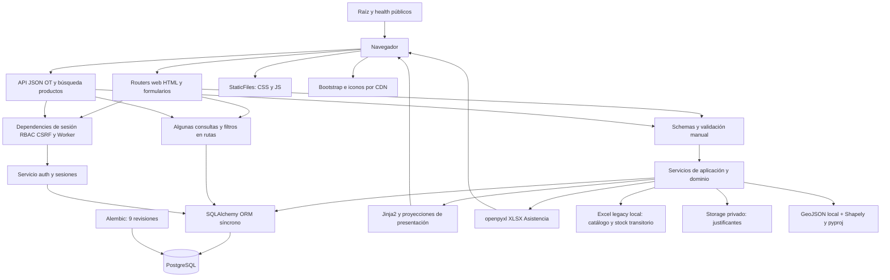
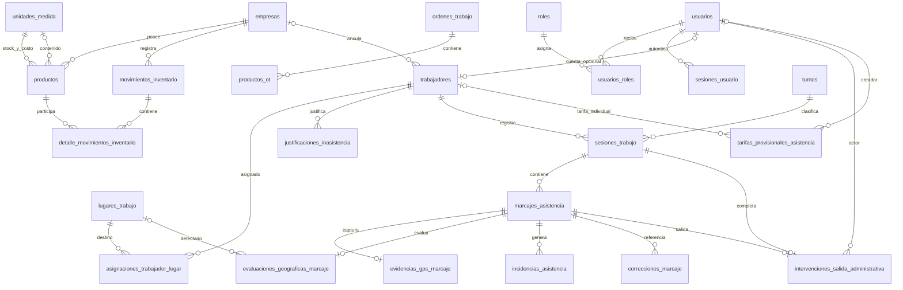

# PROJECT TECHNICAL BASELINE — BOLIKLOR

## 1. Propósito del documento

Fotografía técnica del repositorio `boliklor_ot_backend`, realizada el **7 de septiembre de 2026**, para entregar una base contrastable a una auditoría independiente de arquitectura, seguridad, calidad y Skills. Describe el árbol de trabajo observado, no certifica producción ni sustituye revisar el código. No implementa cambios funcionales.

| Dato | Evidencia del levantamiento |
| --- | --- |
| Rama | `main`, consultada con Git |
| HEAD | `e4251dc0f7a1085f4f24d64e92dfc6771755df3a`; cierre documental de Asistencia 4B-3 |
| Estado inicial | ` M CURRENT.md`; modificación preexistente que se conserva. Por ello, las decisiones de continuidad descritas aquí no están todas en HEAD |
| Head Alembic del repositorio | `20260902_09`, cadena lineal de nueve revisiones; corroborada por la prueba estática de migraciones |
| Revisión aplicada en DB | **NO VERIFICABLE EN ESTA TAREA**. `CURRENT.md` registra una comprobación previa del 07-09-2026 en `20260902_09`; no se ejecutó `alembic current` ni se conectó a PostgreSQL |
| Python requerido | README pide Python 3; no hay `requires-python`, `.python-version` ni versión mínima formal del proyecto. La sintaxis usa características de Python 3.10; metadata local de `pyproj==3.7.2` exige Python >=3.11 |
| Python observado | `.venv/Scripts/python.exe`: **3.14.7**. No equivale a una versión mínima o matriz soportada |
| Dependencias principales | FastAPI, Uvicorn, Pydantic, SQLAlchemy 2, Psycopg 3, Alembic, Jinja2, openpyxl, Argon2, python-multipart, python-dotenv, Shapely y pyproj; detalle en §7 |
| Validación actual | `unittest`: 209 descubiertas, **206 aprobadas, 3 omitidas**, sin fallos, 27,424 s; entorno SQLite aislado (§15) |

### Método y límites de evidencia

Se inventariaron los archivos del proyecto con `rg --files --hidden`, excluyendo `.git`, `.venv`, cachés y datos privados; se leyeron fuentes y se contrastaron imports, rutas, clases, constraints, servicios, templates, scripts, tests, documentación e historial Git. La exploración estructural cubrió 217 archivos de texto bajo las carpetas principales antes de este informe: `app` 112, `tests` 21, `alembic` 11, `docs` 57, `.codex` 11 y `frontend` 5, además de los documentos/configuraciones raíz. No todos requieren la misma profundidad: lógica y controles críticos se revisaron directamente; inventarios y búsquedas estructurales complementan la lectura de assets y tests.

No se inspeccionaron valores secretos de `.env`, documentos laborales, dumps ni el XLSX privado actualizado. No se consultó Internet, el remoto Git, un servidor desplegado ni una base real. Las versiones instaladas se obtuvieron de metadata local. No hubo escaneo CVE, prueba de carga, navegador real o medición de cobertura de líneas. La procedencia SUBDERE se describe según el artefacto y sus documentos locales, sin revalidar el proveedor externo.

Estados utilizados:

| Estado | Interpretación |
| --- | --- |
| `[IMPLEMENTADO]` | Existe comportamiento demostrable en código; no implica despliegue ni completitud del módulo |
| `[PARCIALMENTE IMPLEMENTADO]` | Hay estructura o una parte del flujo, pero falta el proceso completo |
| `[DOCUMENTADO / PLANIFICADO]` | Está en documentos; no se presenta como comportamiento ejecutable |
| `[CONFIRMADO]` | Decisión explícita o comprobación identificada; se indica si es evidencia histórica documental |
| `[PROPUESTO]` | Candidata futura, sin aprobación o implementación acreditada |
| `[DESCONOCIDO / NO VERIFICABLE]` | Falta evidencia suficiente o queda fuera de la inspección autorizada |
| `[PENDIENTE]`, `[DEUDA_TECNICA]` | Brecha o hallazgo observable; no autorizan correcciones |

En tablas de seguridad se usan IMPLEMENTADO/PARCIAL/AUSENTE/NO DETERMINADO. «Ausente» significa ausente del alcance versionado inspeccionado, no una afirmación sobre servicios externos desconocidos. Se privilegia código sobre documentación. Las evaluaciones cualitativas son juicios preliminares apoyados por las referencias indicadas.

## 2. Resumen ejecutivo del proyecto

Boliklor es una aplicación web interna para centralizar cuentas, trabajadores, asistencia y operaciones de inventario, conservando órdenes de trabajo heredadas. El objetivo empresarial documentado es digitalizar registro, consulta y supervisión operacional mediante un portal común. No hay evidencia de un ERP completo, aplicación móvil nativa, microservicios o plataforma BI desplegada (`README.md`, `ARCHITECTURE.md`, `app/main.py`).

Los usuarios reales del diseño son ADMIN, JEFATURA y TRABAJADOR. Una cuenta y un trabajador son entidades diferentes. ADMIN administra cuentas y operación; JEFATURA supervisa Asistencia; TRABAJADOR registra y consulta su asistencia. La exposición adicional de Inventario por dashboard se trata como discrepancia (§10), no como permiso de negocio confirmado.

| Módulo | Objetivo | Estado | Backend | Frontend | Persistencia | Tests |
| --- | --- | --- | --- | --- | --- | --- |
| Identidad/acceso | Credenciales y acceso | IMPLEMENTADO, base funcional | Auth y administración | Login, temporal, cambio, usuarios | 4 tablas de identidad | 25 métodos junto a RRHH |
| RRHH | Ficha laboral independiente | PARCIALMENTE IMPLEMENTADO | Alta/edición/estado básico | Administración de trabajadores | `trabajadores` | Casos en identidad y asistencia |
| Asistencia | Registro, geocercas y supervisión | IMPLEMENTADO 4B-3; procesos posteriores pendientes | Motor, marcajes, decisiones, tarifas | Portal personal, supervisión, tarifas | 12 tablas del dominio | 116 métodos, 3 PostgreSQL omitidos en esta ejecución |
| Inventario | Catálogo y trazabilidad de existencias | PARCIALMENTE IMPLEMENTADO | Catálogo, importación, recepción, ledger, stock/costos | Productos, recepción, consultas | 5 tablas del dominio | 48 métodos |
| Órdenes de Trabajo | Registrar solicitudes de trabajo | IMPLEMENTADO, legado limitado | Crear/listar/detalle, API | Formulario, revisión, confirmación e historial | 2 tablas | 12 métodos web; persistencia real no ejercitada por esos tests |
| Administración | Gestionar cuentas y parámetros | IMPLEMENTADO como interfaz transversal | Usuarios, trabajadores, lugares, asignaciones, tarifas | `/admin/...` | Usa entidades de los dominios | Distribuidos |
| Reportería/exportación | Consulta y extracción | PARCIALMENTE IMPLEMENTADO | XLSX Asistencia, dashboard, JSON OT/búsqueda | Descargas y vistas | Proyecciones; sin almacén BI | Casos en tarifas/supervisión/web |

Las cantidades por dominio se refieren a 24 tablas ORM totales; administración/reportes no agregan tablas propias. No confundir módulo funcional con paquete Python independiente.

## 3. Alcance funcional actual

### 3.1 Inventario

- `[IMPLEMENTADO]` Catálogos `Empresa`, `UnidadMedida`, `Producto`: SKU global único, empresa propietaria, presentación/unidad stock, unidad contenido opcional, factor, unidad costo, mínimo, tipo, familia y activo. Seeds: BOLIKLOR/ALM y siete unidades; el ORM permite más empresas (`models/empresa.py`, `models/producto.py`, `models/unidad_medida.py`, revisión `20260826_02`).
- `[IMPLEMENTADO]` Alta manual y listado filtrado por empresa/familia/búsqueda/stock; orden natural de SKU. Búsqueda JSON de productos activos por empresa limitada a 12 resultados (`inventario_catalogo_service.py`, `web/products.py`, `api/productos.py`).
- `[IMPLEMENTADO]` Importación desde una ruta local configurada, no upload de libros por navegador. Previsualización, detección de errores/advertencias/conflictos y confirmación que inserta sólo filas `VALIDO`; omite SKU ya existente, no lo sobrescribe y confirma las inserciones juntas (`product_import_service.py`).
- `[PARCIALMENTE IMPLEMENTADO]` «Corregir importación» es análisis de sólo lectura, sin POST que aplique correcciones. Reconstruye stock legacy y contrasta presentaciones, factores y evidencia de costo (`product_import_correction_service.py`, `web/products.py`).
- `[IMPLEMENTADO]` Recepción multinea mediante carrito, validación backend, snapshots y transacción; cabecera con número, empresa, fecha, guía/referencia y observación (`inventario_movimiento_service.create_receipt`).
- `[IMPLEMENTADO]` Ledger técnico de movimientos con seis tipos admitidos; historial/detalle, filtros y cálculo de saldo. `[PARCIALMENTE IMPLEMENTADO]` Sólo recepción tiene creación operacional. Despacho, devolución y ajustes existen como tipos y signos, sin flujo equivalente de creación/confirmación.
- `[PARCIALMENTE IMPLEMENTADO]` `inventory_mode` cambia globalmente a `MODO_OPERATIVO` al encontrar cualquier `AJUSTE_INICIAL`. Antes, las páginas de stock muestran el saldo reconstruido del Excel y separan el saldo del ledger. No hay inicialización operativa desde la página GET `/inventario/inicializacion`.
- `[DEUDA_TECNICA]` `/productos` usa `_legacy_stock_values` incondicionalmente, sin consultar ese modo. Después del cutover podría divergir de `/inventario/stock/...` aunque ambas pantallas parezcan mostrar stock (§30).
- `[IMPLEMENTADO]` Costo de presentación y valor de línea en recepción; promedio agregado de entradas positivas y valorización del saldo positivo en consultas. `[PENDIENTE]` promedio ponderado móvil y snapshot histórico de salida, aprobados en CURRENT pero aún no implementados.
- `[PENDIENTE]` Bodegas, compensaciones, actor del ledger, permisos granulares, devolución ligada a despacho, Guía SII estructurada y exportaciones. Lotes/vencimientos/FIFO/FEFO no existen y CURRENT los **excluye del MVP vigente**.

OT no consume stock: `ProductoOT` es una línea descriptiva histórica sin FK a `Producto` ni relación con `MovimientoInventario`. No hay reserva, descuento o despacho automático por confirmar OT.

### 3.2 Órdenes de Trabajo

`web/work_orders.py` ofrece nueva orden → parseo de formulario → validación → revisión sin persistencia → confirmación que vuelve a validar → `crear_orden` → cabecera y líneas → respuesta 201 → historial/detalle. La pantalla web acepta Mostazal/Colina, al menos una línea no vacía, descripción/unidad/cantidad y cantidad positiva finita. Calcula pedido con `date.today()` y entrega dos días calendario después; estas fechas se recomputan al confirmar.

La API `/api/ordenes-trabajo` admite más campos que el formulario y no replica todas sus restricciones: el schema no limita comuna a las dos opciones ni comprueba orden cronológico de fechas. `numero_ot_seq` empieza en 13 según la migración inicial. `[IMPLEMENTADO]` persistencia, listados y respuesta JSON. `[AUSENTE]` exportación OT XLSX/PDF, notificación/email, workflow completo de estados, modificación histórica o integración de stock. El campo `estado` es texto opcional, no una máquina de estados implementada.

### 3.3 Asistencia

`[IMPLEMENTADO]` Un trabajador activo ligado a una cuenta puede consultar calendario, crear/listar justificantes y marcar ENTRADA/SALIDA. El endpoint de marcaje exige además rol TRABAJADOR. Identidad autenticada determina el trabajador; el formulario no puede imponer otro trabajador, sesión, lugar u hora oficial (`web/attendance.py`, `core/security.py`, `schemas/attendance.py`).

El trabajador elige un turno activo al entrar; la salida usa la sesión abierta. El servidor fija la hora UTC y la fecha local de entrada como fecha operacional. Hay una sola sesión abierta por trabajador y múltiples sesiones cerradas por día; no hay cierre automático al cruzar medianoche. GPS se captura bajo demanda con precisión y timestamp del dispositivo, separado de hora oficial y evaluación backend. Precisión baja/fuera de zona generan incidencias sin eliminar el hecho; GPS inválido o ausente se rechaza (§12).

`[IMPLEMENTADO]` Geocercas RADIO/COMUNA, 13 geometrías versionadas, evaluación de todas las zonas activas independientemente de asignaciones, tolerancia exterior y selección determinística. Las asignaciones históricas existen, pero no planifican asistencia ni restringen la zona detectada.

`[IMPLEMENTADO]` Calendario personal con actividad, incompletos, fechas trabajadas y detalle sin coordenadas. No infiere ausencia sin planificación. ADMIN/JEFATURA disponen de búsqueda, período, paginación, calendario/detalle individual, resolución final de incidencias y creación auditada de una SALIDA faltante. No se edita una SALIDA ya existente y la intervención no fabrica GPS (`attendance_admin_service.py`).

`[IMPLEMENTADO]` Proyección provisional de jornadas: una DIURNO y una NOCTURNO como máximo por fecha con actividad, incluso si incompleta o con incidencia. Tarifas globales/individuales versionadas, prevalencia individual, total provisional, administración sólo ADMIN y exportación XLSX ADMIN/JEFATURA. No son liquidaciones de remuneraciones ni descuentos, horas extra o pagos definitivos.

`[PARCIALMENTE IMPLEMENTADO]` Justificaciones tienen estados/modelo de revisión, pero sólo creación, listado y archivo personal como flujo web. `CorreccionMarcaje` existe como tabla histórica genérica, sin un flujo operacional genérico de edición de hechos. No confundirla con `IntervencionSalidaAdministrativa`, que sí está utilizada.

`[PENDIENTE]` Planificación laboral, ausencias confirmadas, revisión completa de justificaciones, alertas, antifraude/offline, política de retención/acceso GPS y remuneración definitiva.

### 3.4 Recursos Humanos

`[IMPLEMENTADO]` Trabajador con nombres/apellidos, código interno opcional único, empresa opcional, activo y usuario opcional único. Alta/edición/activación mediante formulario; una cuenta ADMIN puede existir sin trabajador. Desactivar trabajador no desactiva automáticamente la cuenta, pero `worker_for_user` impide su acceso laboral (`identity_admin_service.py`, `attendance_service.py`, `admin/worker_form.html`).

`[DOCUMENTADO / PLANIFICADO]` RRHH es dueño conceptual de trabajador. `[DEUDA_TECNICA]` modelo y administración siguen en identidad. Contratos, cargo, área, jerarquías, vacaciones, licencias como proceso laboral, onboarding/offboarding y versiones de ficha no están implementados (`docs/product/human-resources/*.md`). Los justificantes de Asistencia no equivalen a gestión integral de licencias.

### 3.5 Administración

`[IMPLEMENTADO]` ADMIN lista/crea/edita trabajadores; lista/crea cuentas, vincula trabajador al crear cuenta, genera/restablece temporal y activa/desactiva usuario. Se bloquea desactivar al último ADMIN activo mediante una consulta de servicio. No hay edición genérica de roles/usuario existente expuesta por el router.

ADMIN crea/edita/activa lugares y crea/lista asignaciones con vigencia; administra tarifas en router separado. No hay CRUD web general de empresas/unidades ni UI de modificación de configuración de entorno. Los lugares tienen validaciones de tipo, coordenadas y configuración geográfica; asignaciones dependen de checks DB para vigencia y no cuentan con detección de solapamientos (`web/admin.py`, `attendance_service.py`).

## 4. Arquitectura actual

`[IMPLEMENTADO]` Monolito por capas técnicas, una instancia FastAPI que compone routers. `[PROPUESTO]` Monolito modular por dominios como evolución. Las carpetas actuales no materializan módulos independientes con interfaces cerradas.



### 4.1 Arquitectura frontend

HTML servido por Jinja2, Bootstrap 5.3.8, Bootstrap Icons 1.13.1, CSS propio y JavaScript sin bundler. Formularios tradicionales; búsqueda de recepción mediante `fetch`. Marcaje depende de Geolocation API. No hay SPA activa ni framework cliente; `frontend/` es histórico.

### 4.2 Arquitectura backend

`app/main.py` crea `FastAPI(title="Boliklor OT API", version="0.1.0")`, valida configuración auth, registra 9 routers web y 2 API y monta `/static`. Las rutas combinan `def` y `async def`; incluso algunas async invocan ORM síncrono. No hay workers de tareas, colas o bus de eventos en el árbol. Se conservan `/docs`, `/redoc` y OpenAPI por defecto.

### 4.3 Arquitectura de persistencia

`app/database/session.py` carga `.env` desde raíz, exige `DATABASE_URL` y crea engine con `pool_pre_ping=True`. `SessionLocal` usa `autoflush=False`, `expire_on_commit=False`; `get_db` abre/cierra sesión por dependencia. No abre una transacción empresarial uniforme: servicios hacen `commit`/`rollback`. Las pruebas usan SQLite temporal/en memoria; producción está orientada a PostgreSQL/Psycopg y secuencias.

### 4.4 Arquitectura de autenticación

Sesiones opacas persistidas, no JWT. `auth_service.py` verifica Argon2 y emite tokens aleatorios; sólo HMAC-SHA256 de token/CSRF se guarda en DB. Resolver sesión comprueba revocación, expiración y usuario activo; actualiza `last_seen_at` con commit, también en solicitudes GET.

### 4.5 Arquitectura de autorización

Mapa `ROLE_PERMISSIONS` en Python y dependencias al incluir routers. `require_platform_access` aplica sesión, cambio obligatorio y CSRF en métodos no seguros; `require_module` verifica permiso. `require_role`, `require_permission` y `require_active_worker` refinan casos. No es un middleware global de seguridad: raíz, health y documentación automática no reciben estos guards. El sidebar comprueba roles, no el mapa de permisos.

### 4.6 Arquitectura de servicios

Predominan funciones con `Session` explícita y excepciones específicas derivadas de `ValueError`/`RuntimeError`. Asistencia separa motor puro de proyecciones, adaptadores ORM, transacciones y exportación. Inventario separa catálogo/movimientos/stock/importación; filtros y algunas reglas siguen en rutas. No hay capa repository independiente ni unit of work formal (§14, §23).

### 4.7 Arquitectura de templates

`base.html` aporta assets/meta CSRF; sidebar, topbar y notificaciones se incluyen por página. Cada router crea su propio `Jinja2Templates` y filtros locales; no hay registro único de entorno/filtros. Templates reciben proyecciones y también objetos ORM. No se encontraron consultas SQL explícitas en templates; el uso de objetos ORM sí merece revisar lazy loads. Varias plantillas están concentradas en una sola línea.

### 4.8 Arquitectura de exportación/reportes

`attendance_export_service.py` consume exactamente las proyecciones de supervisión; libro `write_only`, carga conjunta por lotes de trabajadores, limpieza de texto Excel y respuesta XLSX. El resultado final se materializa en `BytesIO` y `Response`: **no** es streaming HTTP de memoria constante. Dashboard e inventario consultan agregados en aplicación; no hay almacén analítico.

### 4.9 Arquitectura de migraciones

Alembic usa `Base.metadata` importando `app.models`; `env.py` configura URL desde entorno y `NullPool` al migrar. Cadena lineal con DDL y seeds/backfills; algunas revisiones requieren leer datos y rechazan rollback incompatible. El código no llama `create_all` al arrancar; `create_all` aparece como preparación de tests aislados.

### 4.10 Arquitectura de tests

Biblioteca estándar `unittest`, mocks y cliente ASGI manual que invoca la app sin servidor. SQLite para integración local, fixtures sintéticos y storage temporal. Tres tests opcionales usan PostgreSQL desechable ya migrada; la suite estática de migraciones no aplica Alembic. No hay CI ni tests E2E de navegador versionados (§15).

## 5. Flujo de una solicitud

### 5.1 Recepción de Inventario

| Paso | Archivo / símbolo | Comportamiento |
| --- | --- | --- |
| Usuario/formulario | `app/templates/inventory/receipt.html` | Empresa, búsqueda, cantidades, costos y referencias |
| Mejora cliente | `app/static/js/inventory-receipt.js` | Consulta `/api/productos/buscar`, carrito en memoria; calcula preview con Number |
| Composición/seguridad | `app/main.py`; `require_module("INVENTARIO_ACCESS")` | ADMIN en mapa vigente; auth, temporal y CSRF antes del endpoint |
| Entrada web | `app/web/inventory.py:receipt_create`, `_form`, `_receipt_from_form` | POST urlencoded; fecha `date.today()`; construye líneas con Decimal |
| Schema | `LineaRecepcionCreate`, `RecepcionCreate` | Cantidad/costo >0 y al menos una línea |
| Servicio | `inventario_movimiento_service.create_receipt` | Carga productos/unidades, valida empresa y cantidades enteras cuando corresponde |
| Costo/número | `calculate_receipt_cost`, `_next_movement_number` | Conversión según unidad de costo, cuantización de total a 0,01; secuencia `movimiento_inventario_seq` |
| Persistencia | `MovimientoInventario`, `DetalleMovimientoInventario` | Cabecera RECEPCION y detalles snapshot; un commit, rollback en rechazo/error |
| Respuesta | `get_movement`; `inventory/receipt_success.html` | 201 HTML, movimiento confirmado; 422 de validación o 500 seguro para fallo inesperado |
| Lectura posterior | `inventory_stock_rows` | Registra saldo técnico; la recepción por sí sola no cambia modo ni incrementa el stock legacy mostrado |

No hay reserva ni idempotency key. Que el carrito prevenga ciertos errores no reemplaza validación backend. `create_receipt` no comprueba explícitamente `activo` de producto/empresa/unidad; la búsqueda sí filtra productos activos, por lo que esa elegibilidad no es una garantía del servicio.

### 5.2 Marcaje personal

| Paso | Archivo / símbolo | Comportamiento |
| --- | --- | --- |
| Estado/formulario | `attendance/register.html`, `get_attendance_registration_state` | Muestra sesión y única acción disponible; turno sólo al entrar |
| GPS | `app/static/js/attendance-register.js` | Al enviar: `getCurrentPosition`, alta precisión, timeout 15 s, maximumAge 0; no watchPosition ni tracking |
| Guard | `main.py`, `require_module`, `require_active_worker`, `require_role` | Sesión, CSRF, permiso propio, Worker activo y TRABAJADOR |
| Router | `web/attendance.py:register_submit` | Rechaza campos repetidos y separa CSRF del payload |
| Validación | `AttendanceMarkForm`, `EvidenciaGPSCreate` | Extra forbid; tipo/turno coherentes; coordenadas y precisión limitadas, no 0,0, timestamp con zona |
| Evaluación | `register_attendance_mark` → `evaluate_geolocation` | Hora servidor; zonas activas; RADIO/COMUNA y snapshot de reglas |
| Transacción | `_locked_worker`, `_open_session` | Lock de trabajador/sesión; crea entrada o verifica salida mínima y sesión propia |
| ORM/PostgreSQL | Sesión, marcaje, GPS, evaluación, incidencias | Constraints más lock; commit único de hecho/evidencia/evaluación/incidencias |
| Respuesta | `get_attendance_mark_feedback`, `_registration_context` | HTML 200 seguro con estado nuevo; 422 entrada inválida, 409 conflicto de dominio |
| Lectura | `calendar_month`, `project_session` | Agrupa por fecha operacional guardada, sin cambiar hechos ni mostrar GPS preciso |

### 5.3 Completar SALIDA y exportar

`attendance/supervision_day.html` → POST `/asistencia/supervision/sesiones/{session_id}/completar-salida` → permiso/CSRF → `AdministrativeExitForm` (interpreta fecha local sin zona con APP_TIMEZONE) → `complete_administrative_exit` (lock y revalidación de sesión/marcajes) → SALIDA nueva + `IntervencionSalidaAdministrativa` + cierre → commit → redirect 303 al día. Hora laboral introducida y fecha de intervención son conceptos separados. No modifica turno/fecha operacional/ENTRADA.

Para exportar: GET protegido → `supervision_period` → `build_combined_attendance_xlsx` o `export_worker_attendance` → consultas de supervisión y `project_period` → `safe_excel_text` → XLSX. La selección de trabajador en supervisión es intencionalmente privilegiada; no usa el endpoint personal ni permite al trabajador consultar otros IDs.

## 6. Estructura del repositorio

```text
.
|-- AGENTS.md / ARCHITECTURE.md / CURRENT.md / README.md
|-- .env.example / .gitignore / requirements.txt / alembic.ini
|-- .codex/skills/              11 Skills, cada una con SKILL.md
|-- app/
|   |-- AGENTS.md / main.py
|   |-- api/                   ordenes.py, productos.py
|   |-- core/                  config.py, security.py, time.py
|   |-- database/              base.py, session.py
|   |-- models/                identity, attendance, empresa, unidad_medida,
|   |                          producto, movimiento_inventario, orden_trabajo, producto_ot
|   |-- schemas/               identity, attendance, inventario, movimiento_inventario, orden_trabajo
|   |-- services/              auth, identity_admin, attendance_* (9), catálogo,
|   |                          movimientos, stock, importación/corrección, OT
|   |-- web/                   auth, admin, attendance, attendance_supervision,
|   |                          attendance_rates, dashboard, inventory, products, work_orders
|   |-- templates/             base, partials, auth, admin, attendance,
|   |                          dashboard, inventory, products, work_orders
|   |-- static/                css/styles.css; js/*.js; img/logo-boliklor.jpg
|   |-- data/geofences/         GeoJSON comunal y SOURCE.md
|   `-- scripts/               create_admin.py, derive_attendance_communes.py
|-- alembic/                    AGENTS.md, env.py, script.py.mako, versions/ (9)
|-- tests/                      AGENTS.md, 20 test_*.py
|-- frontend/                  AGENTS.md, login/dashboard HTML, assets CSS/JS históricos
`-- docs/
    |-- architecture/          12 documentos
    |-- product/               attendance (7), human-resources (6), inventory (8)
    |-- decisions/             ADR-001 a ADR-005
    |-- plans/active/           roadmap.md, early-production.md
    |-- operations/            4 procedimientos/checklists
    |-- standards/             10 estándares
    |-- security/              risk-register.md
    |-- audit/                 phase-0-audit.md, attendance-4a-baseline.md
    |-- audits/                PROJECT_TECHNICAL_BASELINE.md (este documento)
    `-- asistencia_decisiones.md
```

`app` contiene ejecución, `alembic` historial desplegable, `tests` comprobaciones aisladas y `docs` decisiones/contratos/procedimientos. `.codex/skills` contiene instrucciones para agentes, no módulos de la app. `frontend` no se monta. La coexistencia de `docs/audit` histórico y `docs/audits` nuevo responde a la ruta solicitada; no se movió documentación previa. `storage` y `output` son destinos locales ignorados, no evidencia de infraestructura provisionada. No hay una carpeta raíz `templates` activa.

## 7. Inventario técnico

### Backend

| Tecnología | Uso | Restricción en requirements / versión local | Evidencia |
| --- | --- | --- | --- |
| Python | Runtime | Sin mínimo formal / 3.14.7 | README, intérprete `.venv` |
| FastAPI | App, routers, dependencies, OpenAPI | Sin fijar / 0.141.1 | `requirements.txt`, `app/main.py` |
| Uvicorn | Servidor ASGI | Sin fijar / 0.52.4 | requirements, comando README |
| Pydantic | Validación/serialización | Sin fijar / 2.13.4 | `app/schemas`; usa API v2 |
| SQLAlchemy | ORM síncrono | >=2.0,<3.0 / 2.0.52 | `app/database`, `app/models` |
| Psycopg binary | Driver PostgreSQL | >=3.0,<4.0 / 3.3.4 | requirements, `.env.example` |
| Alembic | Migraciones | >=1.13,<2.0 / 1.19.1 | `alembic.ini`, `alembic` |
| python-dotenv | Configuración local | >=1.0,<2.0 | session.py, env.py |
| Jinja2 | HTML servidor | >=3.1,<4.0 / 3.1.6 | Routers web |
| openpyxl | Leer legacy y escribir XLSX | >=3.1,<4.0 / 3.1.5 | Servicios import/export |
| argon2-cffi | Password hashing | >=23.1,<26.0 / 25.1.0 | `auth_service.py` |
| python-multipart | Parseo multipart | >=0.0.20,<1.0 / 0.0.32 | `request.form`, uploads |
| Shapely | Polígonos/geocercas | ==2.1.2 / 2.1.2 | `attendance_geofence_service.py` |
| pyproj | Transformación CRS | ==3.7.2 / 3.7.2 | Servicio geográfico/script |
| unittest | Framework de pruebas | Biblioteca estándar | 20 archivos test |
| pytest | Sin uso observado | No declarado | requirements y tests |

Las versiones locales no son un lockfile. No hay pinning completo ni separación de dependencias dev/runtime. `zoneinfo` requiere datos de timezone: el entorno local tiene `tzdata 2026.3`, pero requirements no lo declara explícitamente; revisar instalación reproducible especialmente en Windows. No se consultaron vulnerabilidades conocidas de estas versiones.

### Frontend

| Tecnología | Uso | Evidencia |
| --- | --- | --- |
| HTML5/Jinja2 | Formularios/layout/SSR | `app/templates` |
| Bootstrap 5.3.8 | Layout, modal, toast, responsive | `base.html` carga CDN jsDelivr |
| Bootstrap Icons 1.13.1 | Iconografía | `base.html` |
| CSS propio | Tokens, identidad visual, tablas, calendario | `static/css/styles.css` |
| JavaScript nativo | Sidebar, CSRF, carrito, GPS, formularios | `static/js` |
| fetch | Búsqueda de producto | `inventory-receipt.js` |
| Geolocation API | GPS puntual | `attendance-register.js` |

No se observaron `package.json`, npm build, TypeScript, React/Vue o pipeline de assets. Los assets CDN no incluyen `integrity` en `base.html`; su disponibilidad es una dependencia del navegador.

### Base de datos

PostgreSQL es el destino configurado por ejemplo y por documentación. ORM sin schemas PostgreSQL separados declarados; usa nombres de tabla en el esquema por defecto. 24 tablas de aplicación, IDs enteros, `Numeric` para dinero/cantidades, `DateTime(timezone=True)`, FKs y checks. `alembic_version` es adicional y no cuenta como entidad ORM. No hay PostGIS: las geometrías están en GeoJSON y se procesan en Python.

`CURRENT.md` documenta PostgreSQL 18.6 y un inventario local de 150 productos y una recepción. Es evidencia histórica reportada, **no conteo ni versión verificados en esta tarea**; el informe no depende de esos datos para afirmar reglas.

### Infraestructura

`[IMPLEMENTADO]` Código ejecutable por Uvicorn, configuración vía entorno, archivos estáticos y storage privado en filesystem. `[DOCUMENTADO / PLANIFICADO]` arranque local, proxy/HTTPS, staging, backups y despliegue progresivo. No hay Dockerfile/Compose, workflows CI/CD, systemd, manifiestos cloud, Nginx o Caddy versionados. VPS, dominio, certificados, proveedor, número de procesos y servicio operativo permanecen no verificables. El procedimiento manual de backup sí existe; automatización no (§18).

## 8. Modelo de datos

Todas las entidades de la siguiente tabla están `[IMPLEMENTADO]` como ORM. Eso no significa que todas tengan flujo operacional público.

| Entidad / tabla | Propósito | Relaciones principales | Módulo |
| --- | --- | --- | --- |
| `Empresa` / `empresas` | Propiedad operacional | Productos, movimientos, trabajadores | Inventario compartido por referencia |
| `UnidadMedida` / `unidades_medida` | Presentación/contenido/costo | Tres FKs desde producto | Inventario |
| `Producto` / `productos` | Catálogo maestro | Empresa, unidades, detalles de movimiento | Inventario |
| `MovimientoInventario` / `movimientos_inventario` | Cabecera ledger | Empresa, detalles | Inventario |
| `DetalleMovimientoInventario` / `detalle_movimientos_inventario` | Cantidad y snapshots | Movimiento, producto | Inventario |
| `OrdenTrabajo` / `ordenes_trabajo` | Pedido/orden legado | Líneas ProductoOT | OT |
| `ProductoOT` / `productos_ot` | Descripción histórica de línea | Orden; sin FK a catálogo | OT |
| `Usuario` / `usuarios` | Credencial/estado de cuenta | Roles, sesiones, trabajador opcional | Identidad |
| `Rol` / `roles` | Código/nombre/activo | Usuarios vía asociación | Identidad |
| `UsuarioRol` / `usuarios_roles` | Unión N:M | Usuario y rol únicos por par | Identidad |
| `SesionUsuario` / `sesiones_usuario` | Token/CSRF hasheados y vigencia | Usuario | Identidad |
| `Trabajador` / `trabajadores` | Ficha básica | Cuenta y empresa opcionales; asistencia | RRHH conceptual, `identity.py` físico |
| `LugarTrabajo` / `lugares_trabajo` | Centro/zona y configuración | Asignaciones, evaluaciones | Asistencia |
| `AsignacionTrabajadorLugar` / `asignaciones_trabajador_lugar` | Vínculo histórico con vigencia | Trabajador, lugar, usuario creador | Asistencia |
| `Turno` / `turnos` | Catálogo turno factual | Sesiones | Asistencia |
| `JustificacionInasistencia` / `justificaciones_inasistencia` | Justificación y metadata de archivo | Trabajador, revisor opcional | Asistencia |
| `SesionTrabajo` / `sesiones_trabajo` | Actividad por turno/fecha | Trabajador, turno, marcajes, intervención | Asistencia |
| `MarcajeAsistencia` / `marcajes_asistencia` | ENTRADA/SALIDA factual | Sesión, GPS, evaluación, incidencias/correcciones | Asistencia |
| `EvidenciaGPSMarcaje` / `evidencias_gps_marcaje` | Captura puntual | Marcaje único | Asistencia |
| `EvaluacionGeograficaMarcaje` / `evaluaciones_geograficas_marcaje` | Evaluación/snapshot | Marcaje único y lugar opcional | Asistencia |
| `IncidenciaAsistencia` / `incidencias_asistencia` | Señal y resolución final | Marcaje y actor de resolución | Asistencia |
| `CorreccionMarcaje` / `correcciones_marcaje` | Estructura genérica de corrección | Marcaje y actor | Asistencia, flujo genérico pendiente |
| `IntervencionSalidaAdministrativa` / `intervenciones_salida_administrativa` | Completar salida auditable | Sesión, SALIDA mediante FK compuesta, actor | Asistencia |
| `TarifaProvisionalAsistencia` / `tarifas_provisionales_asistencia` | Versión monetaria efectiva | Trabajador opcional, actor según origen | Asistencia |

Evidencia: `app/models/__init__.py` y sus ocho archivos de entidades; constraints en `identity.py`, `attendance.py`, `movimiento_inventario.py` y revisiones correspondientes.



El ER simplifica las FKs de actores de asignación/revisión/corrección. Las relaciones GPS/evaluación se muestran opcionales desde el marcaje: una SALIDA administrativa carece de ellas, y la FK no fuerza que todo marcaje posea evidencia. Los mínimos de líneas/sesiones se validan en servicios; la cardinalidad ORM no exige un hijo. No hay relación OT–Producto, bodega, lote o nómina que deba dibujarse como existente.

## 9. Migraciones y estado del esquema

| Revisión | Predecesora | Cambio principal | Total acumulado de tablas app |
| --- | --- | --- | ---: |
| `20260826_01` | ninguna | OT, líneas, secuencia de negocio desde 13 | 2 |
| `20260826_02` | `_01` | Empresas/unidades/productos; seeds 2 empresas y 7 unidades | 5 |
| `20260827_03` | `_02` | Movimientos/detalles, secuencia desde 1 | 7 |
| `20260828_04` | `_03` | Usuario, rol, asociación, trabajador, sesiones; seeds roles | 12 |
| `20260829_05` | `_04` | Flag e índice de contraseña temporal | 12 |
| `20260830_06` | `_05` | Lugares, turnos, asignaciones, justificaciones y seeds | 16 |
| `20260831_07` | `_06` | Sesiones, marcajes, GPS, evaluación, incidencias, correcciones | 22 |
| `20260901_08` | `_07` | RADIO/COMUNA, precisión de lugares, índices/backfill/13 zonas | 22 |
| `20260902_09` | `_08` | Intervenciones y tarifas; resolución de incidencias | 24 |

Evidencia: `alembic/versions/*.py`; sufijos de la columna predecesora abrevian la revisión completa de la fila anterior. No hay branches/merge revisions. Convenciones `ck_`, `uq_`, `ix_`, FKs RESTRICT/CASCADE/SET NULL según entidad, seeds deterministas y timestamps con timezone. Las secuencias de negocio las crean migraciones y las consumen servicios; no basta `Base.metadata.create_all` para reproducir toda la aplicación PostgreSQL.

En `_09`, la migración comprueba estados/coherencia históricos, transforma `RESUELTA → APROBADA` y `DESCARTADA → RECHAZADA`, exige actor/timestamp para decisión final y crea una tarifa de sistema global **30.000 CLP desde 2026-09-01**. Índices únicos parciales por fecha global y por trabajador/fecha; FK compuesta enlaza intervención con el marcaje SALIDA de la misma sesión.

Rollback es condicionado: `_08` rechaza downgrade si hay evaluaciones COMUNA/tolerancia; `_09` lo rechaza si hay intervenciones o tarifas distintas del único seed esperado. Las revisiones iniciales borran tablas al bajar; no deben describirse como reversión sin pérdida. `_08` reduce precisión de coordenadas al bajar y no elimina automáticamente todas las filas comunales insertadas; rollback estructural no implica restauración exacta de datos previos.

`[CONFIRMADO EN ESTA TAREA]` Test de cadena lineal, tablas con migración creadora e integridad SHA-256 normalizada de las seis revisiones iniciales: aprobado. Esta prueba **no** compara cada columna/default/índice con una instancia real. No se observó desalineación nominal evidente entre las entidades principales y las últimas revisiones; no se certifica paridad completa.

`[CONFIRMADO HISTÓRICO DOCUMENTAL]` `docs/operations/migration-validation.md` y CURRENT registran gates PostgreSQL, `alembic check` sin drift, upgrades/rollbacks, locks y restore. No se reprodujeron aquí. Los documentos que dicen siete/ocho revisiones o 22 tablas como estado vigente están obsoletos. Nunca se editaron/aplicaron migraciones en este levantamiento.

## 10. Autenticación, usuarios y autorización

`Usuario` guarda username normalizado, hash, activo, temporal obligatoria y timestamps. El índice funcional único usa `lower(username)`; servicio usa `strip().casefold()`. Los roles se persisten con relación N:M, aunque alta administrada selecciona uno. `role_codes` incluye códigos de todos los roles relacionados y `primary_role` prioriza ADMIN/JEFATURA/TRABAJADOR. No filtra `Rol.activo` al comprobar permisos de una sesión existente; sí al crear cuentas.

Argon2id se utiliza mediante `PasswordHasher(time_cost=3, memory_cost=65536, parallelism=4)`; mínimo 12 caracteres. Login valida longitud máxima 1024 para password, usa hash dummy si usuario no existe y mensaje genérico para rechazo. No se usa `check_needs_rehash` ni se observa rate limit/MFA.

Login GET emite cookie CSRF de formulario de 600 s; POST compara token/cookie. Tras autenticar, genera tokens sesión/CSRF de 48/32 bytes de entrada a `token_urlsafe`, persiste sus HMAC-SHA256 con `SESSION_SECRET`, y emite cookies HttpOnly/SameSite=Lax/path `/`. `Secure` depende de `COOKIE_SECURE` (default false). Duración por defecto 12 h; expiración absoluta, sin extensión automática por actividad. Logout revoca y borra cookies.

Cuenta administrada: temporal aleatoria `token_urlsafe(18)` mostrada en respuesta de alta/reset, guardada sólo como hash; obliga cambio antes de otros módulos. Reset revoca todas las sesiones; cambio propio exige password actual, nueva distinta y confirmación; revoca las demás sesiones pero conserva token/CSRF de la actual. No hay recuperación autoservicio/email, registro público ni claves API. `create_admin.py` es un script interactivo que persiste un ADMIN, no ejecutado aquí.

`validate_security_config` exige autenticación por defecto, entorno válido, booleanos válidos y secreto no vacío con auth activa. Sólo permite bypass en development/test. No exige longitud/entropía del secreto ni `COOKIE_SECURE=true` en producción: son estándares/documentación, no garantías de arranque completas.

Matriz para cuentas activas **con un solo rol**, auth activa y contraseña ya cambiada:

| Funcionalidad | ADMIN | JEFATURA | TRABAJADOR |
| --- | ---: | ---: | ---: |
| Login/logout/cambiar password | Sí | Sí | Sí |
| `/dashboard` | Sí | **Sí, incluye datos Inventario** | Redirige a mi-asistencia |
| Catálogo/búsqueda/recepción/stock/costos | Sí | No | No |
| OT web/API | Sí | No | No |
| Usuarios/trabajadores/lugares/asignaciones | Sí | No | No |
| Calendario/justificaciones personales | Sólo con Worker activo asociado | No por permiso de módulo | Sí, Worker activo |
| Marcar ENTRADA/SALIDA personal | No: requiere rol TRABAJADOR adicional | No | Sí, Worker activo |
| Supervisar cualquier trabajador | Sí | Sí | No |
| Completar SALIDA / decidir incidencia | Sí | Sí | No |
| Exportar XLSX de Asistencia | Sí | Sí | No |
| Consultar/crear versiones de tarifa | Sí | No | No |
| Ver tarifa efectiva/total en supervisión | Sí | Sí | No |
| Revisar justificantes mediante UI administrativa | No implementado | No implementado | No implementado |

Fuente: `main.py`, `core/security.py`, `auth_service.ROLE_PERMISSIONS`, routers de Asistencia. ADMIN posee wildcard, pero eso no sustituye el guard específico `require_role("TRABAJADOR")`. Con roles combinados se unen permisos y cambia el comportamiento de landing/sidebar; no debe extrapolarse esta matriz a todos esos casos. No hay alcance por empresa/equipo/bodega para JEFATURA.

`[DEUDA_TECNICA]` Dashboard utiliza `require_platform_access` y, salvo TRABAJADOR puro, consulta/renderiza KPIs y últimos movimientos con valor económico. Por tanto, JEFATURA puede ver información de Inventario aunque el módulo directo se deniegue. La tabla documenta código; no asume que el negocio aprobó esta excepción.

## 11. Seguridad actual

Inventario de controles, no auditoría exhaustiva ni prueba de ausencia de vulnerabilidades.

| Tema | Estado | Evidencia / límite |
| --- | --- | --- |
| Hash passwords | IMPLEMENTADO | Argon2id y dummy hash; `auth_service.py` |
| Sesiones | IMPLEMENTADO | Opacas, HMAC, revocables, expiración; commit por resolución |
| Rotación | PARCIAL | Nuevos tokens al login; cambio conserva sesión actual; no rotación periódica |
| Cookies | PARCIAL | HttpOnly/Lax; Secure configurable, no obligatorio en producción |
| CSRF autenticado | IMPLEMENTADO | Guards comunes en mutaciones; compara hash y cookie; header o formulario |
| CSRF login | IMPLEMENTADO | Double-submit de token aleatorio con cookie temporal |
| Formularios sin JS | PARCIAL | Muchos reciben CSRF vía `static/js/app.js`; sin JS fallan cerrados, no evaden control |
| Autenticación por entorno | IMPLEMENTADO | Default activo; bypass limitado development/test |
| Calidad de secretos | PARCIAL | Ausencia de secreto rechazada; placeholder/longitud débil no se rechazan; `.env` ignorado |
| CORS | AUSENTE | No CORSMiddleware/config explícita en main; no es por sí mismo vulnerabilidad |
| XSS/salida HTML | PARCIAL | Autoescape Jinja y `textContent`/escape JS en flujos observados; no auditoría de todos los sinks/contextos |
| SQL injection | IMPLEMENTADO como patrón | ORM y SQL con binds en migraciones; no interpolación de input usuario en consultas observadas |
| Validación | PARCIAL | Pydantic fuerte en marcaje; otras rutas hacen parseo manual, schemas con campos sin límites y validación distinta web/API |
| RBAC/ownership | PARCIAL | Guards y ownership personal; excepción dashboard, roles combinados/alcances requieren revisión |
| IDOR personal | IMPLEMENTADO como control | Justificación por `(item_id, worker_id)` y sesión laboral resuelta backend; no certificación global |
| Uploads | PARCIAL | Límite por archivo, magic bytes, UUID y storage privado; firma inicial no equivale a parseo/antimalware |
| Descarga privada | IMPLEMENTADO | Ruta con Worker/ownership, basename y contención de path; `FileResponse` |
| Exportaciones | IMPLEMENTADO para Asistencia | RBAC y proyecciones sin GPS; datos laborales/nombres siguen siendo sensibles |
| Fórmulas Excel | IMPLEMENTADO | `safe_excel_text`: limpia controles XML y antepone apóstrofo a prefijos `= + - @` tras lstrip |
| Headers de seguridad | AUSENTE explícitamente | No CSP/HSTS/frame policy central ni TrustedHost/proxy policy en aplicación |
| Cache de páginas sensibles | NO DETERMINADO extremo a extremo | No política general `Cache-Control: no-store` explícita para temporal/exports; proxy desconocido |
| API keys / JWT / MFA | AUSENTE | No hay flujos/implementación encontrados |
| Rate limiting / bloqueo login | AUSENTE | Ni app ni proxy versionado |
| Logging sensible | PARCIAL | Logs puntuales; `logger.exception` puede incluir excepción SQLAlchemy y parámetros; no redactor central |
| Errores | PARCIAL | Mensajes seguros en muchos fallos; mezcla HTML/JSON, ValueError y excepciones DB no uniformes |
| Auditoría de negocio | PARCIAL | Salida/decisión/tarifa con actor; sin auditoría central de credenciales, catálogo o ledger |
| Retención GPS/documentos | NO DETERMINADO | Preguntas abiertas en docs; no política ni limpieza implementada |
| Antifraude GPS | AUSENTE | Valida rango/precisión; no prueba autenticidad ni antigüedad admisible de captura |

No se inspeccionaron ACL reales de storage, permisos PostgreSQL, secretos locales o TLS. La existencia de SQLAlchemy/autoescape reduce categorías de riesgo, pero no acredita seguridad de toda la aplicación. No se hicieron solicitudes maliciosas a servicios reales.

## 12. Reglas de negocio críticas

### Inventario

| Regla implementada | Archivo / símbolo |
| --- | --- |
| SKU global único; factor >0; mínimo >=0; cantidad detalle >0 | Modelos producto/movimiento, schemas y migraciones `_02`/`_03` |
| `saldo[(empresa_id, producto_id)] = Σ cantidad × signo` | `inventario_movimiento_service.calculate_stock_from_movements` |
| Positivos: RECEPCION, DEVOLUCION, AJUSTE_INICIAL, AJUSTE_POSITIVO; negativos: DESPACHO, AJUSTE_NEGATIVO | `POSITIVE_TYPES`, `NEGATIVE_TYPES` |
| Recepción no permite líneas de otra empresa; respeta `permite_decimales` de unidad stock | `create_receipt` |
| Costo presentación = costo unitario × factor si costo usa unidad contenido; si no, costo unitario | `calculate_receipt_cost` |
| Valor línea = cantidad × costo presentación, cuantizado a 0,01; snapshots preservan unidades/factor/costos | Mismo servicio y `DetalleMovimientoInventario` |
| Promedio actual = suma valor_total de entradas positivas / suma cantidades positivas; valor NULL se toma como cero | `calculate_weighted_average_cost` |
| Valorización agrega stock positivo × promedio; no valoriza saldo <=0 | `inventory_stock_service.transactional_inventory_values` |
| Cualquier ajuste inicial conmuta el modo de todo el sistema de stock | `inventory_mode` |
| En transición el ledger no sustituye un legacy faltante: saldo mostrado cae a cero | `inventory_stock_rows`, `_legacy_values` |
| Legacy = Recepción col.4 − Despacho col.6 + Devoluciones col.4 por SKU | `product_import_correction_service.analyze_legacy_stock` |
| Reposición si stock mostrado <= mínimo; EN STOCK sólo si >0 | `InventoryStockRow` |
| Importación usa maestro y hojas stock; empresa desde prefijo BOL-/ALM-, SACO factor>1 deriva KG | `product_import_service.company_from_sku`, `unit_mapping`, `analyze_product_workbook` |
| Confirmación importación sólo `VALIDO`, omite existentes, no crea unidades implícitas | `import_valid_products` |

`[CONFIRMADO DOCUMENTAL, NO IMPLEMENTADO]` CURRENT exige bodega, no stock negativo, compensación inmutable, actor/motivo, promedio móvil y devolución relacionable. No hay enforcement de stock negativo para flujos de salida todavía inexistentes. Lotes/vencimientos no son reglas ejecutables ni obligación del MVP actual.

### Asistencia

| Regla implementada | Archivo / símbolo |
| --- | --- |
| Worker activo; una ABIERTA por trabajador; entrada duplicada rechazada | `register_attendance_mark`, lock Worker; índice parcial en modelo/revisión `_07` |
| ENTRADA requiere turno activo; SALIDA no permite elegir turno en web | `AttendanceMarkForm`, `register_attendance_mark` |
| Fecha operacional = fecha local de la ENTRADA; cruzar medianoche no cambia fecha ni turno guardados | `core/time.operational_date`, servicio marcaje |
| SALIDA requiere ENTRADA y al menos 5 min; después se puede abrir otra sesión | `attendance_min_session_minutes`, servicio marcaje |
| GPS obligatorio para marcaje personal; límites lat/lon, precisión positiva, no 0,0 | `EvidenciaGPSCreate` |
| `capturada_at` no es hora oficial; no se observa ventana máxima de antigüedad o contraste con hora servidor | Schema/servicio marcaje |
| Todas las zonas activas se evalúan, sin assignments ni selección manual | `_active_places`, `evaluate_geolocation` |
| RADIO usa Haversine, borde incluido; COMUNA usa Polygon/MultiPolygon WGS84 y distancia métrica UTM | `attendance_geofence_service` |
| COMUNA: dentro/borde → DENTRO_RANGO; exterior <=100 m configurable → DENTRO_TOLERANCIA | `_commune_candidate`, configuración |
| Orden: estado, prioridad menor, margen mayor, ID menor | `evaluate_geolocation` |
| >100 m de precisión → BAJA_PRECISION; fuera de rango/GPS baja abren incidencias sin rechazar | `_attach_geolocation` |
| Sin zonas → SIN_ZONA_CONFIGURADA, registro permitido; catálogo requerido inválido → rollback/rechazo seguro | Servicios marcaje/geocerca |
| Sesión con ENTRADA = actividad; sin SALIDA = incompleta; cerrada válida requiere cronología y mínimo | `attendance_rules_service.project_session` |
| Diurno 09:00–18:00; nocturno 19:00–05:00 siguiente día, sin descontar almuerzo | `configured_shift_references`, duración UTC de `project_session` |
| Entrada antes inicio = adelantada; hasta +10 min inclusive = en horario; después tardía | `_entry_situation` |
| Salida antes/exacta/después del fin = anticipada/en horario/posterior; no genera extras ni incidencia automáticamente | `_exit_situation` |
| Referencias horarias clasifican hechos; no reasignan turno ni prueban obligación de asistir | Motor y ausencia de planificación |
| Jornada provisional por turno con actividad, máximo dos por fecha; repetición mismo turno cuenta una vez | `project_day`, `PAYABLE_SHIFT_ORDER` |
| Incompletas/incidencias mantienen jornada pagable provisional; turno desconocido con actividad falla explícitamente | `project_day` |
| Fecha trabajada completa ≠ jornada pagable: basta una cerrada válida para una fecha, pero entrada incompleta ya aporta pagabilidad | `project_session`, `project_day`, `project_period` |
| Tarifa individual vigente prevalece incluso sobre global más reciente; dentro del alcance gana mayor fecha, luego ID | `resolve_effective_rate` |
| No se aplica tarifa futura a día previo; falta de tarifa produce None/etiqueta, no cero inventado | Resolver y supervisión con `allow_missing_rates=True` |
| Total diario = jornadas × tarifa; total período None si algún día proyectado carece de tarifa | `project_day`, `project_period` |
| Tarifas CLP enteras positivas <=999999999999; fecha sin datetime; scope/fecha único | `attendance_rate_service`, modelo `_09` |
| Creación append-only por servicio; no ruta editar/borrar. No hay trigger general de inmutabilidad | Servicio tarifas/modelo |
| Salida administrativa: exactamente una entrada, ninguna salida, >=5 min, motivo, hora con zona, lock y actor | `complete_administrative_exit` |
| No se observa prohibición explícita de salida administrativa futura respecto a la fecha de intervención | Mismo servicio; pregunta de negocio para auditoría |
| Incidencia PENDIENTE → APROBADA/RECHAZADA una sola vez; sin alterar hecho/pagabilidad | `decide_attendance_incident` |
| Supervisión: fechas inclusivas <=366 días, búsqueda <=100 caracteres, páginas de 25 | `supervision_period`, `_normalized_query`, `list_worker_supervision` |
| Listado incluye activos o inactivos con sesión en período; export conjunta mismos filtros, lotes de 200 | `_worker_conditions`, `iter_worker_supervision_summaries` |
| Calendario personal considera incidencias pendientes; supervisión cuenta todos sus estados | `attendance_session_facts` y `_period_projection(incident_states=None)` |
| Ausencia de registros no crea ausencia; justificantes pueden poner día en revisión | `calendar_month` |

El nombre del lugar en supervisión se lee de la entidad actual, mientras estado/distancia/tolerancia/versiones viven en el snapshot. Cambiar el nombre del lugar puede cambiar la etiqueta histórica mostrada sin alterar la evaluación guardada. Es importante distinguir esa presentación de la trazabilidad numérica.

## 13. Endpoints

Catálogo extraído de decoradores de `app/api/*.py`, `app/web/*.py` y montaje en `main.py`. GET/POST se agrupan sólo cuando comparten ruta. La autorización indicada corresponde a auth activa; todos los POST protegidos por módulo heredan CSRF. Anónimo recibe 303 a login en web y 401 en API; permiso insuficiente, 403. Algunas páginas usan 422/409 propios y otras errores menos uniformes.

### API REST y sistema

| Método | Ruta | Módulo | Autorización | Propósito |
| --- | --- | --- | --- | --- |
| GET | `/` | Sistema | Público | JSON de disponibilidad básica |
| GET | `/health` | Sistema | Público | Liveness sin DB |
| GET | `/docs`, `/redoc`, `/openapi.json` | Sistema | Sin guard explícito | Documentación automática FastAPI |
| GET | `/api/productos/buscar` | Inventario | INVENTARIO_ACCESS | `q` 1–100 caracteres, empresa >0, hasta 12 productos activos |
| POST | `/api/ordenes-trabajo` | OT | OT_ACCESS + CSRF | Crear orden JSON; 201 con número/mensaje |
| GET | `/api/ordenes-trabajo` | OT | OT_ACCESS | Listar órdenes, sin paginación |
| GET | `/api/ordenes-trabajo/{orden_id}` | OT | OT_ACCESS | Leer orden o 404 |

`/api/ordenes` aparece en documentación pero no es el prefijo registrado. No existe API REST general de marcajes/stock/tarifas: las rutas web cumplen esos flujos. En POST JSON autenticado el cliente puede enviar CSRF por `x-csrf-token` junto con las cookies; no hay Bearer/API key alternativo.

### Autenticación y web general

| Método | Ruta | Módulo | Autorización | Propósito |
| --- | --- | --- | --- | --- |
| GET | `/login` | Identidad | Público; detecta sesión | Formulario/token o redirect |
| POST | `/login` | Identidad | CSRF login | Verifica credencial, crea sesión |
| POST | `/logout` | Identidad | Sesión + CSRF | Revoca sesión y borra cookies |
| GET | `/cambiar-password` | Identidad | Autenticado | Formulario de cambio |
| POST | `/cambiar-password` | Identidad | Sesión + CSRF | Cambia credencial y revoca otras sesiones |
| GET | `/dashboard` | General | Plataforma | KPIs/últimos movimientos; TRABAJADOR puro redirigido |

### Administración

Todas las rutas de esta tabla heredan `ADMIN_ACCESS` desde `main.py`.

| Método | Ruta | Módulo | Autorización | Propósito |
| --- | --- | --- | --- | --- |
| GET | `/admin/trabajadores` | RRHH | ADMIN_ACCESS | Listado |
| GET | `/admin/trabajadores/nuevo` | RRHH | ADMIN_ACCESS | Formulario alta |
| POST | `/admin/trabajadores` | RRHH | ADMIN_ACCESS + CSRF | Crear trabajador |
| GET/POST | `/admin/trabajadores/{worker_id}` | RRHH | ADMIN_ACCESS; CSRF POST | Consultar/editar ficha y activo |
| GET | `/admin/usuarios` | Identidad | ADMIN_ACCESS | Listar cuentas |
| GET | `/admin/usuarios/nuevo` | Identidad | ADMIN_ACCESS | Formulario alta y vínculo opcional |
| POST | `/admin/usuarios` | Identidad | ADMIN_ACCESS + CSRF | Crear cuenta/temporal |
| POST | `/admin/usuarios/{user_id}/estado` | Identidad | ADMIN_ACCESS + CSRF | Activar/desactivar |
| POST | `/admin/usuarios/{user_id}/restablecer-password` | Identidad | ADMIN_ACCESS + CSRF | Reset temporal/revocación |
| GET | `/admin/lugares` | Asistencia | ADMIN_ACCESS | Listado de lugares/zones |
| GET | `/admin/lugares/nuevo` | Asistencia | ADMIN_ACCESS | Formulario alta |
| POST | `/admin/lugares` | Asistencia | ADMIN_ACCESS + CSRF | Crear lugar/geocerca |
| GET/POST | `/admin/lugares/{place_id}` | Asistencia | ADMIN_ACCESS; CSRF POST | Consultar/editar |
| POST | `/admin/lugares/{place_id}/estado` | Asistencia | ADMIN_ACCESS + CSRF | Activar/desactivar explícitamente |
| GET/POST | `/admin/asignaciones` | Asistencia | ADMIN_ACCESS; CSRF POST | Listar/crear asignación histórica |
| GET | `/admin/asistencia/tarifas` | Asistencia | ADMIN_ACCESS | Historia global y selector de trabajadores |
| POST | `/admin/asistencia/tarifas/global` | Asistencia | ADMIN_ACCESS + CSRF | Crear versión global |
| GET/POST | `/admin/asistencia/tarifas/trabajadores/{worker_id}` | Asistencia | ADMIN_ACCESS; CSRF POST | Historia/tarifa efectiva y versión individual |

### Asistencia personal y supervisión

| Método | Ruta | Módulo | Autorización | Propósito |
| --- | --- | --- | --- | --- |
| GET | `/mi-asistencia` | Personal | ASISTENCIA_PROPIA + Worker activo | Calendario year/month |
| GET/POST | `/mi-asistencia/registrar` | Marcajes | Propia + Worker activo + TRABAJADOR; CSRF POST | Estado/registro GPS |
| GET | `/mi-asistencia/justificaciones` | Personal | Propia + Worker activo | Listado propio |
| GET/POST | `/mi-asistencia/justificar` | Personal | Propia + Worker activo; CSRF POST | Crear justificación |
| GET | `/mi-asistencia/justificaciones/{item_id}/archivo` | Personal | Propia + ownership Worker | Archivo privado |
| GET | `/asistencia/supervision` | Supervisión | ASISTENCIA_SUPERVISAR | Trabajadores, búsqueda, período, página |
| GET | `/asistencia/supervision/trabajadores/{worker_id}` | Supervisión | ASISTENCIA_SUPERVISAR | Resumen/calendario individual |
| GET | `/asistencia/supervision/trabajadores/{worker_id}/dias/{fecha}` | Supervisión | ASISTENCIA_SUPERVISAR | Sesiones/marcajes/incidencias/intervención |
| POST | `/asistencia/supervision/sesiones/{session_id}/completar-salida` | Supervisión | ASISTENCIA_SUPERVISAR + CSRF | Crear salida faltante con actor/motivo |
| POST | `/asistencia/supervision/incidencias/{incident_id}/decision` | Supervisión | ASISTENCIA_SUPERVISAR + CSRF | Decisión final |
| GET | `/asistencia/supervision/exportar` | Exportación | ASISTENCIA_SUPERVISAR | XLSX conjunto para filtros actuales, todas las páginas |
| GET | `/asistencia/supervision/trabajadores/{worker_id}/exportar` | Exportación | ASISTENCIA_SUPERVISAR | XLSX individual |

### Inventario y productos web

| Método | Ruta | Módulo | Autorización | Propósito |
| --- | --- | --- | --- | --- |
| GET | `/productos` | Catálogo | INVENTARIO_ACCESS | Listado y filtros legacy |
| GET/POST | `/productos/nuevo` | Catálogo | INVENTARIO_ACCESS; CSRF POST | Alta manual |
| GET | `/productos/importar` | Importación | INVENTARIO_ACCESS | Analizar/previsualizar libro configurado |
| GET | `/productos/importar/confirmar` | Importación | INVENTARIO_ACCESS | Confirmación visual sin mutación |
| POST | `/productos/importar` | Importación | INVENTARIO_ACCESS + CSRF | Importar válidos |
| GET | `/productos/corregir-importacion` | Importación | INVENTARIO_ACCESS | Preview de corrección sin escritura |
| GET/POST | `/inventario/recepcion` | Movimientos | INVENTARIO_ACCESS; CSRF POST | Formulario/confirmar recepción |
| GET | `/inventario/movimientos` | Movimientos | INVENTARIO_ACCESS | Historial y filtros |
| GET | `/inventario/movimientos/{movement_id}` | Movimientos | INVENTARIO_ACCESS | Detalle |
| GET | `/inventario/stock/boliklor` | Stock | INVENTARIO_ACCESS | Consulta empresa BOLIKLOR |
| GET | `/inventario/stock/alm` | Stock | INVENTARIO_ACCESS | Consulta empresa ALM |
| GET | `/inventario/inicializacion` | Stock | INVENTARIO_ACCESS | Comparación/consulta, no cutover |
| GET | `/inventario/costos` | Costos | INVENTARIO_ACCESS | Valorización técnica agregada |

### OT web

| Método | Ruta | Módulo | Autorización | Propósito |
| --- | --- | --- | --- | --- |
| GET | `/ordenes-trabajo/nueva` | OT | OT_ACCESS | Formulario |
| POST | `/ordenes-trabajo/nueva` | OT | OT_ACCESS + CSRF | Volver a editar payload; no modifica orden persistida |
| POST | `/ordenes-trabajo/revisar` | OT | OT_ACCESS + CSRF | Validación/revisión sin persistencia |
| POST | `/ordenes-trabajo/confirmar` | OT | OT_ACCESS + CSRF | Crear orden/líneas |
| GET | `/ordenes-trabajo` | OT | OT_ACCESS | Historial |
| GET | `/ordenes-trabajo/{orden_id}` | OT | OT_ACCESS | Detalle/404 |

## 14. Servicios de dominio

Todos los archivos de la tabla están bajo `app/services/`.

| Servicio / funciones principales | Archivo | Responsabilidad | Dependencias |
| --- | --- | --- | --- |
| authenticate_user/create_session/resolve_session | `auth_service.py` | Credenciales, sesión y RBAC | Config, Argon2, modelos identidad, Session |
| save_worker/create_managed_user/reset_password/change_password | `identity_admin_service.py` | Administración básica y revocación | Auth, identity/empresa, schemas |
| save_place/create_assignment/create_justification | `attendance_service.py` | Estructura y documentos personales | Modelos, geocercas, storage, UploadFile, IdentityError |
| register_attendance_mark | `attendance_marking_service.py` | Transacción personal ENTRADA/SALIDA | Tiempo/config, schemas, geocerca, ORM/locks |
| evaluate_geolocation/load_commune_catalog | `attendance_geofence_service.py` | RADIO/COMUNA, selección y catálogo | Shapely, pyproj, GeoJSON, lugar/schema |
| attendance_session_facts/calendar_month | `attendance_calendar_service.py` | Adaptación hechos y calendario | ORM, tiempo, motor reglas |
| project_session/project_day/project_period/resolve_effective_rate | `attendance_rules_service.py` | Proyecciones inmutables, horario/pagabilidad/tarifas | Dataclasses, config y tiempo; sin ORM |
| complete_administrative_exit/decide_attendance_incident | `attendance_admin_service.py` | Intervención/resolución transaccional | ORM, actor, config/tiempo |
| create_rate_version/rate_versions_for_workers/effective_rate_for_worker | `attendance_rate_service.py` | Versionado/lectura tarifas | ORM, motor de tarifa |
| list_worker_supervision/get_worker_supervision/iter_worker_supervision_summaries | `attendance_supervision_service.py` | Consulta paginada/detalle/lotes | Calendario como adaptador, reglas, tarifas, ORM |
| build_combined_attendance_xlsx/build_individual_attendance_xlsx | `attendance_export_service.py` | Serialización segura XLSX | Supervisión, openpyxl |
| listar_productos/crear_producto/product_natural_key | `inventario_catalogo_service.py` | Catálogo y orden natural | ORM, ProductoCreate |
| create_receipt/calculate_stock_from_movements/calculate_weighted_average_cost | `inventario_movimiento_service.py` | Ledger/recepción/cálculos | ORM, secuencia, Decimal, schemas |
| inventory_mode/inventory_stock_rows/transactional_inventory_values | `inventory_stock_service.py` | Fuente visible/valoración | Catálogo, ledger, lector legacy |
| analyze_product_workbook/import_valid_products | `product_import_service.py` | Mapping y alta desde Excel | openpyxl, normalizadores, ORM |
| analyze_product_corrections/analyze_legacy_stock | `product_import_correction_service.py` | Preview de corrección y stock legacy | openpyxl y helpers privados del importador |
| crear_orden/listar_ordenes/obtener_orden | `orden_trabajo_service.py` | Persistir/consultar OT | ORM, schema y secuencia PostgreSQL |

Hay una separación útil y especialmente explícita en reglas de Asistencia, pero no uniforme. `web/work_orders.build_order` contiene regla de comunas/fechas; `web/inventory._stock_page` filtra en Python; `web/products.products` decide fuente de stock; `api/productos.search_products` contiene SQLAlchemy directamente; `web/attendance_rates` hace `db.get(Trabajador, ...)`. `core/security.py` depende de `attendance_service.worker_for_user`, y el servicio estructural de Asistencia importa `FastAPI.UploadFile`, límites cruzados respecto a un core/domino independiente.

Autorización pertenece principalmente a rutas/dependencies. Por ejemplo, pasar un `actor` a `complete_administrative_exit` no valida su rol dentro del servicio: todo nuevo consumidor interno debe preservar el guard. La existencia de un service no significa que pueda exponerse sin autorización adicional.

## 15. Tests y estrategia de calidad

### Suite encontrada y cobertura cualitativa

Se contaron métodos `test_` mediante AST en 20 módulos. Cobertura cualitativa relativa al alcance existente; no son porcentajes ni medición de líneas.

| Área | Tests encontrados | Cobertura cualitativa |
| --- | ---: | --- |
| Asistencia marcajes/estructura/calendario/geocercas/reglas/admin/supervisión/tarifas | 113 locales + 3 PostgreSQL | ALTA para reglas actuales; faltan E2E y ampliaciones |
| Identidad/RRHH básico | 25 | MEDIA: auth/RBAC/CSRF/temporal/estado; sin matriz multirol completa ni ciclo RRHH |
| Inventario/importación | 48 | MEDIA: catálogo, mapping, recepción, transición; salidas/concurrencia de stock no implementadas |
| OT web | 12 | MEDIA en formularios; BAJA en integración PostgreSQL real/API completa |
| Web general | 5 | BAJA: raíz, health, dashboard, estáticos y registro de rutas |
| Migración estática | 3 | MEDIA para cadena/creación/hash; BAJA para drift/DDL vivo automatizado |
| Navegador/accesibilidad/carga | 0 | AUSENTE |
| CI/CD/backup automatizado | 0 | AUSENTE |

Desglose exacto:

| Archivo bajo tests/ | Métodos |
| --- | ---: |
| test_attendance_admin_service.py | 10 |
| test_attendance_calendar.py | 9 |
| test_attendance_geofences.py | 11 |
| test_attendance_marking.py | 17 |
| test_attendance_postgresql.py | 3 |
| test_attendance_rates_web.py | 4 |
| test_attendance_rules.py | 14 |
| test_attendance_structure.py | 12 |
| test_attendance_supervision.py | 10 |
| test_attendance_web_marking.py | 26 |
| test_identity_admin.py | 11 |
| test_identity_auth.py | 14 |
| test_inventory_base.py | 17 |
| test_inventory_movements.py | 8 |
| test_inventory_phase9.py | 8 |
| test_migration_baseline.py | 3 |
| test_product_import_correction_service.py | 4 |
| test_product_import_service.py | 11 |
| test_web.py | 5 |
| test_work_orders_web.py | 12 |
| **Total** | **209** |

`ASGIClient` en `test_identity_auth.py` construye scopes, cookie jar y mensajes ASGI manuales; otros tests reutilizan ese helper o invocan handlers con mocks. No se requiere pytest/httpx. `StaticPool`, overrides de `get_db`, fixtures SQLAlchemy, relojes parcheados y archivos sintéticos temporales aíslan los casos. No es un navegador, no ejecuta JavaScript ni prueba política real de cookies/TLS.

Los tests PostgreSQL tienen guardas: variable `TEST_DATABASE_URL`, nombre terminado en `_test`/`_ci`, diferente de URL real leída sólo para comparación, y revisión `20260902_09`. Crean y limpian fixtures; prueban exactamente una SALIDA, decisión y tarifa ante concurrencia. No hacen upgrade desde cero. Los gates de migración más amplios están documentados como procedimientos históricos, no automatizados por esos tres tests.

### Ejecución de este levantamiento

Se ejecutó el siguiente bloque en PowerShell, usando stdin para evitar crear un script en el repositorio:

```powershell
@'
import os, unittest
os.environ.update(APP_ENV='test', AUTH_ENFORCED='false', DATABASE_URL='sqlite+pysqlite:///:memory:', TEST_DATABASE_URL='', SESSION_SECRET='baseline-isolated-test-secret', PYTHONDONTWRITEBYTECODE='1')
suite = unittest.defaultTestLoader.discover('tests')
result = unittest.TextTestRunner(verbosity=1).run(suite)
raise SystemExit(not result.wasSuccessful())
'@ | .\.venv\Scripts\python.exe -B -
```

Resultado: **Ran 209 tests in 27.424s; OK (skipped=3)**, salida 0. Son 206 casos ejecutados/aprobados, no 209 ejecutados satisfactoriamente. Las pruebas de seguridad activan auth dentro de sus fixtures; el bypass global del proceso no elimina esas verificaciones. Los tres omitidos requieren PostgreSQL; se dejó la variable vacía deliberadamente para no escribir allí.

Un primer intento de invocación con `-c` falló por quoting de PowerShell antes de ejecutar pruebas; se corrigió usando stdin. No fue un fallo de la aplicación. No se ejecutó `compileall`, para evitar cachés; se analizó sintaxis Python con AST y la suite importó los módulos utilizados. No se ejecutaron `alembic upgrade/downgrade/check`, migraciones ni scripts administrativos de escritura. Las únicas escrituras de la suite son fixtures temporales/SQLite aislada, no cambios de datos operativos.

Validaciones complementarias de cierre: AST de **88 archivos Python** en app/tests/alembic sin errores; parseo Jinja de **45 templates** sin errores; 36 secciones numeradas y bloques Mermaid/Markdown delimitados; rutas de la lista prioritaria existentes; resumen EXTERNAL AUDITOR BRIEF de 882 palabras. Parseo Jinja no equivale a ejecución/renderizado completo de todos los estados. `git diff --check` y comprobación del archivo nuevo contra `NUL` no reportaron errores de whitespace. Se revisaron `git status`, diff estadístico y contenido del documento nuevo. El hash SHA-256 de CURRENT se conservó: `9a48d37105b3eae588ce380f5150ac402f5a9c911017e30b5f6d89374ae41c30`.

Estado Git de entrega: ` M CURRENT.md` preexistente y `?? docs/audits/PROJECT_TECHNICAL_BASELINE.md` como único archivo generado por la tarea. El diff estadístico de CURRENT pertenece al trabajo anterior, no a este levantamiento. La indicación de sincronía con origin/main proviene de referencias locales; no se hizo fetch ni comprobación del remoto.

### Brechas de calidad

Algunas pruebas afirman strings en archivos/templates y no comportamiento de navegador; las de OT sustituyen `crear_orden`, por lo que su secuencia/commit PostgreSQL requieren otra capa. La prueba de migración coteja nombres de tablas y hashes, no estructura completa del esquema. No hay porcentaje de cobertura verificable, CI, revisión automatizada de dependencias o matriz soportada de Python/PostgreSQL.

## 16. Frontend y experiencia web

`[IMPLEMENTADO]` Layout español con `lang="es"`, viewport, sidebar responsive, topbar, colores negro/amarillo, tokens CSS, tablas responsive, tarjetas/KPIs, calendario, estados de éxito/error y formularios HTML. Sidebar móvil usa backdrop, Escape y `aria-expanded`; Bootstrap aporta modales/toasts. Hay `aria-live` en notificaciones y estado de marcaje y foco visible en algunos controles.

Los componentes reutilizados son principalmente includes (`base`, `sidebar`, `topbar`, `notification`) y `work_orders/_order_fields.html`; no existe un sistema formal de macros/componentes. CSS agrupa login, tablas, inventario, asistencia y administración en un archivo. No se inspeccionó visualmente en un navegador; no se certifica contraste/WCAG ni responsive real.

Deuda visible:

- Formularios de recepción/nuevo producto/usuarios/asignaciones/justificaciones y OT no siempre contienen un input CSRF inicial; `app.js` lo inyecta. Sin JS, la protección rechaza POST. Marcaje y formularios recientes de tarifas/supervisión sí lo renderizan explícitamente.
- El carrito recepción necesita JS para agregar líneas/habilitar envío y el marcaje necesita JS para GPS. La mejora progresiva es una dirección arquitectónica; no todos los flujos funcionan sin JS. Los controles backend permanecen necesarios y presentes.
- Varios labels no tienen `for` y los inputs no tienen ID vinculado; botones iconográficos requieren inspección de nombre accesible. No hay E2E de foco/modal/lector de pantalla.
- Algunas rutas pasan `form` tras error, pero plantillas como `products/new.html` y `admin/worker_form.html` no lo usan para reconstruir todos los valores. Recepción devuelve carrito vacío después de rechazo.
- `inventory-receipt.js` está muy condensado, calcula preview en Number y muestra moneda sin decimales; backend usa Decimal con centavos. Las búsquedas no tienen manejo de error de red visible uniforme.
- Sidebar muestra Despacho/Devoluciones con `href="#"`; son placeholders, no flujos terminados.
- Contextos `DEMO_USER`/`DEMO` persisten en rutas antiguas, aunque topbar/sidebar activos usan `request.state.current_user`. No deben confundirse con usuarios reales o rol BODEGA.
- `web/attendance_rates.py` contiene un fallback textual `—`, indicio concreto de codificación residual.

`frontend/login.html`, `frontend/dashboard.html` y sus assets son prototipo estático explícitamente histórico según su AGENTS. No forman parte del arranque FastAPI y no son evidencia de contratos operativos.

## 17. Exportaciones y BI

| Capacidad | Estado real | Datos y punto de acceso |
| --- | --- | --- |
| XLSX conjunto Asistencia | IMPLEMENTADO | Hoja Resumen: trabajador, código, días trabajados, jornadas pagables, dobles turnos, incidencias, total provisional; GET exportar supervisión |
| XLSX individual Asistencia | IMPLEMENTADO | Hojas Resumen/Detalle diario: período, turno, estado, entradas/salidas, jornadas, tarifa/origen, total, incidencias |
| Privacidad Excel | IMPLEMENTADO | No incluye lat/lon ni precisión GPS exacta; nombres/código siguen presentes |
| Paridad portal/export | IMPLEMENTADO | Ambos consumen proyección común; tests en `test_attendance_rates_web.py` |
| CSV | AUSENTE | Sin generador/ruta funcional encontrado |
| PDF generado | AUSENTE | Aceptar PDF de justificación no es generar PDF |
| Exportación Inventario | DOCUMENTADO / PLANIFICADO | CURRENT prevé XLSX/PDF por módulo y «Detalles y trabajos»; no hay endpoints |
| Exportación OT | AUSENTE | Hay consulta JSON/HTML, no exportador documental |
| Dashboard | IMPLEMENTADO | KPIs y últimos 8 movimientos, computados a partir de colecciones completas |
| API de consulta | IMPLEMENTADO limitada | OT listado/detalle y búsqueda producto; no API analítica |
| Power BI / DWH / ETL / cubos | DOCUMENTADO / PLANIFICADO a futuro | CURRENT los excluye del MVP; sin integración encontrada |

No hay una tabla de total pagado ni saldo BI persistido. Los importadores usan `data_only=True`: leen valores cacheados del Excel, no recalculan fórmulas como Excel. El saldo legacy se reconstruye de filas de recepción/despacho/devolución en el libro. No se verificó la actualidad o integridad del XLSX del negocio.

La exportación conjunta recorre lotes de 200 trabajadores y el límite de período es 366 días; no existe límite total de trabajadores/filas ni archivo HTTP transmitido progresivamente. Los límites prácticos de memoria y consistencia bajo cambios concurrentes requieren medición.

## 18. Observabilidad y operaciones

| Capacidad | Clasificación | Evidencia y alcance |
| --- | --- | --- |
| Logs técnicos | PARCIAL | logging en importación, recepción y OT; logging Alembic configurado en ini |
| Logs estructurados/request ID/latencia | PLANIFICADA | `logging-standards.md`, `architecture/observability.md`; sin middleware |
| Auditoría de negocio | PARCIAL | Intervenciones, resolución y tarifas con actor/tiempo; sin registro transversal |
| Manejo errores | PARCIAL | Rollbacks y errores seguros frecuentes, traducción desigual |
| Health/liveness | IMPLEMENTADA | `/health` devuelve status ok sin dependencia |
| Readiness DB/storage | PLANIFICADA | Checklist/plan, no endpoint implementado |
| Métricas/monitorización/alertas | PLANIFICADA | Docs; sin exporters ni integración |
| Backup/restore manual | PARCIAL | Runbook versionado, ensayo local histórico documentado |
| Backup automático/copia externa/PITR | PLANIFICADA | Sin job/config/owner/RPO/RTO demostrables |
| Storage justificantes | IMPLEMENTADA en código | Filesystem privado configurable; durabilidad/ACL operativas no comprobadas |
| Docker/Compose | AUSENTE | Sin artefactos encontrados |
| CI/CD | PLANIFICADA | Sin workflows/scripts pipeline versionados |
| VPS/proxy/TLS/HTTPS | PLANIFICADA | Sin infraestructura ejecutable; hosting real desconocido |
| Entornos app | IMPLEMENTADA en configuración | development/test/staging/production; no provisioning de staging |
| Deploy/rollback | PLANIFICADA | Secuencia manual en docs, no automatización |

`database-backup-restore.md` documenta `pg_dump -Fc`, hash, ACL y restore a base desechable validado el 02-09-2026, en una revisión anterior a la actual. Esto impide afirmar «no existe procedimiento de backups», pero tampoco demuestra backup automático vigente, copia externa o recuperación de todo el sistema: los justificantes en filesystem necesitan su propia continuidad. No se abrió el dump ni se repitió restore.

`resolve_session` escribe `last_seen_at` en cada resolución y hace commit; un GET autenticado no es necesariamente sólo lectura DB. Por eso este levantamiento no levantó la aplicación contra datos reales para hacer «smoke de lectura». El cliente ASGI de tests trabajó con SQLite aislada.

## 19. Documentación existente

Inventario anterior a este informe: 57 Markdown en `docs`, más documentos raíz y AGENTS por carpeta. Las referencias agrupadas enumeran los archivos de cada categoría; la coincidencia es cualitativa y se concreta en §30.

| Documento(s) | Propósito | Estado | ¿Coincide con código? |
| --- | --- | --- | --- |
| `README.md` | Instalación, funcionalidades, rutas | Parcialmente desactualizado | Stack/arranque mayormente sí; supervisión/tarifas/exports y conteo tests atrasados |
| `CURRENT.md` | Continuidad y decisiones | Más reciente; modificado antes de esta tarea | Describe bien brechas Inventario y 4B-3; DB histórica no revalidada; simplifica fuente stock/corrección |
| `AGENTS.md` y `app/AGENTS.md` | Contrato de trabajo/capas | Vigentes como normas | Son objetivos/reglas; la separación real tiene excepciones |
| `tests/AGENTS.md`, `alembic/AGENTS.md`, `frontend/AGENTS.md` | Aislamiento/historial/UI histórica | Vigentes | Acordes al propósito de carpetas |
| `ARCHITECTURE.md` | Actual/objetivo y módulos | Parcial | Monolito correcto; términos «en árbol» y afirmación sobre backups necesitan contexto |
| `docs/architecture/system-overview.md` | Visión global | Obsoleto parcialmente | Dice siete revisiones; auditoría no es totalmente ausente |
| `docs/architecture/database.md` | Modelo/esquema | Obsoleto parcialmente | Ocho revisiones/22 tablas frente a nueve/24 |
| `docs/architecture/api.md` | Rutas y contratos | Parcial | Prefijo OT erróneo; frase general «sin paginación» no aplica a supervisión |
| `docs/architecture/authentication-authorization.md` | Auth/RBAC | Bastante alineado | Limitaciones bien descritas; falta excepción dashboard/roles combinados |
| `docs/architecture/backend.md`, `frontend.md` | Capas y UI | Mayormente alineados | Declaran brechas; 4B-3D aún «en árbol» |
| `docs/architecture/module-boundaries.md`, `data-governance.md` | Ownership/datos | Actual + objetivo | Contienen «futuros eventos»/«lote futuro» y límites no realizados físicamente |
| `docs/architecture/infrastructure.md`, `deployment.md`, `observability.md` | Operación actual/objetivo | Parcial/planificado | Infra reconoce runbook manual; no acreditar infraestructura externa |
| `docs/product/attendance/overview.md`, `business-rules.md`, `data-model.md`, `workflows.md`, `permissions.md`, `geolocation.md`, `open-questions.md` | Contratos de Asistencia | Mezcla de fases | Reglas extensas sí; pendientes de supervisión y migración candidata conviven con cierre 4B-3 |
| `docs/product/human-resources/overview.md`, `data-model.md`, `business-rules.md`, `permissions.md`, `worker-lifecycle.md`, `open-questions.md` | RRHH actual/futuro | Básico/planificado | Ficha actual alineada; atributos futuros no existen |
| `docs/product/inventory/overview.md`, `data-model.md`, `business-rules.md`, `permissions.md`, `stock-and-movements.md`, `workflows.md`, `lots-and-expiration.md`, `open-questions.md` | Inventario/objetivo | Necesita alineación con CURRENT | Costo/negativo/bodega/lotes ya tienen decisión de continuidad; flujos propuestos no actuales |
| `docs/decisions/ADR-001...ADR-005` | Decisiones arquitectónicas | Dos ACCEPTED, tres PROPOSED | Ver §22; estado documental no siempre refleja decisiones en CURRENT |
| `docs/plans/active/roadmap.md` | Orden de evolución | Parcialmente obsoleto | 4B-3C+ pendiente aunque ya hay código/commits |
| `docs/plans/active/early-production.md` | Gates release | Planificado | Requisitos operativos pendientes; partes funcionales ya avanzaron |
| `docs/operations/migration-validation.md` | Gates y guardas | Histórico acumulativo | Encabezado baseline viejo y gates nuevos en el mismo archivo |
| `docs/operations/database-backup-restore.md` | Runbook y ensayo | Procedimiento + evidencia histórica | Existencia comprobada; infraestructura/artefacto externo no revalidado |
| `docs/operations/production-checklist.md` | Go-live | Checklist | No es evidencia de despliegue |
| `docs/operations/attendance-4b3d-manual-validation.md` | Validación de navegador/Excel | PENDIENTE explícito | No se debe convertir suite verde en checklist manual ejecutado |
| `docs/standards/api-standards.md`, `backend-standards.md`, `database-standards.md`, `frontend-standards.md`, `ux-standards.md` | Reglas de implementación | Normativo | No se cumplen uniformemente (schemas/rutas/forms) |
| `docs/standards/security-standards.md`, `testing-standards.md`, `logging-standards.md`, `documentation-standards.md`, `git-workflow.md` | Calidad/operación | Normativo | CI/logs estructurados/release son objetivos, no capacidades actuales |
| `docs/security/risk-register.md` | Riesgos iniciales | Requiere contexto | Auth bypass figura resuelto; auditoría ya es parcial en Asistencia |
| `docs/audit/phase-0-audit.md` | Auditoría histórica | Histórico con ediciones parciales | Conserva afirmaciones antiguas contradictorias internamente |
| `docs/audit/attendance-4a-baseline.md` | Gate previo a marcajes | Histórico | Correcto como fotografía de 4A, no del presente |
| `docs/asistencia_decisiones.md` | Decisiones antiguas | Obsoleto reconocido | Dice que no hay sesiones/GPS; debe leerse como antecedente |
| `app/data/geofences/SOURCE.md` | Procedencia/reproducción geográfica | Versionado | Hash/códigos contrastables con dataset; fuente externa no consultada |

La documentación es amplia y útil para entender intención, pero la actualización incremental dejó frases de distintas fases conviviendo. En una auditoría no se debe reutilizar una severidad/pendiente histórico sin contrastarlo con HEAD, el árbol local y la decisión vigente. No se modificó ningún documento de esta tabla.

## 20. Sistema actual de Skills

`.codex/skills/` contiene **11 Skills**, cada una con frontmatter name/description y un `SKILL.md` breve. No se encontraron recursos/scripts/tests propios adicionales dentro de esas carpetas. Se evaluó su contenido, no su activación empírica en múltiples tareas. Las Skills personales del entorno no pertenecen al sistema versionado Boliklor y no forman parte de este inventario.

| Skill | Objetivo | Cuándo se usa | Calidad observada | Solapamientos | Problemas/límites |
| --- | --- | --- | --- | --- | --- |
| api-review | Revisar contratos/autorización/errores | Endpoint JSON o web | Buena checklist básica | backend/security/testing | Sin matriz real de rutas ni ejemplos de errores actuales |
| architecture-review | Revisar monolito/ownership | Decisiones de capas/dominios | Bien enfocada y incremental | backend, RRHH | Instrucciones compactas, sin mapa ejecutable de imports actuales |
| attendance-feature | Preservar hechos/Worker/GPS | Cambios Asistencia | Relevante para privacidad | backend/testing/security | No detalla proyección pagable, override, 4B-3 ni reglas COMUNA actuales |
| backend-feature | Implementación compatible/transaccional | Cambios backend | Base razonable | Casi todas las especializadas | Genérica; no enumera excepciones de servicios/rutas reales |
| database-migration | Revisiones seguras/paridad | Cambios de esquema | Buena protección historial/DB | release/testing | Sin referencias precisas a guards `_08`/`_09` ni comandos aislados reproducibles |
| frontend-feature | Jinja/static accesible | Cambios UI activa | Alineada con stack | backend/UX/testing | Dirige a `frontend/AGENTS.md` histórico; no recoge deuda CSRF inyectado/preservación de forms |
| human-resources-feature | Worker independiente de cuenta | Ficha/ciclo RRHH | Buena distinción intención/hechos | architecture/attendance | Sin recetas sobre estado Worker vs cuenta y empaquetado actual |
| inventory-feature | Ledger/costos/concurrencia | Cambios Inventario | Buen foco transaccional | backend/database/testing | Remite a docs/ADR obsoletos; no incorpora gate CURRENT ni exclusión actual de lotes |
| release-check | Evaluar readiness sin desplegar | Preparación de release | Buen alcance operacional | security/database/testing | No concreta validación ejecutable; debe reconocer backup manual existente |
| security-review | Revisión defensiva/privacidad | Riesgo/controles | Bien delimitada, sin explotación | api/backend/release | Menciona «security architecture» sin ruta exacta; no catálogo de pruebas/reglas específico |
| testing | Pruebas aisladas proporcionales | Añadir/evaluar tests | Coherente con unittest/aislamiento | Todas las features | No identifica cliente ASGI compartido ni separación 206/3 y PostgreSQL gate |

Evidencia de cada fila: `.codex/skills/<nombre>/SKILL.md`.

### Qué cubren actualmente las Skills

Ownership, preservar contratos, no modificar historial, DB aislada, transacciones, CSRF/RBAC, GPS puntual, frontend Jinja, revisión de release y clasificación de intenciones. Son una base de gobernanza, no automatización ni garantía de aplicación de reglas.

### Áreas sin cobertura específica

Cutover/conciliación legacy, reglas exactas de tarifa y proyección, exportación segura/paridad portal, mantenimiento/procedencia geográfica, observabilidad/runbooks, consistencia documental y pruebas con cliente ASGI manual. No hay Skill específica para OT; dado el congelamiento de alcance, sólo tendría sentido para conservación/revisión del legado, no expansión.

### Generalidad y duplicación

`backend-feature`, `testing`, `api-review` y `security-review` comparten mandatos de leer docs, validar, revisar permisos, rollback y pruebas. `database-migration`/`release-check` duplican gates DB y aprobación real. Esa repetición es coherente pero puede divergir si no se referencia una fuente común. Las Skills de dominio no siempre añaden reglas suficientemente concretas sobre el código actual.

### Contradicciones y especialización

No se encontró una orden inequívoca de reescribir la app, sustituir Jinja o aplicar DB real automáticamente. Sí existe riesgo de **fuentes indirectas obsoletas**: `inventory-feature` pide confirmar costo/stock negativo/lotes aunque CURRENT ya recoge decisiones, y ninguna Skill destaca expresamente CURRENT como primera continuidad. Su referencia a lotes es condicional; no autoriza implementarlos contra la exclusión del MVP.

`attendance-feature` debe distinguir decisiones ya aprobadas de preguntas abiertas y evitar reabrir 4B-3 cerrada. `security-review` puede resolver su lectura con `docs/architecture/authentication-authorization.md`, estándares y risk register; no existe archivo literal `security-architecture.md`. La calidad se mejoraría con evidencia y procedimientos específicos, pero esta tarea no modifica ni crea Skills. Categorías candidatas en §32.

## 21. Convenciones de desarrollo

| Aspecto | Convención observada | Formalización / excepción |
| --- | --- | --- |
| Nombres Python/DB | snake_case; clases PascalCase; tablas plurales español | DB/backend standards; nombres de funciones mezclan español/inglés |
| Servicios | Funciones por caso de uso y `Session` explícita | Normado; commits dentro de servicios, sin repository uniforme |
| Schemas | Pydantic BaseModel, Create/Read/Form/Data | Repetición y standards; `from_attributes` en lecturas ORM |
| Modelos | `Mapped`, `mapped_column`, Base declarativa | Uso consistente SQLAlchemy 2 |
| Imports | Capas web/api → services → models/database | Normado; core→Asistencia y imports circulares ORM son excepciones reales |
| Routers | APIRouter, prefijos por área, dependencias en main | Convención; products usa rutas completas sin prefijo, errors no homogéneos |
| Transacciones | Commit de operación y rollback | Normado; algunas funciones compactas carecen de manejo uniforme de error |
| Tiempo | UTC persistido, APP_TIMEZONE operacional | Normado; OT/recepción/dashboard usan `date.today()` |
| Dinero/cantidad | Decimal/Numeric | Normado; frontend preview Number, escalas de schemas no siempre igual DB |
| Estados | Strings con checks/constantes | No enum PostgreSQL; nombres heredados transformados por migración |
| Migraciones | Fecha + ordinal, un down_revision, nombres constraints | Normado y comprobado; seis hashes históricos protegidos en test |
| Tests | `test_*.py`, unittest, fixtures/mocks | Normado; helpers compartidos importados desde otros tests |
| Templates/assets | Jinja/static, includes, CSS único | Normado; minificación manual y formas heterogéneas |
| Permisos | Capacidad en backend, menú por rol | Normado; wildcard ADMIN y excepción dashboard |
| Documentación | Estados funcionales, ADR y CURRENT | Normado; actualización desigual por fase |
| Git/commits | Commits pequeños sólo autorizados, no reescribir historia | `git-workflow.md`; no convención obligatoria Conventional Commits encontrada |
| Errores | Clases específicas y mensajes seguros | Normado; algunos 422/400/409/500 y HTML/JSON varían |

No hay configuración de linter/formatter/type checker en el inventario inspeccionado. Las normas no prueban cumplimiento automático. Tampoco la existencia de timestamps implica triggers DB: `updated_at` se actualiza principalmente por `onupdate` de ORM.

## 22. Decisiones arquitectónicas existentes

| ADR / decisión | Problema | Decisión documentada | Estado actual |
| --- | --- | --- | --- |
| ADR-001 modular-monolith | Crecer sin sobrecosto distribuido | Un despliegue/DB; modularización interna incremental | PROPOSED; monolito actual, módulos físicos pendientes |
| ADR-002 worker-domain-ownership | Cuenta no equivale a ficha laboral | RRHH dueño de Worker, cuenta opcional | PROPOSED; separación entidades ya real, ubicación física en identity |
| ADR-003 authentication-rbac | Seguridad uniforme y bypass | Sesión opaca+CSRF, Argon2id, RBAC, auth fail-closed | ACCEPTED; implementado, hardening restante documentado |
| ADR-004 attendance-geolocation | GPS sensible e impreciso | Captura puntual, evidencia/evaluación, RADIO/COMUNA, snapshot | ACCEPTED; implementado; frase contextual «no hay marcajes» es histórica |
| ADR-005 inventory-stock-ledger | Saldo/trazabilidad | Ledger y compensaciones | PROPOSED; ledger existente, inmutabilidad/compensación integral futura |
| CURRENT: Inventario MVP | Cerrar alcance antes de cutover | Bodega, no negativos, promedio móvil, guía SII, permisos granulares, no lotes | CONFIRMADO documental; no implementado |
| Docs reglas Asistencia 4B-3 | Distinguir actividad y pago provisional | Máximo dos turnos, tarifa individual/global, salida administrativa y decisiones finales | Implementado y tests; sin ADR dedicado adicional |

Decisiones materializadas sin ADR propio identificado: hash HMAC centralizado con secret, mantenimiento de sesión actual al cambiar password, almacenamiento privado local, tablas de tarifas append-only por servicio, número secuencial OT/MOV, fuente dual global de stock, XLSX a partir de proyecciones, dataset geográfico verificado por hash, uso de SQLite/cliente ASGI manual. Esto no exige un ADR por detalle: el auditor deberá valorar cuáles tienen impacto suficiente.

Ninguna decisión encontrada autoriza microservicios, SPA, expansión de OT o módulos ERP nuevos. CURRENT limita la próxima fase a discovery de Inventario y exige inputs concretos antes de implementar.

## 23. Dependencias y acoplamiento

Conteo estático de líneas (incluye blancos/comentarios, no métrica de complejidad): `product_import_service.py` 495, `attendance_supervision_service.py` 444, `attendance_rules_service.py` 442, `models/attendance.py` 374, `web/products.py` 359, `web/attendance_supervision.py` 357, `web/admin.py` 312 y `web/work_orders.py` 307. Tamaño orienta revisión, no demuestra mala calidad por sí solo.

Acoplamientos concretos:

1. **Identidad/RRHH/Asistencia:** Trabajador está en `models/identity.py`; ambos modelos identity/attendance se importan al final para relaciones; `core/security` llama `attendance_service.worker_for_user`. No son paquetes de dominio desacoplados.
2. **Ciclos de modelos:** `Producto ↔ MovimientoInventario`, `Producto ↔ Empresa/UnidadMedida`, `OrdenTrabajo ↔ ProductoOT`, `Identity ↔ Attendance` usan imports finales y relaciones por string. Funcionan en suite con el orden actual; no hay prueba que garantice todos los órdenes de importación independientes. No afirmar «sin imports circulares».
3. **Stock/Excel:** `inventory_stock_service` necesita `product_import_correction_service`, que importa helpers privados `_find_sheet` del importador. El router productos duplica la selección/lectura legacy. Un formato Excel privado influye en solicitudes web ordinarias.
4. **Proyección Asistencia:** supervisión importa `attendance_session_facts` desde calendario; calendario depende del motor; tarifas reutilizan resolver. Hay reutilización real, pero el adaptador ORM común reside en un servicio de presentación específica.
5. **Routes/persistencia:** búsqueda JSON producto, consulta Worker en tarifas y filtros por Python en web. La norma «rutas delgadas» no es descripción uniforme de la implementación.
6. **Costos/UI:** fórmula preview de recepción repetida en JS y Python; formato moneda difiere. No hay una transacción separada de confirmación/idempotencia que vincule review de usuario con una versión del catálogo.
7. **Escala de consultas:** stock/costos/listados cargan ledger/catálogos completos; dashboard carga todos los movimientos para mostrar ocho. Supervisión sí tiene paginación y cargas por lotes; no generalizar N+1 a todo el sistema.
8. **Sesión/operación:** resolver auth usa la misma infraestructura `Session` y hace commit; añade escritura/latencia a GET y exige revisar límites de transacción al reutilizar servicios.
9. **Templates:** entornos Jinja/filtros/contextos repetidos; ORM puede llegar a presentación. No se halló SQL ejecutado directamente en Jinja.
10. **Tests:** helpers ASGI y fixtures viven en módulos test que otros importan; aumenta acoplamiento de suite, aunque el run actual pasó.

No se midieron carga real, latencia ni tamaño operativo de datasets. No se propone refactor como resultado de este levantamiento.

## 24. Deuda técnica observable

| ID | Área | Hallazgo | Evidencia | Impacto potencial |
| --- | --- | --- | --- | --- |
| DT-01 | Arquitectura | Ownership RRHH en identidad y referencias cruzadas | `models/identity.py`, `models/attendance.py`, `core/security.py` | Cambios laborales/seguridad acoplados |
| DT-02 | Backend | Reglas de filtros/fechas/comunas en rutas | `web/products.py`, `inventory.py`, `work_orders.py` | Divergencia de contratos entre interfaces |
| DT-03 | Backend | Async handlers llaman ORM sync | Routers POST, services sync | Latencia/bloqueo bajo concurrencia a medir |
| DT-04 | Inventario | Catálogo siempre lee legacy; stock por modo | `web/products.products`, `inventory_stock_rows` | Fuentes divergentes tras inicialización |
| DT-05 | Inventario | Cualquier ajuste inicial cambia modo global | `inventory_mode` | Cutover parcial afecta todas las empresas |
| DT-06 | Backend/escala | Lectura completa de colecciones y filtrado Python | Ledger, catálogo, OT, dashboard | Memoria/latencia crecientes |
| DT-07 | Base de datos | Sin bodega/actor/inmutabilidad completa ni costo móvil | Modelos inventario y CURRENT | Brechas para MVP aprobado; migración futura requerida |
| DT-08 | Seguridad | Dashboard expone datos Inventario sin permiso específico | `main.py`, `web/dashboard.py`, template | Exposición a JEFATURA de valores/movimientos |
| DT-09 | Seguridad | No rate limit ni validación de fortaleza secret/Secure en producción | `config.py`, `auth_service.py` | Riesgo de acceso/operación según exposición |
| DT-10 | Seguridad/operación | Auditoría parcial y sin política de retención | Modelos Asistencia, standards, risk register | Trazabilidad y privacidad incompletas |
| DT-11 | Frontend | CSRF inyectado por JS en formularios antiguos | `static/js/app.js`, templates | Formularios fallan sin JS |
| DT-12 | UX | Valores perdidos tras error, labels no asociados, placeholders | Templates de productos/admin/recepción/sidebar | Fricción operativa/accesibilidad |
| DT-13 | Frontend | Código condensado/filtros Jinja duplicados/encoding residual | `inventory-receipt.js`, web/templates | Mantenibilidad y errores de presentación |
| DT-14 | Tests | Sin E2E, CI ni cobertura medida | `tests`, ausencia workflows | Regresiones JS/deploy no detectadas |
| DT-15 | Tests/DB | Baseline estática no comprueba estructura PostgreSQL completa | `test_migration_baseline.py` | Falsa sensación de paridad si se interpreta de más |
| DT-16 | DevOps | Dependencias sin lock/Python mínimo; tzdata no explícita | requirements, README, metadata local | Instalación no reproducible |
| DT-17 | Observabilidad | Health sin DB, logging puntual, excepción SQL sin redactor | main, servicios, alembic.ini | Diagnóstico limitado y eventual fuga por logs |
| DT-18 | DevOps | Sin automatización de backups/deploy/restore total DB+storage | docs operations, árbol | Recuperación dependiente de operación manual |
| DT-19 | Documentación | Estados y conteos de distintas fases conviven | README, architecture, plans, product | Auditoría/implementación guiada por supuestos antiguos |
| DT-20 | Skills | Instrucciones breves y referencias que no priorizan CURRENT | `.codex/skills` | Reabrir decisiones cerradas o inventar alcance |
| DT-21 | BI/reportería | Sólo XLSX Asistencia; sin export Inventario/OT | Routers/export service | Interoperabilidad operacional limitada |
| DT-22 | Backend/validación | Schema y DB no siempre comparten límites/normalización | `schemas/identity.py`, `inventario.py`, `orden_trabajo.py` | Datos inesperados/errores DB; revisar whitespace y precisión |
| DT-23 | Asistencia | Falta de límite temporal para salida admin y autenticidad/edad GPS | Admin/marking services | Calidad de evidencia depende de reglas/actores |
| DT-24 | Seguridad/sesiones | Escritura por resolución, sin limpieza/rotación periódica | `auth_service.resolve_session` | Contención/crecimiento y política de sesión incompleta |

Lotes, vencimientos y expansión OT **no** son deudas obligatorias del MVP: se excluyen o requieren decisión expresa. Los hallazgos no implican autorización para implementar sus tratamientos.

## 25. Riesgos técnicos preliminares

La severidad es contextual y preliminar. ALTO se usa para una consecuencia relevante acreditada por el diseño o una condición de despliegue explícita; no se infiere exposición pública actual. No se identificó evidencia suficiente para declarar un hallazgo CRÍTICO vigente. Las severidades antiguas del registro Fase 0 no se copian automáticamente.

| ID | Área | Riesgo | Severidad preliminar | Evidencia |
| --- | --- | --- | --- | --- |
| R-01 | Inventario | Pantallas pueden dar saldos distintos; si falla lectura legacy, stock transitorio puede aparecer como cero | ALTO para decisiones operativas | `web/products.py`, `inventory_stock_service.py`; no se verificó fallo del archivo real |
| R-02 | Inventario/costos | Tomar promedio agregado actual como promedio móvil/costo histórico correcto | ALTO si se usa para valoración operacional definitiva | `calculate_weighted_average_cost`, CURRENT exige otro comportamiento |
| R-03 | Autorización | JEFATURA ve últimos movimientos y valores sin INVENTARIO_ACCESS a través de dashboard | MEDIO; alcance de negocio pendiente | `main.py`, `dashboard.py`, `dashboard/index.html` |
| R-04 | Seguridad | Despliegue productivo puede aceptar secret débil y cookies no Secure; sin rate limit | ALTO condicionado a exposición productiva | `config.py`, `auth_service.py`, ausencia de proxy versionado |
| R-05 | Privacidad | GPS/documentos retenidos sin política definida y acceso/operación no acreditados | MEDIO; revisar antes de producción | Models, storage, docs geolocation/open-questions |
| R-06 | Recuperación | Dependencia de backup manual y ausencia de estrategia completa DB+storage automatizada | ALTO para continuidad productiva | operations/backup, deployment, sin jobs |
| R-07 | Escala | Colecciones completas y commit auth por request pueden degradar operación | MEDIO | Ledger/listados/dashboard, `resolve_session` |
| R-08 | Trazabilidad Asistencia | Horas admin futuras admitidas por ausencia de regla; captura GPS no acredita autenticidad/recencia | MEDIO | Admin/marking/schema; no explotación ni política inferida |
| R-09 | Calidad/deploy | Suite local verde no cubre navegador, DDL vivo completo ni artefacto productivo | MEDIO | tests y ausencia CI/E2E |
| R-10 | Gobernanza | Auditor o agente toma roadmap viejo como fase activa, o lotes como requisito inmediato | MEDIO | CURRENT frente a plans/product/ADR-005 |
| R-11 | Logging | Excepción técnica puede incluir parámetros SQL sin redacción central | MEDIO potencial | `logger.exception` en OT/import/recepción, engine sin hide_parameters explícito |
| R-12 | Frontend | Dependencia CDN sin SRI y flows dependientes JS | BAJO como hallazgo preliminar de disponibilidad/integridad | `base.html`, `app.js`, receipt JS |

El futuro despacho sin control concurrente sería un riesgo importante, pero hoy no hay endpoint de confirmación de salidas. Se registra como **gate de diseño pendiente**, no como vulnerabilidad explotable de una ruta inexistente. Tampoco existe evidencia suficiente para afirmar pérdidas de datos, fraude real o filtración efectiva de documentos.

## 26. Estado actual del proyecto

Madurez cualitativa de este árbol; «Funcional» no significa listo para producción. No se asigna «Maduro» a ninguna área sin evidencia operacional sostenida.

| Área | Madurez | Justificación |
| --- | --- | --- |
| Arquitectura | Funcional | Monolito claro, reutilización de motor Asistencia; límites físicos/capas incompletos |
| Backend | Funcional | Casos de uso reales y validaciones; errores/consultas heterogéneos |
| Base de datos | Consolidándose | Nueve revisiones, constraints e índices; gates históricos, paridad real no revalidada aquí |
| Frontend | Funcional | UI integrada y flujos concretos; accesibilidad/progresividad/E2E pendientes |
| Seguridad | En desarrollo | Auth/CSRF/RBAC sólidos como base; hardening/alcance/dashboard/operación requieren revisión |
| Tests | Consolidándose | 206 pruebas locales pasan y 3 PostgreSQL opcionales; sin CI/E2E/cobertura medida |
| Documentación | En desarrollo | Amplia pero contiene contradicciones de fase |
| DevOps | Inicial | Arranque/runbooks locales, sin plataforma reproducible desplegada acreditada |
| Observabilidad | Inicial | Liveness y logging puntual; auditoría limitada al dominio |
| Skills | En desarrollo | 11 checklists coherentes; falta especificidad y evaluación práctica |
| BI / Reporting | En desarrollo | XLSX Asistencia reutiliza proyección; resto todavía planificado |

## 27. Trabajo completado

Hitos reconstruidos con Git, código y migraciones, sin transcribir todo el historial:

| Hito | Evidencia | Qué permite afirmar |
| --- | --- | --- |
| Persistencia OT | Revisión `20260826_01`, servicio y web/API | Cabecera/líneas/numeración e interfaces presentes |
| Base de Inventario y recepción | `_02`, `_03`, servicios/importadores/tests | Catálogo, ledger inicial, recepción y consultas; no MVP de salidas completo |
| Identidad/RBAC | Commit `ef3b2d8`, `_04`, auth/security | Cuenta, rol, sesión y guards |
| Administración/temporal | `4eed966`, `_05`, identity_admin | Cuentas administradas, reset/cambio obligatorio y trabajadores |
| Estructura Asistencia | `db7b861`, `8e8c487`, `_06` | Lugares/asignaciones/turnos/justificaciones |
| Gobernanza Fase 0 | `c50d3c3`, AGENTS/docs/Skills | Documentación/estándares y dirección modular |
| Baseline 4A y auth fail-closed | `8972f12`, tests/config | Corrección del default/bypass inseguro y suite aislada |
| Paridad nominal índices Inventario | `4df2a1c`, `test_inventory_base.py` | Metadata usa nombres de índices históricos |
| Marcajes 4B-1 | `e9b7ee9`, `_07` | Sesiones/eventos/GPS/evaluación/locks |
| Web/calendario real | `1b7b6f9` | Marcaje personal protegido y calendario derivado |
| Geocercas comunales | `0678869`, `_08`, dataset | RADIO/COMUNA y 13 geometrías oficiales derivadas |
| Motor/administración 4B-3A/B | `aea9c32`, `_09` | Proyecciones, SALIDA administrativa, decisiones y tarifas |
| Supervisión 4B-3C | `72534f5` | Portal ADMIN/JEFATURA |
| Tarifas/Excel 4B-3D | `ef468ec` | UI de tarifas y XLSX individual/conjunto |
| Cierre 4B-3 | `e4251dc`, CURRENT | Fase declarada cerrada y continuidad transferida a Inventario |

Los nombres de migraciones usan fases históricas; «Fase 4B» en la primera migración de OT no es la actual Fase Asistencia 4B. Un commit/archivo acredita entrega al repositorio, no despliegue automático. Los gates de DB/backup de cierre tienen evidencia documental previa, no repetida durante este trabajo.

## 28. Trabajo actualmente en curso

`[CONFIRMADO DOCUMENTAL]` Según el **CURRENT del árbol de trabajo**, la continuidad es **INVENTARIO MVP**, en gate previo a diseño/implementación de MVP-A. Asistencia 4B-3 está cerrada y sus asuntos restantes van a backlog. La presente tarea es sólo levantamiento técnico; no inicia ese desarrollo.

| Aspecto | Continuidad explícita |
| --- | --- |
| Módulo activo | Inventario |
| Fase | Discovery/gate de inputs antes de MVP-A |
| Objetivo inmediato | Revisar XLSX actualizado y ejemplos reales de Guía de Despacho |
| Entregables posteriores previstos | Fuente legacy, mapping/conciliación/cutover, contrato guía, alineación docs/ADR; luego prompt/diseño MVP-A para aprobación |
| Dependencias | Inputs negocio, decisiones de Bodega/stock/costo/seguridad y estrategia de datos existentes |
| Restricciones | No cutover, migraciones, stock real, permisos nuevos, despacho/devolución/ajustes, OCR o exports sin fase autorizada |
| Exclusiones | Sin lotes/vencimientos/FIFO/FEFO en MVP; sin ampliación OT ni BI completo |

`docs/product/inventory/legacy-inventory-source.md` figura como **archivo futuro**, no existe en el inventario actual. No se exige al usuario convertir el XLSX a Markdown. No se infieren contenidos del libro actualizado a partir de fixtures ni del código del importador.

El `roadmap.md` aún dice 4B-3 en progreso y 4B-3C+ pendiente: es una inconsistencia, no una razón para reabrir esa fase. Se prioriza CURRENT para continuidad y código/commits para confirmar qué ya existe.

## 29. Roadmap documentado

No hay fechas de entrega comprometidas ni horizontes temporales cuantificados. «Próximo/mediano/largo» se usa como orden relativo extraído de CURRENT y `docs/plans/active`, no como cronograma nuevo.

### Próximo

`[DOCUMENTADO / PLANIFICADO]` Recepción/análisis de XLSX actualizado y guías reales; documentar origen/mapeo, conciliación/cutover, contrato de despacho y alinear decisiones. Sólo después preparar INVENTARIO MVP-A para aprobación. En paralelo como exigencia del plan de producción: demostrar configuración segura, aislamiento, backup/restore y camino de despliegue.

### Mediano plazo

`[CONFIRMADO DOCUMENTAL COMO ALCANCE, NO IMPLEMENTADO]` Inventario con Empresa→Bodega→Stock/Productos, salidas/ajustes/devoluciones, stock negativo prohibido concurrentemente, compensación auditable, promedio ponderado móvil y permisos granulares. Consulta express «Detalles y trabajos» sin reserva/persistencia/movimientos y exportaciones XLSX/PDF con proyección común. El orden exacto de subfases no está definido en código ni debe inventarse.

`[DOCUMENTADO / PLANIFICADO]` Fundaciones de release: CI/staging, HTTPS, logs/readiness, backups automáticos y restore, matriz de permisos y políticas de privacidad. Piloto limitado con soporte/rollback después de gates; no existe aprobación de producción acreditada por este informe.

### Largo plazo

`[PROPUESTO]` Ampliaciones RRHH, analítica/BI y otros procesos sólo mediante discovery/ADR. CURRENT excluye del MVP Power BI, data warehouse, ETL, cubos y API analítica; OCR/extracción de guía se plantea como futuro prellenado con revisión humana. OT permanece heredado y cualquier expansión exige decisión expresa.

Los planes antiguos mencionan lotes si necesarios: la exclusión más reciente en CURRENT prima para el MVP. No hay autorización para reservas, FEFO o módulos ERP especulativos.

## 30. Inconsistencias detectadas

### Documentación vs código

| ID | Afirmación o expectativa documental | Evidencia efectiva | Conclusión |
| --- | --- | --- | --- |
| I-01 | README: JEFATURA preparada para supervisión futura; jornadas/reportes 4B-3 sin implementar | `web/attendance_supervision.py`, rates/export/rules, commits 72534f5/ef468ec | Obsoleto: UI y XLSX existen |
| I-02 | `architecture/api.md` y auditoría Fase 0: `/api/ordenes` | `api/ordenes.py` prefix `/api/ordenes-trabajo` | Ruta documental incorrecta |
| I-03 | `database.md`: ocho revisiones/22 tablas; overview: siete | 9 revisiones, 24 modelos/tablas, test baseline | Conteos desactualizados |
| I-04 | `asistencia_decisiones.md`: sin sesiones/marcajes/GPS | Modelos/servicio `_07` y web | Antecedente histórico, no estado actual |
| I-05 | Documentos de Asistencia aún dicen revisión administrativa pendiente o migración candidata no aplicada | Servicio/UI presentes; CURRENT declara gate aplicado | Código ya implementado; aplicación real sólo acreditada documentalmente |
| I-06 | Arquitectura/Fase 0 dicen ausencia de backups/procedimientos en términos generales | `operations/database-backup-restore.md` | Existe runbook y ensayo histórico; automatización sigue ausente |
| I-07 | Logging/API/frontend standards como si fueran patrón uniforme | No request ID; errores variados; forms dependen de JS | Estándares son objetivos, no garantía de cumplimiento |
| I-08 | CURRENT usa «importación/corrección» de catálogo como capacidad resumida | Corrección sólo GET/análisis, sin aplicar cambios | Debe precisarse «preview de corrección» |

### README vs CURRENT

README enumera 166 pruebas y funcionalidad de 4B-2; CURRENT registra cierre 4B-3 y 209 históricas. La ejecución actual tiene 209 descubiertas/206 aprobadas/3 omitidas. README no debe servir para deducir que JEFATURA o exportación faltan. CURRENT prioriza Inventario; roadmap conserva Asistencia en curso. Las decisiones de costo móvil/stock negativo/bodegas/no lotes del CURRENT preexistente no se han propagado a ADR-005/product docs.

### ORM vs migraciones

La prueba estática de nombres de tablas/cadena/hash pasa; no se confirmó drift de columnas/índices en DB real. Los nombres históricos de índices de detalle sí figuran explícitamente en ORM y `_03`. Índices parciales tienen además variantes SQLite en ORM para tests; no significa que las migraciones PostgreSQL deban ser intercambiables con SQLite.

La anotación `MarcajeAsistencia.evidencia_gps`/`evaluacion_geografica` no expresa `None`, pero la relación es opcional en la base y la SALIDA administrativa se crea sin ellas. Es una discrepancia de tipado/expectativa de consumidor, **no** prueba de que falte una FK o que la migración esté rota. `updated_at` ORM no implica trigger en esquema. Los downgrades condicionados no son inconsistencias: son protecciones explícitas.

### Backend vs frontend

- `ROLE_PERMISSIONS` niega Inventario a JEFATURA, pero dashboard permite y muestra sus KPIs/valores. El enlace a historial puede luego responder 403 (`main.py`, dashboard route/template).
- `/productos` sigue legacy independientemente de `inventory_mode`; `/inventario/stock/...` y dashboard sí cambian al ledger. Es contradicción entre proyecciones de UI/backend, no saldo mutable DB duplicado.
- DB admite DESPACHO/DEVOLUCION, pero filtro visible `movement_types` omite ambos y sidebar sólo tiene placeholders. El query backend acepta tipo por texto; no implica creación operacional.
- Preview recepción usa Number/formato CLP sin centavos, backend Decimal/0,01. Revisar paridad de presentación/redondeo.
- Formularios parecen estándar HTML, pero algunos requieren `app.js` para CSRF o carrito; no cumplen totalmente la mejora progresiva declarada.
- Web OT restringe comuna/determina fechas; API recibe esos valores libremente conforme a schemas menos restrictivos. Compatibilidad existente, sin regla única de negocio.

### Tests vs implementación

- `test_migration_baseline` verifica presencia de tablas e historial, no paridad total; éxito no sustituye `alembic check` contra DB autorizada.
- `test_work_orders_web` sustituye servicio para confirmar sin DB real; no valida secuencia PostgreSQL de OT.
- Tests de cadenas/HTML no ejecutan GPS/Bootstrap/JS; el checklist manual 4B-3D sigue marcado pendiente.
- Las cifras 166/168/209 en documentos pertenecen a distintas fechas. No son una contradicción de código por sí mismas; sí requieren etiquetar fecha, omitidos y entorno al usarlas como evidencia actual.

### Arquitectura declarada vs arquitectura real

`app/AGENTS.md` pide web/api→services→models y core transversal. Realidad: consultas API/rutas, reglas en web, `core/security` depende de servicio Asistencia y modelos con imports mutuos. El motor Asistencia sí ofrece separación efectiva; no procede describir toda la aplicación como desordenada o totalmente modular.

Identidad y RRHH son conceptos distintos pero comparten archivo/administración. La documentación propone ledger inmutable, aunque ORM permite cascada de borrado de detalles y no hay actor o protección DB general contra edición/borrado. La ausencia de rutas editoras limita exposición actual, pero no materializa toda la garantía futura.

## 31. Preguntas abiertas para auditoría

1. ¿Debe JEFATURA acceder a KPIs/valores de Inventario por dashboard? ¿Qué alcance por trabajador/empresa/equipo aprueba el negocio para supervisión?
2. ¿Cómo deben comportarse cuentas multirol, roles inactivos y ADMIN con Worker? ¿La matriz de pruebas refleja estos casos y el permiso efectivo de cada ruta?
3. ¿Es adecuada la política de sesiones (12 h, commit por request, conservar sesión al cambiar password, falta de rotación/limpieza)? ¿Qué exigencias reales existen de MFA/recuperación/rate limit?
4. ¿Qué debe bloquear el arranque productivo además de secreto no vacío/auth activa: Secure, fortaleza de secreto, timezone, storage y confianza de proxy?
5. ¿Todos los formularios preservan CSRF y valores sin depender accidentalmente de JS? ¿Los errores HTML/JSON mantienen un contrato seguro y compatible?
6. ¿La validación de archivos por magic bytes, tamaño y storage privado basta para el uso real? ¿Cómo se controla acceso, cache, retención, backup y eliminación de documentos?
7. ¿Qué política de GPS/consentimiento/retención/acceso requiere decisión empresarial? ¿Qué grado de fraude/offline/recencia es aceptable sin inventar reglas?
8. ¿Se permite introducir una SALIDA futura? ¿Cómo tratar DST/horas locales ambiguas y referencias de turno cuando aún no hay planificación?
9. ¿Los consumidores distinguen actividad, fecha trabajada, sesión incompleta y jornada provisional? ¿Sigue siendo correcta pagabilidad pese a incidencia/incompleto para el alcance aprobado?
10. ¿Qué semántica de recalcular períodos históricos se acepta al añadir tarifas con vigencia anterior? ¿Debe mantenerse algún cierre, hoy inexistente, sin confundirlo con nómina?
11. ¿Qué evidencia hace falta del XLSX actualizado y guías para cerrar cutover? ¿Cómo evitar el cambio global parcial y la persistencia de legacy en `/productos`?
12. ¿Cómo materializar bodega/actor, compensaciones, costo móvil y control concurrente de negativos preservando datos y contratos? ¿Qué nuevas constraints necesita el MVP autorizado?
13. ¿Se validan uniformemente activo, unidades, precisión Decimal, longitud y whitespace antes de DB? ¿Qué diferencias web/API son intencionales?
14. ¿Qué prueba PostgreSQL reproducible verifica cadena, drift, seeds, upgrades/downgrades condicionados y locks? ¿Cómo incorporarla a CI sin tocar datos reales?
15. ¿Qué consultas son costosas con volúmenes reales y cuántos usuarios concurrentes se esperan? ¿Basta mejorar consultas/capas existentes antes de introducir repository, caché o procesos adicionales?
16. ¿Qué infraestructura y RPO/RTO reales existen? ¿Cómo se restaura conjuntamente DB y justificantes y se prueba rollback del artefacto?
17. ¿Pueden los logs de excepciones revelar parámetros sensibles? ¿Qué auditoría mínima se requiere además de la ya presente en Asistencia?
18. ¿Cómo mantener documentación y Skills alineadas con CURRENT y las decisiones cerradas, sin amplificar instrucciones duplicadas?
19. ¿Qué componentes de frontend requieren pruebas reales de móvil, teclado, lector de pantalla, red interrumpida y errores de GPS?
20. ¿Qué mejoras mínimas de contratos/exportación preparan analítica futura sin convertir BI o expansión OT en alcance inmediato?

## 32. Áreas que deberían convertirse en Skills específicas del proyecto

`[PROPUESTO]` Categorías candidatas para evaluación posterior; pueden especializar Skills existentes en vez de multiplicarlas. No se crean archivos ni se aprueban cambios de alcance.

| Skill candidata | Problema que resolvería | Archivos sobre los que actuaría | Reglas que debería contener |
| --- | --- | --- | --- |
| architecture-governance | Ownership y excepciones reales de capas | ARCHITECTURE, module-boundaries, models/core/services | Monolito incremental, Worker separado, medir acoplamiento y citar excepción |
| backend-fastapi | Contratos/rutas heterogéneos | web/api/schemas/services | Guards en main, schemas, errores seguros y compatibilidad por interfaz |
| authentication-authorization | Matriz efectiva y sesiones | config/security/auth/identity_admin/tests | Auth por entorno, CSRF, multirol, Worker, dashboard y revocación |
| attendance-domain | Regla factual/proyección/acciones | attendance rules/marking/admin/calendar/supervision | No confundir día/sesión/pago; max dos turnos, incompletos, hora UTC y revisión auditable |
| attendance-geofences | Cambios reproducibles de geografía | GeoJSON, SOURCE, derive script, geofence service | CUT_COM, hash/CRS, RADIO/COMUNA, snapshots, no GPS en logs |
| attendance-rates-exports | Paridad cálculo/Excel | rate/rules/export/supervision/tests | Precedencia individual, vigencia, None sin tarifa, neutralizar fórmulas, omitir GPS |
| inventory-domain | Evolucionar ledger con decisiones vigentes | CURRENT, inventory product docs, services/models | Leer CURRENT primero, no lotes MVP, costo móvil/negativos/compensación según aprobación |
| inventory-legacy-cutover | Evitar dos fuentes incoherentes | import/correction/stock/products, futura documentación legacy | Reconciliar entradas reales, distinguir preview/mutación, gate explícito y rollback |
| database-postgresql-alembic | Paridad real y migración segura | models/alembic/tests/operations | Nueva revisión, secuencias/índices, guards downgrade, PostgreSQL desechable y nunca real implícitamente |
| frontend-jinja | Formularios accesibles/coherentes | templates/static/web | UI activa, CSRF inicial, conservar valores, JS necesario identificado y testing navegador |
| testing-quality | Reproducir suite y no sobreatribuir cobertura | tests, requirements, futura CI | unittest/ASGI manual, SQLite vs PostgreSQL, contar omitidos, contratos negativos/rollback |
| production-operations | Preparación operativa concreta | config, operations, deployment, observability | Artefacto/entorno, DB+storage, backup/restore, readiness y evidencia de gates |
| documentation-governance | Reducir contradicciones de fase | CURRENT/README/product/plans/ADR/Skills | Estado/fecha/commit, código prevalece, conservar historia y no inventar roadmap |
| legacy-work-orders-review | Mantener compatibilidad OT | api/ordenes, web/work_orders, schemas/service/model OT | Revisar contrato, fechas y persistencia sin ampliar funcionalidad congelada |

No todas necesitan una Skill separada. `security-review`, `release-check`, `testing`, `inventory-feature` y otras ya cubren parte del contenido; la auditoría debería priorizar especialización, evitar duplicación y evaluar con tareas representativas antes de declarar calidad.

## 33. Contexto necesario para una auditoría externa

# AUDIT HANDOFF CONTEXT

Boliklor centraliza operaciones internas de identidad, trabajadores, asistencia e inventario; mantiene Órdenes de Trabajo heredadas. Repositorio analizado: `boliklor_ot_backend`, rama `main`, HEAD `e4251dc0f7a1085f4f24d64e92dfc6771755df3a`, fecha 07-09-2026. El árbol tenía **CURRENT.md modificado antes del levantamiento**: sus decisiones de Inventario forman parte del contexto local y no deben atribuirse indiscriminadamente al commit HEAD.

**Arquitectura y stack.** Una app FastAPI/Uvicorn, routers web y pequeña API JSON, SQLAlchemy síncrono/PostgreSQL/Psycopg, Pydantic v2, Jinja2, Bootstrap/JS/CSS y openpyxl. Geocercas con Shapely/pyproj y GeoJSON local, sin PostGIS. Código por capas, no paquetes de dominio independientes. UI activa en `app/templates`/`app/static`; `frontend/` histórico. Engine y sesiones en `app/database/session.py`; configuración vía entorno/.env. La versión Python mínima no está formalizada; entorno observado 3.14.7 y pyproj fijado requiere >=3.11 según metadata instalada.

**Estado funcional.** Identidad implementa cuentas/roles/sesiones, temporales y cambio/reset. RRHH sólo ficha básica de trabajador opcionalmente ligado a cuenta, ubicada en identity.py. Asistencia 4B-3 está cerrada: sesiones ENTRADA/SALIDA GPS, RADIO/COMUNA, calendario, motor de reglas, supervisión, salida administrativa auditable, decisión final de incidencia, tarifas versionadas y XLSX. No hay planificación, ausencia inferida, nómina definitiva ni revisión integral de justificaciones. Inventario tiene catálogo/importación, recepción, ledger y vistas, pero despachos/devoluciones/ajustes no tienen flujo operacional de confirmación. OT crea/lista/consulta órdenes con líneas descriptivas sin relación al stock.

**Roles y seguridad.** ADMIN wildcard; JEFATURA ASISTENCIA_SUPERVISAR; TRABAJADOR ASISTENCIA_PROPIA. Marcaje requiere rol TRABAJADOR y Worker activo además del permiso. Sesiones opacas HMAC-SHA256, Argon2id, CSRF y cookies HttpOnly/Lax; Secure configurable. Auth activa por defecto, bypass sólo development/test. No rate limit/MFA; validación de secreto sólo no vacío. Dashboard permite JEFATURA y expone movimientos/valores de Inventario aunque el permiso directo no esté concedido. Ownership personal se resuelve en backend. Archivos justificantes privados, limitados y validados por firma inicial; no confundir con antimalware completo. La privacidad/retención GPS necesita definición.

**Reglas que no deben reinterpretarse.** Turno y fecha operacional son hechos guardados; la fecha es la fecha local de la ENTRADA y se conserva al cruzar medianoche. Una entrada ya implica actividad/jornada provisional; una fecha trabajada completa exige una sesión cerrada válida. Máximo una jornada DIURNO y una NOCTURNO por fecha. Incidencias/incompletas no eliminan pagabilidad provisional. Individual vigente prevalece sobre global; falta de tarifa se expresa, no se sustituye por futura. Salida administrativa crea evidencia de intervención, no GPS ficticio. Geocerca considera todas las zonas activas sin asignaciones; fuera de rango/precisión >100 m conservan marcaje con incidencia. Tolerancia comunal configurable no genera incidencia automática.

**Persistencia/migraciones.** 24 tablas ORM, nueve revisiones lineales, head `20260902_09`. `_08` añade COMUNA; `_09` intervenciones/tarifas y estados finales APROBADA/RECHAZADA, con seed global 30.000 CLP desde 2026-09-01. Downgrades rechazan pérdida de datos incompatibles. No se conectó a PostgreSQL durante esta tarea; CURRENT/operations reportan gates reales anteriores y paridad Alembic histórica. No convertir esa documentación en comprobación actual. No modificar historia ni usar create_all como migración.

**Inventario y riesgos principales.** En transición stock mostrado proviene de Excel; cualquier AJUSTE_INICIAL conmuta vistas de inventario al ledger globalmente. `/productos` permanece leyendo legacy siempre. Excel faltante puede producir saldo visible cero. Promedio actual agrega entradas positivas, no es promedio móvil; no hay bodega/actor del ledger. No hay flujos salientes concurrentes/compensación ni exports Inventario. CURRENT aprueba bodega, no stock negativo, costo móvil/histórico, devolución relacionada, permisos granulares y guías estructuradas, pero **excluye lotes/vencimientos/FIFO/FEFO del MVP**. No implementar por inferencia.

**Tests.** 20 módulos unittest, 209 métodos: ejecución de este levantamiento 206 aprobados, 3 PostgreSQL omitidos, sin fallos. SQLite en memoria, overrides, fixtures sintéticos, cliente ASGI manual. No navegador ni porcentaje de cobertura. Test migración verifica cadena/nombres/hash; no drift total. Tests PostgreSQL opcionales exigen base desechable ya migrada. OT web mockea servicio. No CI.

**Operación.** Uvicorn/configuración/storage local están codificados. No Docker, reverse proxy/TLS, hosting/staging, CI/CD ni monitorización provisionados en el árbol. Hay runbook manual de backup/restore y evidencia histórica; no backup automático/externo, RPO/RTO ni recuperación conjunta DB+archivos demostrados. Health sólo proceso; logs puntuales; auditoría parcial Asistencia. No hay evidencia para aprobar producción.

**Documentación/Skills.** Leer AGENTS → ARCHITECTURE → documentos aplicables y CURRENT para continuidad. Docs amplios, 5 ADR, 11 Skills locales. README/roadmap y parte de docs aún omiten 4B-3 o usan conteos antiguos; API OT documental incorrecta. Las Skills son checklists breves útiles, con duplicación y sin prioridad explícita de CURRENT; pueden remitir a decisiones obsoletas. La tarea siguiente del negocio es revisar XLSX actualizado y guías reales antes de diseñar MVP-A. Esta auditoría debe mantener el monolito incremental, preservar contratos, no ampliar OT/ERP, no modificar datos reales o migraciones compartidas y no hacer commit/push/deploy sin instrucción expresa.

## 34. Archivos prioritarios para revisar durante la auditoría

```text
P0 — revisar obligatoriamente
- AGENTS.md
- CURRENT.md (versión local, distinta de HEAD)
- ARCHITECTURE.md
- app/main.py
- app/core/config.py
- app/core/security.py
- app/core/time.py
- app/database/session.py
- app/services/auth_service.py
- app/services/identity_admin_service.py
- app/web/auth.py
- app/web/dashboard.py
- app/templates/dashboard/index.html
- app/models/identity.py
- app/models/attendance.py
- app/models/producto.py
- app/models/movimiento_inventario.py
- app/services/inventory_stock_service.py
- app/services/inventario_movimiento_service.py
- app/web/products.py
- app/services/attendance_marking_service.py
- app/services/attendance_rules_service.py
- app/services/attendance_admin_service.py
- app/services/attendance_rate_service.py
- app/services/attendance_service.py
- app/services/attendance_export_service.py
- alembic/versions/20260901_08_asistencia_geocercas_comunales.py
- alembic/versions/20260902_09_asistencia_supervision_persistencia.py
- tests/test_identity_auth.py
- tests/test_attendance_web_marking.py
- tests/test_inventory_phase9.py
- tests/test_attendance_postgresql.py
- tests/test_migration_baseline.py

P1 — alta relevancia
- app/api/ordenes.py
- app/api/productos.py
- app/web/admin.py
- app/web/inventory.py
- app/web/work_orders.py
- app/web/attendance.py
- app/web/attendance_supervision.py
- app/web/attendance_rates.py
- app/schemas/attendance.py
- app/schemas/identity.py
- app/schemas/inventario.py
- app/schemas/movimiento_inventario.py
- app/schemas/orden_trabajo.py
- app/services/product_import_service.py
- app/services/product_import_correction_service.py
- app/services/attendance_geofence_service.py
- app/services/attendance_calendar_service.py
- app/services/attendance_supervision_service.py
- app/services/orden_trabajo_service.py
- app/templates/base.html
- app/templates/partials/sidebar.html
- app/templates/inventory/receipt.html
- app/static/js/app.js
- app/static/js/inventory-receipt.js
- app/static/js/attendance-register.js
- alembic/env.py
- alembic/versions/ (resto de cadena)
- requirements.txt
- .env.example (nunca divulgar .env real)
- docs/operations/database-backup-restore.md
- docs/operations/migration-validation.md
- docs/plans/active/early-production.md
- docs/security/risk-register.md
- docs/decisions/ADR-003-authentication-rbac.md
- docs/decisions/ADR-004-attendance-geolocation.md
- docs/decisions/ADR-005-inventory-stock-ledger.md
- .codex/skills/ (las 11 Skills)

P2 — contexto complementario
- README.md
- docs/architecture/ (resto)
- docs/product/ (reglas y preguntas por módulo)
- docs/standards/
- docs/plans/active/roadmap.md
- docs/audit/ (fotografías históricas)
- docs/asistencia_decisiones.md
- app/data/geofences/SOURCE.md
- app/data/geofences/subdere_dpa_2023_approved_communes.geojson
- app/scripts/derive_attendance_communes.py
- app/scripts/create_admin.py (leer, no ejecutar sin autorización)
- app/static/css/styles.css
- app/templates/ (resto)
- tests/ (resto de casos y fixtures)
- frontend/AGENTS.md y prototipo histórico
```

## 35. Mapa de responsabilidades

Los responsables son capas, no personas. Las rutas se abrevian respecto a `app/` salvo cuando se indica otro directorio.

| Dominio | Archivos principales | Responsable arquitectónico |
| --- | --- | --- |
| Composición plataforma | `main.py`, `core/config.py` | configuration / router |
| Autenticación y RBAC | `core/security.py`, `services/auth_service.py`, `web/auth.py` | service / router / configuration |
| Cuenta y temporal | `models/identity.py`, `schemas/identity.py`, `services/identity_admin_service.py`, `web/admin.py` | model / schema / service / router |
| Trabajador RRHH | `models/identity.py:Trabajador`, identity_admin, `templates/admin/worker_form.html` | model / service / template |
| Lugares/asignaciones/justificantes | `models/attendance.py`, `services/attendance_service.py`, web/admin y attendance | model / schema / service / router |
| Marcajes/GPS | `schemas/attendance.py`, `services/attendance_marking_service.py`, `web/attendance.py`, `static/js/attendance-register.js` | schema / service / router / template |
| Geometría | `services/attendance_geofence_service.py`, `data/geofences`, derive script | service / configuration |
| Reglas y proyección | `services/attendance_rules_service.py`, calendar/supervision services | service |
| Supervisión/intervenciones | attendance_admin/supervision services, `web/attendance_supervision.py`, templates/supervision | service / router / model / template |
| Tarifas | rate service, `models/attendance.py`, schemas, `web/attendance_rates.py` | service / model / schema / router |
| Export Asistencia | `services/attendance_export_service.py`, supervision router | service / router |
| Catálogo/importación | modelos empresa/unidad/producto, catálogo/import/correction services, web/products | model / service / schema / router |
| Ledger/recepción/stock | modelos movimiento, schemas, movimiento/stock services, web/inventory | model / schema / service / router |
| OT legado | modelos/schema/service OT, api/ordenes, web/work_orders, templates/work_orders | model / schema / service / router / template |
| Navegación/presentación | `templates/base.html`, partials, `static/css/styles.css`, `static/js/app.js` | template / configuration |
| Evolución esquema | `alembic/env.py`, `alembic/versions/*.py` | migration / configuration |
| Calidad | `tests/test_*.py`, `tests/AGENTS.md` | test |
| Gobernanza | AGENTS, CURRENT, ARCHITECTURE, docs y `.codex/skills` | configuration documental |

## 36. Resumen para Claude / auditor externo

# EXTERNAL AUDITOR BRIEF

Boliklor es una aplicación web interna para digitalizar identificación de usuarios, trabajadores, asistencia y operaciones de inventario, conservando Órdenes de Trabajo heredadas. Esta fotografía corresponde al 07-09-2026, rama `main`, HEAD `e4251dc0f7a1085f4f24d64e92dfc6771755df3a`. CURRENT tenía cambios locales previos; sus decisiones recientes deben conservarse y distinguirse de lo versionado en HEAD.

La aplicación es un monolito FastAPI con SQLAlchemy síncrono/PostgreSQL/Psycopg, Pydantic v2, Alembic y Jinja2. UI activa: `app/templates` y `app/static`, Bootstrap y JavaScript nativo. `frontend/` es prototipo histórico. openpyxl lee Excel legacy y genera XLSX de Asistencia; Shapely/pyproj procesan un GeoJSON comunal local. No hay PostGIS ni SPA activa. Python observado: 3.14.7; no hay versión mínima formal ni lock completo de dependencias.

Identidad dispone de usuarios, roles, sesiones y credenciales temporales administradas. RRHH tiene sólo trabajador básico independiente de cuenta, aún ubicado en `models/identity.py`. Asistencia 4B-3 está implementada y declarada cerrada: sesiones, marcajes con GPS puntual, geocercas RADIO/COMUNA, calendario, motor común, supervisión ADMIN/JEFATURA, salida administrativa auditable, decisiones finales de incidencias, tarifas versionadas y XLSX. Quedan planificación, retención/fraude/offline, revisión integral de justificaciones y remuneración definitiva. Inventario tiene catálogo/importación, recepción, ledger y consultas, pero no flujo operacional completo de despachos, devoluciones o ajustes. OT persiste cabecera/líneas sin consumir stock.

Los roles son ADMIN, JEFATURA y TRABAJADOR. ADMIN tiene wildcard; JEFATURA sólo permiso de supervisión; TRABAJADOR permiso personal. Marcaje exige además rol TRABAJADOR y Worker activo. Sesiones opacas con tokens/CSRF guardados mediante HMAC, passwords Argon2id, cookies HttpOnly/Lax, expiración y revocación. Auth está activa por defecto y bypass sólo se permite en development/test. Faltan rate limit/MFA, política completa de sesión y hardening productivo: Secure es configurable y el secret sólo se valida como no vacío. Dashboard permite JEFATURA y muestra valores/movimientos de Inventario aunque el módulo directo esté denegado; revisar alcance aprobado.

Asistencia conserva turno/fecha operacional como hechos. Fecha operacional es fecha local de ENTRADA, retenida al cruzar medianoche. Actividad, fecha trabajada completa y jornada pagable son diferentes: una incompleta ya aporta jornada provisional; máximo una DIURNO y una NOCTURNO por fecha. Incidencias no descuentan automáticamente. Tarifa individual vigente prevalece sobre global, y la falta de tarifa se muestra sin inventar total. La salida administrativa crea un nuevo marcaje y su intervención, sin GPS ficticio, y no edita hechos previos. Revisar ausencia de límite de salida futura y antigüedad/autenticidad de GPS como preguntas concretas, sin introducir reglas laborales nuevas por suposición.

Inventario presenta dos fuentes. Antes de cualquier AJUSTE_INICIAL, stock visible se reconstruye del Excel; después las páginas de inventario usan ledger, pero `/productos` continúa consultando legacy. El cambio de modo es global, no por empresa. La ausencia de valores legacy puede producir cero visible. El costo actual es un promedio de entradas positivas, no el promedio ponderado móvil aprobado. CURRENT exige bodega, prohibición concurrente de negativos, compensaciones/auditoría, costo histórico de salida, devoluciones ligadas y permisos granulares, pero aún no existe implementación. Lotes/vencimientos/FIFO/FEFO están excluidos del MVP; no tratarlos como requisitos inmediatos.

Hay 24 tablas ORM y nueve migraciones lineales hasta `20260902_09`. Las últimas revisiones contienen guardas para impedir downgrades con datos incompatibles; la tarifa seed es 30.000 CLP desde 2026-09-01. La suite de este levantamiento descubrió 209 pruebas unittest: 206 aprobadas, tres PostgreSQL omitidas, sin fallos. Utiliza SQLite, fixtures sintéticos y cliente ASGI manual; no prueba navegador, toda la paridad DDL ni todos los contratos reales de OT. No hay porcentaje de cobertura medido. Se documentan gates PostgreSQL y backup/restore históricos, pero aquí no se conectó a DB ni se aplicó Alembic.

No hay Docker, CI/CD, proxy/TLS, hosting o staging provisionados en el repositorio. Existe runbook manual de backup con ensayo histórico; faltan automatización, recuperación conjunta DB+justificantes y RPO/RTO acreditados. Health sólo comprueba proceso; logging puntual y auditoría parcial en Asistencia. No está demostrada readiness productiva. La auditoría debe distinguir falta de artefactos versionados de ausencia absoluta de servicios externos no inspeccionados.

Arquitectura objetivo: modularizar gradualmente el monolito, mantener cuenta y Worker separados, preservar contratos, centralizar reglas y no ampliar OT ni diseñar ERP especulativo. Deuda visible: reglas/queries en rutas, ciclos de imports ORM, stock/listados completos en memoria, ORM síncrono en handlers async, commit por resolución de sesión, formularios con CSRF inyectado por JS, valores perdidos tras error y pruebas sin E2E/CI. No hay razón acreditada para una reescritura.

Documentación abundante: AGENTS, ARCHITECTURE, CURRENT, product/architecture/standards/operations/plans, cinco ADR y once Skills. README/roadmap conservan pendientes 4B-3 ya implementados, conteos de esquema antiguos y prefijo API OT incorrecto. Las Skills son checklists breves y coherentes, pero necesitan especificidad de reglas, evidencia y prioridad de CURRENT; no se modificaron. La línea activa es discovery de Inventario: revisar XLSX actualizado y guías reales, documentar mapeo/conciliación/contrato y sólo después preparar MVP-A para aprobación.

Este levantamiento generó únicamente `docs/audits/PROJECT_TECHNICAL_BASELINE.md`. Conservó CURRENT preexistente y no cambió código productivo, configuración, Skills, migraciones o datos reales. No hubo commit, push ni despliegue.

## Objetivo de la siguiente auditoría

Evaluar arquitectura, seguridad, calidad del código, modularidad, escalabilidad, mantenibilidad, PostgreSQL, ORM, migraciones, FastAPI, frontend, autenticación, autorización, testing, DevOps, observabilidad, documentación, reglas de negocio y Skills del proyecto. Contrastar cada conclusión con código y evidencia, reproducir pruebas sólo en entornos aislados autorizados y separar defectos actuales, decisiones pendientes y ampliaciones fuera de alcance.

Se esperan recomendaciones priorizadas por impacto, evidencia, dependencias y esfuerzo que permitan evolucionar gradualmente, preservar compatibilidad y evitar una reescritura innecesaria. No se solicita implementar correcciones, aplicar migraciones o desplegar como parte de esa evaluación sin autorización adicional.
