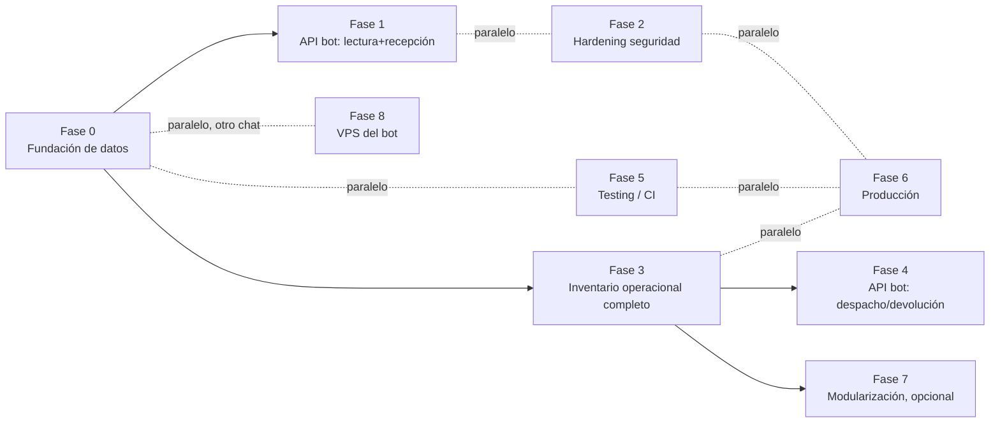

# BOLIKLOR — ROADMAP MAESTRO HACIA PRODUCCIÓN

**Fecha:** 21 de septiembre de 2026
**Insumos de este roadmap:** `BOLIKLOR_TECHNICAL_AUDIT.md` (auditoría + 4 addenda) y `BOLIKLOR_BOT_API_DESIGN.md` (diseño de integración). Este documento no repite el detalle de ambos — los referencia. Si una tarea dice "ver Addendum 3", vuelve a ese documento para el hallazgo completo.

**Cómo se construyó el orden:** no por lo que es más rápido de escribir, sino por **qué bloquea qué**. Todo lo que no depende de una decisión pendiente se marca como paralelo, para comprimir el tiempo real sin saltarse pasos de seguridad/integridad.

---

## 1. Principio de secuenciación

```text
Camino crítico  = la cadena mínima de tareas que SÍ tienen que ir una detrás de otra.
Pistas paralelas = todo lo que puede avanzar al mismo tiempo, en otra sesión de trabajo,
                    sin esperar al camino crítico.
```
El objetivo de "lo antes posible, seguro, escalable y profesional" se logra recortando el camino crítico, no recortando pasos de seguridad. Cada fase abajo dice explícitamente si es camino crítico o pista paralela.

---

## 2. Mapa de fases

| Fase | Nombre | Camino crítico | Bloqueada por | Chat responsable |
| --- | --- | :-: | --- | --- |
| 0 | Fundación de datos e integridad | ✅ Sí | Nada (decisiones ya resueltas) | Este (ERP) |
| 1 | API del bot — solo lectura + recepción | ✅ Sí | Fase 0 | Este (ERP) — el otro chat la consume |
| 2 | Hardening de seguridad | Paralela | Nada | Este (ERP) |
| 3 | Inventario operacional completo (despacho/devolución/ajuste) | ✅ Sí (para BI real) | Fase 0 | Este (ERP) |
| 4 | API del bot — Fase 2 (despacho/devolución vía bot) | Depende de 3 | Fase 3 | Ambos chats |
| 5 | Testing / CI | Paralela | Nada (arranca desde ya) | Este (ERP) |
| 6 | Producción (Docker, backup, proxy/TLS) | Paralela hasta el final | Nada, pero el go-live real espera a 0-3 | Este (ERP) |
| 7 | Modularización de dominios | Opcional, después | Fase 3 estable | Este (ERP) |
| 8 | Infraestructura del bot (VPS, salir del PC local) | Paralela | Nada | El otro chat |



---

## 3. Fase 0 — Fundación de datos e integridad (arranca ya)

**Objetivo:** que PostgreSQL refleje fielmente el estado real del inventario (incluyendo Mas Vial y el stock negativo ya existente) antes de construir nada encima.

| Tarea | Detalle | Referencia |
| --- | --- | --- |
| Migración: nueva empresa | `Empresa(codigo='MASV', nombre='Mas Vial')` | Addendum 3/4 |
| Migración: campos de trazabilidad | `movimientos_inventario.origen` (`ERP_WEB`\|`BOT_TELEGRAM`, default `ERP_WEB`) y `actor_referencia` (nullable) | `BOLIKLOR_BOT_API_DESIGN.md` §3 |
| Redactar ADR-011 | Stock negativo permitido con observación obligatoria (supersede parcial de ADR-005) | Addendum 4 |
| Redactar ADR-012 | Costo fijo = 1 definitivo para ALM/Mas Vial | Addendum 4 |
| Servicio de carga inicial / reconciliación | Lee `Maestro de Productos` + `Stock Consolidado` + `Registro de Movimientos` en su formato real (no el legacy de `product_import_service.py`) y carga/concilia contra Postgres. Éste es el "cruce de datos" — ya no es SYNC-001 en abstracto, es una tarea concreta con esquema conocido | Addendum 2 (SYNC-001), Addendum 3 |
| Validación post-carga | `/productos` y `/inventario/stock/*` deben mostrar los mismos números que el Excel, incluyendo `BOL-12 = -40` | — |
| Resolver INV-001 de paso | Mientras se construye la carga, unificar que `/productos` deje de leer `_legacy_stock_values` incondicionalmente | Audit, sección 14 |

**Criterio de salida:** una consulta de stock desde el ERP y una desde el Excel dan el mismo número, para las 3 empresas.

---

## 4. Fase 1 — API del bot: solo lectura + recepción

Ya diseñada completa en `BOLIKLOR_BOT_API_DESIGN.md`. Resumen de tareas:
1. Mecanismo de API key de servicio (`X-Service-Key`), scope limitado a `/api/bot/inventario/*`.
2. `GET /api/bot/inventario/productos`, `GET /api/bot/inventario/stock/{empresa}`, `GET /api/bot/inventario/movimientos`.
3. `POST /api/bot/inventario/recepciones` (reutiliza `create_receipt`), con `Idempotency-Key` = `ID Transacción` del bot.
4. Tests: auth rechazada sin key válida, idempotencia (misma key dos veces no duplica), y un caso de recepción real end-to-end.

**Criterio de salida:** el bot (en el otro chat) puede consultar stock/catálogo y registrar una recepción real contra PostgreSQL, sin tocar Google Sheets como registro final.

---

## 5. Fase 2 — Hardening de seguridad (paralela, arranca ya)

De `BOLIKLOR_TECHNICAL_AUDIT.md`, Top 5 Security Actions (sección 40) + ADR-008:
1. Rate limiting en `/login`.
2. `COOKIE_SECURE` forzado + fortaleza mínima de `SESSION_SECRET` cuando `APP_ENV=production`.
3. Headers de seguridad centralizados (CSP/HSTS/X-Frame-Options).
4. Redacción de parámetros sensibles en logs de excepción.
5. Resolver RBAC-002 (matriz de roles combinados, con tests).

No depende de Fase 0 ni de Fase 1 — se puede trabajar en paralelo, incluso antes.

---

## 6. Fase 3 — Inventario operacional completo (despacho/devolución/ajuste)

Ahora que el stock negativo tiene regla clara (ADR-011), esto deja de estar bloqueado por falta de decisión de negocio — sigue siendo trabajo de ingeniería real, no trivial:

| Tarea | Detalle |
| --- | --- |
| Control de concurrencia | Lock optimista o `SELECT ... FOR UPDATE` al confirmar despacho, para que dos confirmaciones simultáneas no calculen sobre el mismo stock desactualizado — el bot ya resuelve esto revalidando antes de confirmar (ver resumen N8N, sección 8); replicar ese mismo principio en el ERP |
| Flujo de despacho operacional | Cabecera + detalle + actor + observación obligatoria si deja stock negativo |
| Flujo de devolución operacional | Igual, con referencia opcional al despacho relacionado |
| Flujo de ajuste | Con motivo obligatorio y actor (ADMIN/BODEGA equivalente) |
| Costo móvil real (sólo Boliklor) | Implementar el promedio ponderado móvil que CURRENT exige — ALM/Mas Vial quedan fuera por ADR-012 |
| Bodega/permisos granulares | INV-004, según lo que CURRENT ya aprobó (fuera de la parte de stock negativo, que ya se resolvió distinto) |
| Exportación XLSX/BI de Inventario | Confirmado como requisito de negocio explícito (Addendum 1) — construir `inventory_export_service.py` análogo a `attendance_export_service.py` |

**Criterio de salida:** el ERP puede hacer, de punta a punta, lo mismo que hoy sólo hace el bot para recepción — despacho, devolución y ajuste con confirmación segura.

---

## 7. Fase 4 — API del bot: despacho/devolución (depende de Fase 3)

Activar en `BOLIKLOR_BOT_API_DESIGN.md` los endpoints hoy bloqueados (`/api/bot/inventario/despachos`, `/devoluciones`, `/ajustes`), reutilizando los servicios construidos en Fase 3. Trabajo conjunto con el otro chat para reconectar los nodos de N8N que hoy escriben en Sheets.

---

## 8. Fase 5 — Testing / CI (paralela, arranca ya)

De la sección 30 del audit — pipeline mínimo: unit + integration SQLite + PostgreSQL efímero + migration check + RBAC matrix + secrets scan. Cada fase anterior debería ir sumando sus propios tests a este pipeline a medida que se construye, no al final.

---

## 9. Fase 6 — Producción

Checklist completo en `BOLIKLOR_TECHNICAL_AUDIT.md`, sección 36 (Minimum Production Readiness) — ya actualizado con las decisiones de esta conversación. No se repite aquí; se ejecuta cuando 0, 2, 3 y 5 estén razonablemente maduras.

---

## 10. Fase 7 — Modularización de dominios (opcional)

Sección 7 y 41 del audit. Después de que Inventario (Fase 3) esté estable — modularizar código que todavía va a cambiar de forma es trabajo perdido.

---

## 11. Fase 8 — Infraestructura del bot (el otro chat, en paralelo)

Ya está en el propio resumen técnico que compartiste (sección 16: migración de PC local + Cloudflare Tunnel a VPS 24/7). No bloquea nada de este chat, pero si se hace en paralelo, cuando lleguen las Fases 1 y 4 el bot ya tendrá una URL estable en vez de un túnel temporal.

---

## 12. Qué se decide todavía, sin bloquear el arranque

Estas preguntas de la sección 37 del audit siguen abiertas, pero **no** frenan el inicio de la Fase 0: se resuelven durante la Fase 2/6 cuando corresponda.
- Política de retención GPS.
- RPO/RTO formal para backups.
- Alcance de exposición pública (¿el sistema sale de la red interna alguna vez?) — determina qué tan agresivo debe ser el rate limiting/MFA de la Fase 2.
- Permisos granulares finos de quién puede hacer qué en Inventario más allá de `INVENTARIO_ACCESS`.

---

## 13. Próximo paso inmediato

Con las decisiones ya tomadas, lo primero que se puede construir hoy mismo es la **Fase 0**: las dos migraciones (empresa MASV + campos `origen`/`actor_referencia`) y el servicio de carga inicial desde el Excel real. Es la tarea con menor riesgo, mayor apalancamiento (todo lo demás depende de ella) y ya tiene todos los insumos resueltos — Excel real ya revisado, reglas de negocio ya definidas, esquema de destino ya conocido.
